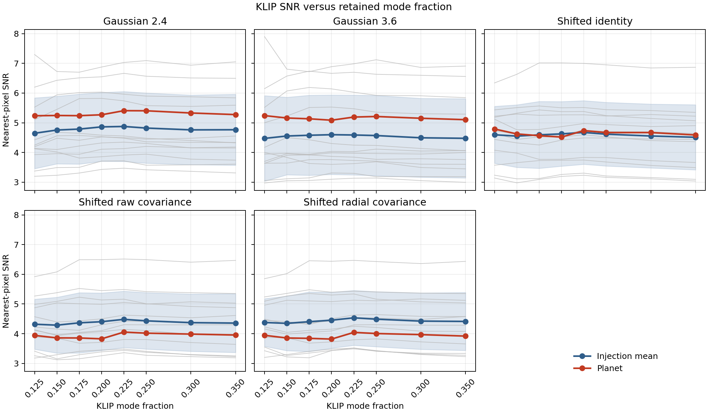
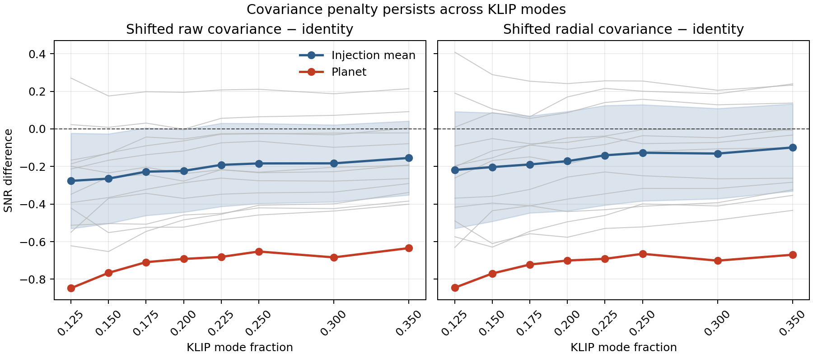

# KLIP Stage-J mode-dependence result

## Result

Stage J completed the shifted-template planet and twelve-injection analysis at
all eight frozen KLIP mode fractions. Individual sites do fluctuate and their
maximizing modes differ, as anticipated. The fluctuations do not explain the
planet's covariance penalty.

At every tested fraction, the planet's raw-covariance-minus-identity and
radial-covariance-minus-identity values are below all twelve injection values.
The raw comparison lies between `-2.06` and `-2.44` injection sample standard
deviations from the mean; the radial comparison lies between `-1.96` and
`-2.46` standard deviations.

## Mode selection controls

The result remains the same under both predeclared ways of handling mode
selection.

| Selection rule | Comparison | Injections | Planet | Planet deviation | Predictive two-sided p |
| :--- | :--- | ---: | ---: | ---: | ---: |
| Independent maximum | Raw covariance - identity | -0.2227 +/- 0.2346 | -0.7362 | -2.19 SD | 0.0593 |
| Independent maximum | Radial covariance - identity | -0.1642 +/- 0.2896 | -0.7464 | -2.01 SD | 0.0796 |
| Injection-selected | Raw covariance - identity | -0.1913 +/- 0.2217 | -0.6813 | -2.21 SD | 0.0573 |
| Injection-selected | Radial covariance - identity | -0.1404 +/- 0.2653 | -0.6914 | -2.08 SD | 0.0713 |

For the independent maximum, every method chooses its best mode separately at
every location. For the injection-selected result, the planet uses the mode
selected by the twelve-injection mean, while every injection is scored at the
mode selected by the other eleven sites.

The planet is below all twelve injections in all four comparisons. Their
one-sided exchangeable lower-tail rank is therefore the minimum available,
`1/13 = 0.0769`. Some individual high-mode diagnostic t probabilities are
below 0.05, but those are correlated members of an eight-mode scan and do not
override the predeclared scan-level comparisons or the exchangeable-rank
limit.

## Location-dependent fluctuation

The mean range of SNR across modes at an individual injection site is:

| Method | Mean injection range | Planet range |
| :--- | ---: | ---: |
| Gaussian 2.4 | 0.404 | 0.171 |
| Gaussian 3.6 | 0.441 | 0.155 |
| Shifted identity | 0.293 | 0.271 |
| Shifted raw covariance | 0.298 | 0.227 |
| Shifted radial covariance | 0.304 | 0.225 |

The planet's mode variation is typical or smaller than the injection
variation. Individually maximizing injections choose several different
fractions. Despite this site dependence, leave-one-site-out selection chooses
fraction `0.225` for all twelve sites for Gaussian 2.4, shifted identity, raw
covariance, and radial covariance. Gaussian 3.6 consistently selects `0.200`.
The ensemble optimum is therefore stable.

At the injection-selected modes, absolute SNR is:

| Method | Injections | Planet | Selected fraction |
| :--- | ---: | ---: | ---: |
| Gaussian 2.4 | 4.8761 +/- 1.1772 | 5.4077 | 0.225 |
| Gaussian 3.6 | 4.5990 +/- 1.3375 | 5.0869 | 0.200 |
| Shifted identity | 4.6745 +/- 1.0710 | 4.7356 | 0.225 |
| Shifted raw covariance | 4.4832 +/- 0.9487 | 4.0543 | 0.225 |
| Shifted radial covariance | 4.5342 +/- 0.9243 | 4.0441 | 0.225 |

Gaussian 2.4 remains highest for both the injection mean and planet. Gaussian
3.6 minus shifted identity remains statistically consistent between the
planet and injections under both mode-selection controls.

## Interpretation

Mode fraction affects every location, and choosing one favorable mode without
a comparable injection scan would be misleading. Once the same selection rule
is applied to the planet and injections, the Stage-I conclusion is unchanged.
The covariance penalty is broad across the complete mode range rather than a
mode-0.200 accident.

Within the tested model, Stages H through J show that integer template
centering and KLIP mode fraction do not explain the covariance
underperformance. The remaining
possibilities are local residual noise, a planet-response morphology not
represented by the injections, or another planet-specific effect. Increasing
the optimized-phase injection count remains the direct way to improve the
current `1/13` rank resolution.

## Verification and archived products

The frozen completion verifier reran on ROC. Every one of the 245 calibration
positions at each of eight modes reproduced its parent weights exactly. Each
science image replaced 189 radius-12 policy positions per mode. All unchanged
injection values reproduced Stage G with zero error, and the maximum
production-versus-oracle SNR error was `9.54e-7`.

The compact archive contains:

- [aggregate machine-readable result](results.json)
- [all per-site curves](mode_curves.csv)
- [modewise summary table](mode_summary.csv)
- [runner report](results.md)
- [verification record](verification.json)
- [frozen protocol](protocol.json)
- [frozen manifest](manifest.json)
- [completion receipt](complete.json)
- [all-mode shifted calibration weights](calibration/weights.npz)
- `analysis/`: per-task results, commands, logs, annular checks, and receipts

The 26 large analysis FITS maps are omitted from the repository archive. Their
hashes and completion receipts were verified on ROC before the compact
metadata products were copied.
