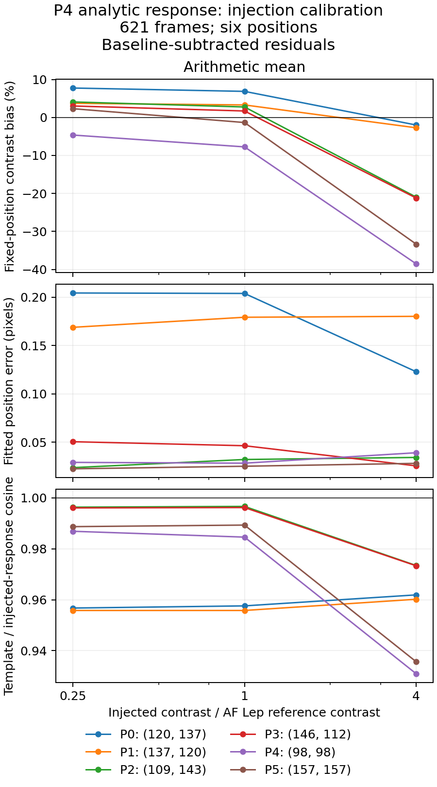

# Step 3 review checkpoint — 2026-09-17

**Paused at the user's request after 54 of 84 injection reductions. Step 3 remains open.**
The current reduction finished normally before the scheduler stopped; no experiment jobs remain running.
The full AF Lep comparison and all 42 arithmetic-mean reductions are complete. The remaining work is
30 sigma-mean reductions, the controlled timing benchmark, and the combined final report.

## Results to review

The full 621-frame analytic response leaves the science image **byte-for-byte unchanged**. Its AF Lep fit
differs from the accepted paired-refit fit by **−0.588% in contrast and 0.009 pixel in position**.
All 176566 detector responses succeed analytically, with no fallback or unavailable outcomes.
The full run takes 9894 seconds and 11.92 GiB peak memory; the same-build science-only control takes
310 seconds and 4.93 GiB. These whole-process observations do not establish a controlled speedup.

The completed injection study shows brightness-dependent under-recovery with both fixed template fields.
These are baseline-subtracted, identity-noise fits over six positions, two each at approximately 12.1,
24.1, and 41.7 pixels from the star. Bias below is measured at the known integer source position;
astrometry comes from the bounded quadratic fit. Ranges retain all six positions.

| Template | Brightness / reference | Median contrast bias | Bias range | Median position error (pixels) |
| --- | ---: | ---: | ---: | ---: |
| Analytic | 0.25 | +3.38% | −4.63% to +7.75% | 0.0397 |
| Analytic | 1 | +2.23% | −7.75% to +6.87% | 0.0391 |
| Analytic | 4 | −21.09% | −38.54% to −1.99% | 0.0365 |
| Paired refit | 0.25 | +5.54% | −1.10% to +8.08% | 0.0391 |
| Paired refit | 1 | +3.73% | −4.12% to +7.21% | 0.0366 |
| Paired refit | 4 | −19.21% | −35.36% to −1.66% | 0.0356 |

The reference contrast is `0.004763925929356391`. All 36 conditional fits converge; maximum position
errors reach 0.206 pixel. The faintest raw-image fit at the first position reaches the search boundary
with both templates; those statuses remain in the data. Analytic median template/response cosine is
0.9878, 0.9870, and 0.9611 at the three brightnesses. Both fixed fields lose photometric accuracy at
four times the reference brightness. This experiment includes finite-amplitude effects and sparse
spatial interpolation; it does not isolate the analytic derivative or establish detection completeness.

## Scope and records

The 84-run protocol uses a baseline and both signs of three amplitudes at each position, under mean
and 5-sigma clipped mean combination. All trials use 621 frames and native M32D64 science. A zero-padded
12-by-12 source crop matches the response support without renormalization; local output windows are
15-by-15 and fitted templates 11-by-11. Both combination experiments use mean-combined response fields;
the final clipping rule is not differentiated. The sigma-mean comparison is incomplete at this checkpoint.

- [Full-data results](science.json): fits, template mismatch, source-support caveats, resources, and provenance.
- [Every mean-combination comparison](mean_injections.csv), also in [JSON](mean_injections.json).
- [Mean summary](mean_summary.json): medians, ranges, fit statuses, and missing-result counts.
- [Pause record](pause.json): all 54 completed and 30 remaining trial names; the next trial is `sigmaMean_p1_a5`.
- [Input verification](input_verification.json): all 621 input, configuration, and PSF hashes still match.
- [Plan and implementation details](../../Covariance-Aware-Matched-Filtering.md#step-3-scientific-and-computational-validation-2026-09-17).

The raw checkpoint is preserved in the ignored repository directory
`working/roc/p4_analytic_step3_20260917_review/`. It includes frozen software, commands, FITS products,
the original injection runner, current analysis scripts, coverage/test logs, and a SHA-256 archive index.
The live records remain at `/tmp/p4-step3-aflep` for continuation. Do not rerun the serial helper from
the beginning: it intentionally requires new output directories. Resume the 30 named remaining trials
without overwriting completed ones, validate all 84, then run the queued analysis and timing commands.

The partial analysis is reproducible using `run_p4_step3_injections.py analyze --completed-mean-only`
with the paths recorded in `followup_commands.json`. It writes separate `mean_summary` files and does
not create a full-sweep completion marker. The archived `archive_review.py` records the export operation.
