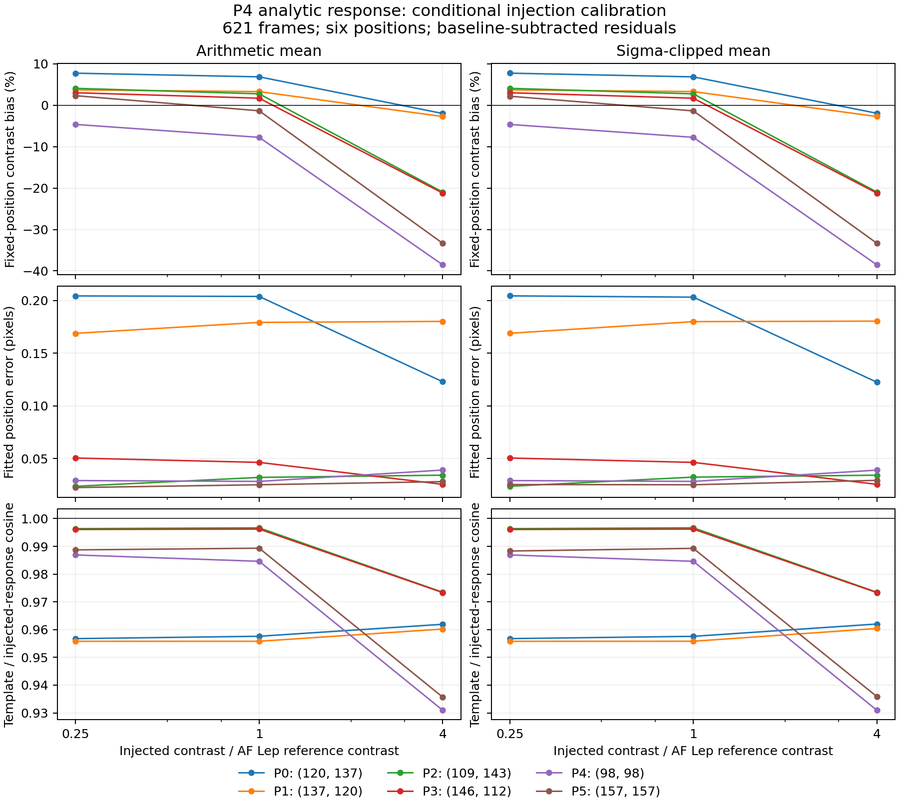
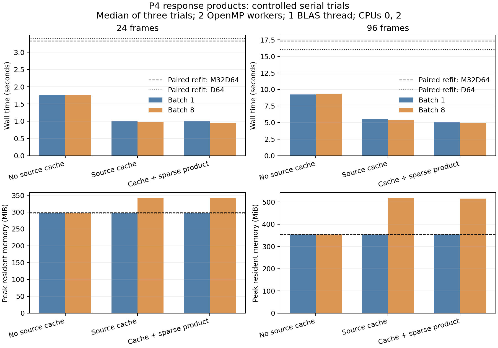

# P4 analytic response validation — 2026-09-17

These records complete Step 3 of
[Covariance-Aware-Matched-Filtering.md](../../Covariance-Aware-Matched-Filtering.md).
The experiment measures response accuracy and cost before adding covariance weighting.

## Results

The full analytic AF Lep fit differs from the accepted paired-refit result by
**−0.588% in contrast and 0.009 pixel in position**, with matched-filter SNR 4.334.
All 176566 detector responses are analytic, with no fallback or unavailable outcomes.
There are 30166 baseline factorizations, 82.9% fewer than preparing one for each direction.

All **84 injection reductions and 72 conditional fits** completed. Both fixed response
fields under-recover the brightest injections. Mean and 5-sigma mean results are close:
the largest change in any analytic fixed-position bias is 0.125 percentage point.

| Template | Brightness / reference | Mean median bias | Sigma-mean median bias | Mean median position error (pixels) | Sigma-mean median position error (pixels) |
| --- | ---: | ---: | ---: | ---: | ---: |
| Analytic | 0.25 | +3.376% | +3.373% | 0.03969 | 0.03969 |
| Analytic | 1 | +2.232% | +2.230% | 0.03911 | 0.03925 |
| Analytic | 4 | −21.087% | −21.087% | 0.03654 | 0.03649 |
| Paired refit | 0.25 | +5.543% | +5.489% | 0.03907 | 0.03907 |
| Paired refit | 1 | +3.727% | +3.731% | 0.03657 | 0.03657 |
| Paired refit | 4 | −19.209% | −19.209% | 0.03557 | 0.03558 |

Bias means `100*(measured added contrast / known injected contrast - 1)`, evaluated
at the known integer position and summarized across six positions. It is not a
comparison with a negative-planet optimizer. The baseline-subtracted measurement
cancels much of the shared residual noise, so its scatter across positions is **not an
SNR estimate**. The negative injections supply a separate symmetric-response diagnostic.

At the brightest level, analytic fixed-position bias spans −38.54% to −1.99% for mean
combination and −38.54% to −1.93% for sigma-mean. Individual conditional position errors
reach 0.206 pixel. All 72 conditional fits converge. Four raw-image fits reach the
search boundary: the faintest first-position trial, for both fields and combinations.
Their statuses and measurements are retained in the exported data.

Median analytic template/response cosine is 0.9878, 0.9870, and 0.9611 for mean
combination, and 0.9876, 0.9869, and 0.9612 for sigma-mean. These tests include finite
amplitude, sparse template interpolation, and production mixed-precision arithmetic.
They measure conditional calibration, not detection completeness.

Median one-sided versus symmetric response differences are 0.95%, 2.01%, and 3.61%
for mean combination, and 1.12%, 2.08%, and 3.61% for sigma-mean. The largest such
difference is 8.31%; individual faint sigma-mean trials also reach 6.17%. Similar
photometric gains therefore do not imply identical responses for the two combinations.



## Files

| File | Contents |
| --- | --- |
| `science.json` | Full AF Lep fit, unchanged-science control, response diagnostics, template differences, source support, resources, and provenance. |
| `injections.csv`, `injections.json` | Every position, brightness, combination, and template comparison, including raw-image fit statuses. |
| `summary.json` | Injection summaries over six positions, with missing-result and fit-status counts. |
| `timing.json` | Twelve analytic timing groups: two frame counts, three implementations, and two batch sizes. |
| `refit_timing.json` | Four paired-refit timing groups, separating production mixed precision and FP64. |
| `injections.png`, `timing.png` | Calibration and performance figures. |
| `validation.json` | Final completion counts and byte-equality checks. |
| `cpu_reproducibility.json` | CPU-affinity reproduction results and cache topology. |

## Experiment and interpretation

The full experiment uses all 621 preprocessed NACO AF Lep frames from 2011-10-21,
mode fraction 0.15, 232 response measurements at 58 radii, and the accepted source-avoidance
geometry. The analytic field and accepted paired-refit field have identical coordinates and
finite support. A separate reduction with the same executable and libraries produces
byte-for-byte identical science pixels when response calculation is disabled.

The injection study uses six integer positions: two each at radii approximately 12.1,
24.1, and 41.7 pixels. Each has a baseline and signed injections at 0.25, 1, and 4 times
the reference contrast `0.004763925929356391`, with arithmetic mean and 5-sigma mean
combination: 84 reductions. The central 12-by-12 source crop is zero-padded without
renormalization, matching the 11-by-11 response's source support. Local science windows
are 15-by-15. Every candidate in the 5-by-5 fitting grid has complete response support.

Both combination experiments use mean-combined templates. The sigma-clipped experiment
also measures the consequence of that approximation; the model does not differentiate
the final clipping rule. Baseline subtraction isolates conditional response calibration
from the particular residual-noise realization. Raw-image fits are retained separately.
The bounded quadratic fit searches within one pixel of the known source. These tests
do not measure detection completeness or false-positive rates; those belong to Step 5.

Fixed-position bias measures the template's photometric gain without interpolating a
fitted peak. Fitted contrast and position diagnostics include the quadratic interpolation.
The one-sided response is `(science(+a)-science(0))/a`; the symmetric response is
`(science(+a)-science(-a))/(2a)`. Their difference measures amplitude asymmetry.
All six positions are shown individually in the calibration figure.

The archived known-source negative-removal comparison also includes subpixel registration,
clipping, finite-amplitude effects, and different source support. Its full-image removal
uses the full PSF, while the accepted local optimizer and response use 14- and 12-pixel
source crops. Its mismatch is therefore not an isolated analytic-derivative error.
Full-field template statistics retain outer-edge cases with only 19 of 121 pixels available.

## Timing scope

The full run uses 20 OpenMP workers and one BLAS thread on an i9-12900HK. It takes
9894.06 seconds and peaks at 11.92 GiB; its same-build science-only control takes 310.21
seconds and 4.93 GiB. Small development checks overlapped parts of the full run.
The historical refit run used 48 workers, so those two full-run times do not establish
a controlled speed comparison.

The separate subset benchmark runs serially with two OpenMP workers and one BLAS thread,
pinned to performance-core CPU IDs 0 and 2.
For each of 24 and 96 frames, it compares three frozen analytic implementations
(before source caching, cached dense, cached sparse), batches of one and eight realized
source measurements, and three repeats. Timings include science and response generation;
the independently run science control is excluded from each response timing.

Analytic trials use M32D64 science and FP64 response calculations. Paired-refit controls
use either M32D64 at half-contrast `0.0047639259293563909` or D64 at `1e-5`; the latter
also uses FP64 science. They are different accuracy policies, explicitly recorded in
`refit_timing.json`. Each control checks its science against a same-precision baseline.
All timing summaries use the median of three trials; individual resources are archived.

| Configuration | 24 frames: seconds | 24 frames: MiB | 96 frames: seconds | 96 frames: MiB |
| --- | ---: | ---: | ---: | ---: |
| No cache, batch 1 | 1.75 | 298.2 | 9.24 | 354.1 |
| No cache, batch 8 | 1.75 | 298.2 | 9.38 | 354.1 |
| Cached dense, batch 1 | 1.00 | 298.1 | 5.49 | 354.1 |
| Cached dense, batch 8 | 0.97 | 340.8 | 5.36 | 516.3 |
| Cached sparse, batch 1 | 1.00 | 298.2 | 5.06 | 354.1 |
| Cached sparse, batch 8 | 0.95 | 340.7 | 4.93 | 515.0 |
| Paired refit, M32D64 | 3.33 | 298.1 | 17.34 | 354.1 |
| Paired refit, D64 | 3.41 | 297.8 | 16.06 | 354.1 |

The cached sparse batch-eight implementation takes 0.95 and 4.93 seconds, compared with
1.75 and 9.38 seconds for the uncached batch-eight version. Against the native paired-refit
controls, these subset timings are about 3.5 times faster, with higher peak memory for the
batch cache. Native paired-refit maximum stamp differences from the analytic field are
0.114% and 0.760%; FP64 controls differ by at most `3.15e-7` and `1.96e-7` in relative norm.

These subsets use 5-pixel response stamps, eight measurements at radii 7.8 and 10.8 pixels,
and mode fractions 0.05, 0.15, and 0.3. Their speed ratios do not establish the speed ratio
for the 621-frame, 11-pixel, 232-measurement full experiment. Batch reuse reduces factor
counts from 610 to 424 (24 frames) and 702 to 480 (96 frames); source caching accounts for
most of the measured subset speed improvement.

### CPU placement and numerical reproducibility

The initial unpinned timing attempt stopped after 12 successful trials when its next
science/response comparison differed. The maximum science-pixel difference was
`0.0024900436401367188`, with identical finite support. Both the science-only and
response-enabled reductions reproduce one result on CPUs 0/2 and the other on CPUs
12/13. Two repeats of each mode on each CPU set agree within that set; three additional
unpinned pairs also agree. All response templates in the failed trial match the
repeated analytic products exactly.

Thus the failed check exposed a CPU-placement dependency of native-precision science,
not a science change caused by response calculation. Bitwise reproducibility across
the performance and efficiency core classes is not guaranteed. The exact internal
arithmetic mechanism has not been isolated. The successful controlled benchmark uses
the same two performance cores for every process and retains the strict equality check.
The full-data and injection studies retain their original unpinned 20-worker policy;
their reported science equality and calibration results apply to those recorded runs.

The original failure, repeat commands, images, and comparisons are preserved in
`reuse_benchmark_unpinned/` and `cpu_affinity_investigation/` in the raw archive. Future
controlled replays should pass `--cpus 0 2` on this machine, or choose a homogeneous
CPU set appropriate to the machine being used.



## Reproduction and raw archive

Raw products and exact software are in the ignored directory
`working/roc/p4_analytic_step3_20260917/` at the repository root. It contains commands,
input fingerprints, logs, FITS products, resource measurements, frozen executable/library
pairs, completed subset references, analysis scripts, and a SHA-256 archive index.
The preserved input files themselves remain in the user's NACO data directory.

Manifests retain the original `/tmp/p4-step3-aflep` paths as provenance. For replay,
restore that directory layout from the archive, or consistently repoint command paths.
The subset references originally lived in `/tmp/p4-response-convergence-20260917/`;
their archived copies are under `subset_references/`. Their configuration fingerprints
refer to `/tmp/p4-response-convergence-20260916/smoke.conf` and
`/tmp/p4-response-convergence-20260917/96.conf`; preserved copies are in
`supporting_records/`. The accepted full refit and negative-planet reference records
remain in `working/roc/p4_refit_difference_20260912T200301Z/` and
`working/roc/p4_matched_response_20260907T225744Z/`.

The maintained drivers are in `agents/plans/scripts/`:
`run_p4_step3_products.py`, `analyze_p4_step3.py`, `run_p4_step3_injections.py`,
`benchmark_p4_step3_reuse.py`, and `summarize_p4_step3.py`.
Their `--help` describes required paths. Reduction and export destinations must be new;
existing records are not overwritten. The archive preserves the exact injection runner
used before the pause and the detached continuation under `background_resume/`.
The latter validates the original 54 completed trials and executes only the remaining
30. The final timing drivers are frozen separately under `pinned_timing_scripts/`.

To regenerate the compact tables and figures from the archive into a new directory:

```sh
MPLCONFIGDIR=/tmp/p4-step3-mplconfig \
python3 agents/plans/scripts/summarize_p4_step3.py \
  --experiment working/roc/p4_analytic_step3_20260917 \
  --output /tmp/p4-step3-export
```

Step 4 adds identity, diagonal, and regularized PCA covariance choices. The exact
mxlib template-instantiation coverage gaps remain documented under
`Known non-blocking ownership follow-ups` in `agents/plans/mxlib_cleanup.md`.
