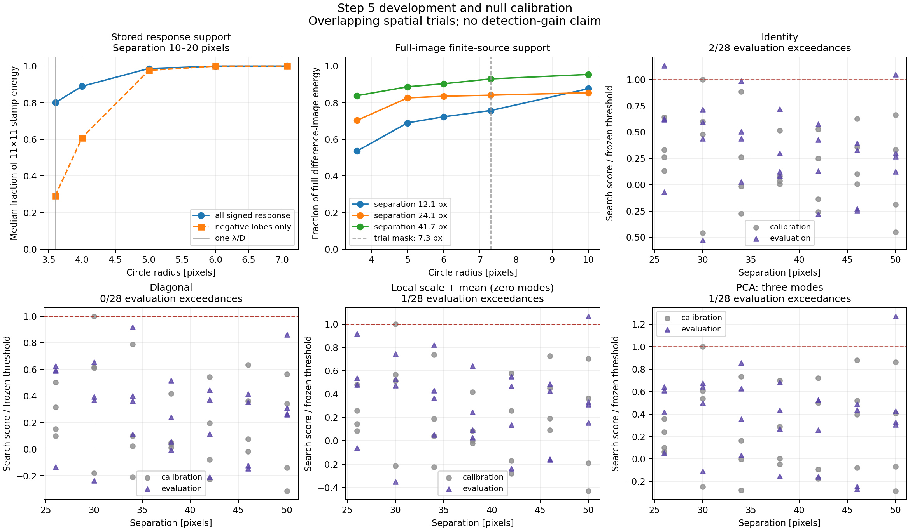

# Step 5: exclusion audit, full-image development, and held-out null calibration

**Status: development and null calibration complete; the 18-injection evaluation is running unattended.**
The queue also performs all four filter measurements and writes a results table when it finishes.
No covariance detection gain has been established at this checkpoint.

## Exclusion geometry and image scale

The original ten-pixel source radius was inherited from the application's signal/SNR mask. It was not derived
from the response or the half-overlap discussion. The dataset's `working/analyze.conf` uses **3.6 pixels per
lambda/D**, so ten pixels is about 2.8 lambda/D. The first pilot explicitly used 2.5 pixels per lambda/D;
its archived commands retain that setting. Covariance sampling is specified in pixels; this scale correction
affects its physical interpretation and the separate empirical SNR calculation.

The old rule expanded the source mask by the training stamp's half diagonal plus an interpolation margin:
`10 + sqrt(50) + sqrt(2) = 18.49` pixels between source and training centers. The candidate-overlap rule separately
required `2*sqrt(50) + sqrt(2) = 15.56` pixels. These exclusions are combined by their union.

The optional `noise.exactExclusion=true` instead checks every native pixel read by a nonzero interpolation weight.
It withholds the candidate rectangle, with an optional Euclidean guard, and pixel centers inside the additional
source/held-out circles. Any touching patch is rejected. Enclosing circles screen impossible overlaps; their
interpolation margin is not added again to the exact pixel check. The default remains the old circle rule.

We retain the **11×11 stamp and five-pixel half-width spacing**. At separations of 10–20 pixels, a radius of one
lambda/D contains median **80.1% of the stored response energy but only 29.3% of its negative-lobe energy**.
These denominators include only the stored stamp. The provisional **7.3-pixel source radius** encloses its
7.07-pixel half diagonal plus the known source's 0.21-pixel offset from the nearest response center, rounded upward.
It is not a claim that the full processed source has compact support there.

The following geometry ablation uses the same original science and response field. Counts depend on footprint
and finite support, not on choosing a model's score. All covariance methods share these sampling counts.

| Exclusion rule | Source radius (pixels) | Covariance-valid positions | Too few patches | AF Lep patches | AF Lep valid |
| --- | ---: | ---: | ---: | ---: | --- |
| Enclosing circles | 10 | 7,679 | 937 | 6 | No |
| Enclosing circles | 7.3 | 7,793 | 823 | 8 | Yes |
| Exact stencils | 10 | 7,834 | 782 | 7 | No |
| Exact stencils | 7.3 | 7,919 | 697 | 8 | Yes |

There are 15 proposed training centers at the nearest AF Lep pixel before exclusions. The approximately
19-patch example in the plan assumes a one-lambda/D patch half-width. Accepted overlapping patches are not
independent samples. An independent NumPy stencil implementation matches production counts at 64 representative
positions, including AF Lep. These runs assess geometry; their timings are not a controlled comparison.

## Full-image development injections

A FITS-header audit corrected the original pilot report: it used **sigma-mean science with mean response
templates**. The fresh development/evaluation reductions explicitly use **mean combination**, all 621 frames,
mode fraction 0.15, the stored PSF normalization, a parity-preserving 12×12 source crop zero-padded to the original
template size, and fixed homogeneous CPU cores 0/2/4/6/8/10. Every injection reruns the full 256×256 reduction.
The 11×11 analytic response field is fixed across all methods.

Development used a fresh zero-contrast baseline and three positive injections at contrast 0.00119098148.
Difference images below diagnose source support and changes to training data; they are not detection or
contrast-recovery measurements.

| Separation (pixels) | Patches after 7.3-pixel source masks | Full difference energy inside mask | Training-data change / centered-noise norm | Relative covariance change |
| --- | ---: | ---: | ---: | ---: |
| 12.1 | 4 | 75.7% | 2.35% | 2.68% |
| 24.1 | 20 | 84.2% | 4.89% | 5.32% |
| 41.7 | 47 | 93.0% | 5.98% | 5.84% |

Training changes use the Frobenius norm of `X_positive − X_baseline`, divided by the centered baseline norm.
Covariance changes compare their centered sample covariance matrices in Frobenius norm. The known planet and
the development source are both masked. The inner source therefore leaves fewer samples than the single-source
AF Lep geometry test and cannot support the eight-patch filter policy. Expanding the source mask to ten pixels
reduces these changes, but does not eliminate them; it leaves 3, 19, and 46 patches. See
[`support_and_leakage.json`](support_and_leakage.json) for all tested radii.

The processed signal has appreciable wings outside the stored template and declared mask. The evaluation keeps
the predeclared footprint and measures the resulting finite-source behavior. A mask that makes training exactly
source-free has not been established. Raw positive images, rather than baseline-subtracted cutouts, are required
to capture this effect in the evaluation.

## Held-out null calibration

[`protocol.json`](protocol.json) fixes 32 calibration and 32 evaluation searches at nominal radii
20/26/30/34/38/42/46/50 pixels and four angular blocks in each set. Their pixel neighborhoods and the three
development neighborhoods are pairwise disjoint. The **union of all those neighborhoods** is excluded from every
noise fit, in addition to the known-source mask. Each trial searches the same five native pixels within radius
one of its assigned center. A `sqrt(61)`-pixel circle encloses the union of their 11×11 response footprints.

Every search pixel's production training counts agree with the independent stencil audit. The response subset
copies original field values without modification; the full residual image remains the training input.
`noise.only=true` writes conditional maps without requiring an unrelated source-aperture SNR measurement in
this sparse field.

All four methods share 28 usable calibration and 28 usable evaluation trials. The eight searches at radius 20
fail the eight-patch minimum and remain recorded as failures. All four methods use the original response;
diagonal, zero-mode PCA, and three-mode PCA train the mean. Rank three and floor fraction 0.1 stay fixed,
with no parameter selection from evaluation scores.

The target is 5% false positives per preassigned search. The frozen threshold is order statistic
`ceil((n+1)*0.95)`, with strict exceedance. At `n=28` this takes the maximum calibration score. These scores
are **conditional filter quantities, not Gaussian significances**.

| Method | Frozen score threshold | Calibration exceedances | Evaluation exceedances | Observed evaluation fraction |
| --- | ---: | ---: | ---: | ---: |
| Identity | 0.67598 | 0/28 | 2/28 | 7.14% |
| Diagonal | 7.7661 | 0/28 | 0/28 | 0% |
| Local mean/scale, zero PCA modes | 20.1801 | 0/28 | 1/28 | 3.57% |
| PCA, at most three modes | 17.8365 | 0/28 | 1/28 | 3.57% |

The trials overlap spatially. Four angular blocks provide only a rough sensitivity check; all observed evaluation
exceedances are in one block. Block-resampling percentiles are retained in
[`null_results.json`](null_results.json), explicitly without an independent-trial confidence guarantee.
In particular, the diagonal method's zero events and degenerate bootstrap interval do not bound its tail at zero.
These counts cannot establish a preferred method or a precise 5% operating point.

## Running evaluation

The frozen batch launched at **2026-09-18 14:55:59 UTC**, detached supervisor PID **934537**.
It contains **18 separate full-image injections**: six preassigned evaluation positions at 0.5, 1, and 2 times
the contrast scale from the zero-mode calibration threshold and the center's training-only conditional sigma.
All six sites had common baseline eligibility; none was substituted after inspecting its score.
The resulting contrasts range from about 0.000145 to 0.001293. The background runner uses frozen binaries,
libraries, PSF/response products, thresholds, commands, and input hashes; later builds cannot change it.

Raw queue: `working/roc/p4_noise_step5_evaluation_20260918/`.

- `launch.json`: detached launch command and PID.
- `state.json`, `reductions/state.json`: supervisor phase and current reduction.
- `background.log`: progress and any error.
- `complete.json`: written only after all 18 reductions and 72 model measurements finish successfully.
- `results.json`, `results.md`: individual measurements and the automatic recovery table, produced on completion.

The completed development reductions took roughly seven minutes each. The evaluation is expected to take
about two hours plus analysis, with no session polling required. Recovery uses raw scores at the frozen threshold.
Invalid searches count as nondetections. Contrast bias and one-conditional-sigma coverage use the exact injected
position, without baseline subtraction or selecting a fitted amplitude peak. Identity sigma assumes unit pixel
covariance and is not a trained noise uncertainty. The six positions provide a small spatial sample.

## Verification and artifacts

Four focused C++ suites pass: **33 test cases, 2,105 assertions**. Tests include whole-holdout NaN mutation,
zero-weight interpolation neighbors, rectangular support and guards, default-policy preservation, CLI loading,
FITS metadata, and conditional-only execution with no valid listed-source aperture. The independent real-data
audits check 64 full-field candidates and all 320 held-out search pixels. The evaluation analysis smoke test
reproduces baseline score, amplitude, and conditional sigma exactly for all four production models.

Changed C++ sections follow `clang-format`; new scripts pass `py_compile`. A focused Doxygen build retains
production API/test references; its included-fixture preprocessor warning also occurs before these changes.
The current mxlib coverage audit retains the documented non-blocking gaps: unsigned-long configuration retrieval,
the 34/40-line command-line parser, and missing exact float cube lifecycle instantiations. Concrete follow-ups
remain in [`mxlib_cleanup.md`](../../mxlib_cleanup.md).

Tracked results include the geometry ablation, support/leakage audit, null protocol and results, full development
input manifest, evaluation design/jobs/launch, and the figure above. Raw inputs/results/logs are under:

- `working/roc/p4_noise_step5_stencil_20260918/`
- `working/roc/p4_noise_step5_development_20260918/`
- `working/roc/p4_noise_step5_holdout_20260918/`
- `working/roc/p4_noise_step5_evaluation_20260918/`

The development archive preserves a runner validation correction: a valid single-mode 2D FITS image was initially
rejected by a check expecting a 3D singleton cube. Its unchanged mean-combined output was independently validated
and retained. The holdout archive similarly preserves an initial application exit after conditional products were
written but its unrelated source-SNR aperture lacked support; `noise.only` resolves that workflow. Neither
correction changed trial geometry, reduction settings, science values, or noise parameters.

Maintained scripts are `run_p4_step5_pilot.py`, `run_p4_step5_full_injections.py`,
`analyze_p4_step5_development.py`, `run_p4_step5_holdout.py`, `run_p4_step5_evaluation.py`, and
`plot_p4_step5_development.py` in `agents/plans/scripts/`. Step 5 remains in progress pending review of the
positive-injection completeness, raw contrast errors, and conditional-uncertainty coverage.
