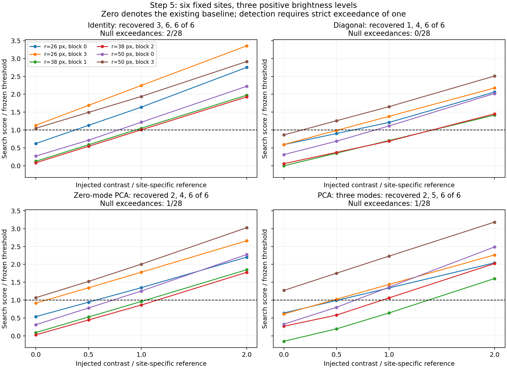
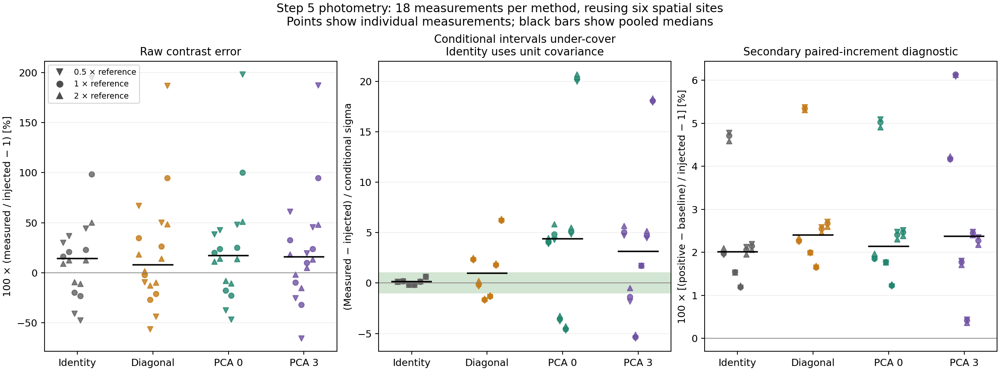

# Step 5: completed held-out positive-injection evaluation

**Status: the initial fixed-policy evaluation is complete.** All 18 full-image reductions and 72 filter
measurements succeeded, with no invalid injection searches. The saved FITS measurements and frozen input hashes
pass an independent review. The reductions took **1 h 58 min 52 s** in total, excluding subsequent filter analysis;
the median was 395 seconds per reduction.

This small study **does not establish a covariance-weighting detection gain**. The learned models' conditional
uncertainties substantially under-cover the injected contrasts. The response itself behaves much better in a
separate paired-amplitude diagnostic: median increment errors are approximately +2–2.4%. That diagnostic removes
the existing background offset and is not the raw photometric error or a completeness measurement.

## Recovery at the frozen thresholds

Each brightness level uses the same six preassigned sites. The reference contrast is specific to each site:

`reference = zero-mode PCA calibration threshold × baseline center conditional sigma`.

The multipliers below are neither measured SNRs nor each method's own threshold contrast. Actual injected
contrasts span 0.00014474–0.00129272. Nominal separations are 26, 38, and 50 pixels, with two sites at each radius.
The three brightness levels reuse the same residual field at those sites; they are not 18 independent noise
realizations. All methods use identical injections, response templates, search footprints, and held-out exclusions.
Rank three and floor fraction 0.1 remain the initial fixed policy, with no evaluation-based tuning.

| Method | Recovered at 0.5× | Recovered at 1× | Recovered at 2× | Held-out null exceedances |
| --- | ---: | ---: | ---: | ---: |
| Identity | 3/6 | 6/6 | 6/6 | 2/28 (7.14%) |
| Diagonal | 1/6 | 4/6 | 6/6 | 0/28 (0%) |
| Zero-mode PCA: local mean and scale | 2/6 | 4/6 | 6/6 | 1/28 (3.57%) |
| PCA: at most three modes | 2/6 | 5/6 | 6/6 | 1/28 (3.57%) |

Detection requires the maximum signed score in the preassigned five-pixel search to **strictly exceed** its
method's frozen calibration threshold. These thresholds target 5% false positives per search. The observed null
rates differ and have substantial uncertainty: there are only 28 eligible evaluation searches and four correlated
angular blocks. Zero observed diagonal events do not establish a zero false-positive probability. Therefore,
identity's larger recovery count cannot establish superiority at a matched achieved false-positive rate.

The three-mode model gains one middle-brightness detection over the zero-mode control, at `(row, column) =
(152, 157)` and nominal radius 38. Both have one null exceedance. This is a useful paired observation, but one site
in a six-site sample does not establish a general gain from correlated weighting.



Zero on the horizontal axis denotes the unmodified baseline. Two identity sites already exceed threshold there
(`r26_b3`, `r50_b3`), as does `r50_b3` for both PCA models. Those sites remain in the prescribed evaluation;
removing them after inspecting scores would change the sample. Their positive-injection detections are part of
the raw recovery count, not evidence that the source alone caused a new threshold crossing. Lines connect the
sampled brightness levels for readability; they do not fit a continuous completeness function.

## Raw photometry and conditional uncertainty

The amplitude and sigma are evaluated at the **exact injected position**, without selecting a fitted peak or
subtracting a baseline. Relative contrast error is `measured / injected − 1`. Ranges below are the minimum and
maximum across six positions, not confidence intervals. These errors combine the existing residual background,
finite-source response error, and any change in the learned noise model.

| Method | Brightness | Median raw contrast error | Range across six sites | Within ±1 conditional sigma |
| --- | ---: | ---: | ---: | ---: |
| Identity | 0.5× | +33.6% | −47.3% to +195.0% | 6/6 |
| Diagonal | 0.5× | +20.4% | −56.0% to +187.0% | 1/6 |
| Zero-mode PCA | 0.5× | +40.7% | −46.5% to +198.1% | 0/6 |
| Three-mode PCA | 0.5× | +32.7% | −65.4% to +187.1% | 0/6 |
| Identity | 1× | +18.5% | −23.0% to +98.5% | 6/6 |
| Diagonal | 1× | +12.2% | −27.0% to +94.8% | 1/6 |
| Zero-mode PCA | 1× | +22.0% | −22.6% to +100.2% | 0/6 |
| Three-mode PCA | 1× | +17.1% | −31.8% to +94.6% | 0/6 |
| Identity | 2× | +10.8% | −10.9% to +50.3% | 6/6 |
| Diagonal | 2× | +8.0% | −12.5% to +48.7% | 1/6 |
| Zero-mode PCA | 2× | +12.4% | −10.7% to +51.3% | 0/6 |
| Three-mode PCA | 2× | +9.2% | −15.1% to +48.4% | 1/6 |

| Method | Positive trials within ±1 sigma | Median absolute error / sigma | Null centers containing zero within ±1 sigma |
| --- | ---: | ---: | ---: |
| Identity | 18/18 | 0.161 | 28/28 |
| Diagonal | 3/18 | 1.718 | 6/28 |
| Zero-mode PCA | 0/18 | 4.623 | 2/28 |
| Three-mode PCA | 1/18 | 4.883 | 1/28 |

**Identity assumes unit pixel covariance; its sigma is not a fitted noise uncertainty.** Its broad intervals are
not evidence of successful calibration. For the learned models, these conditional intervals are much too narrow
to describe the observed raw amplitude errors in this sample. Poor coverage is also present at the exact centers
of unmodified evaluation nulls, so finite-source nonlinearity alone cannot explain it. The null-center check uses
no search-maximum selection and does not change the detection thresholds.

The conditional formula treats the estimated mean, covariance, and response as known. Possible contributors to
the mismatch include covariance regularization, limited overlapping training patches, interpolation-altered noise
statistics, spatial variation, and uncertainty in those estimates. This experiment does not identify their separate
contributions or justify applying one universal correction factor. Conditional scores remain uncalibrated as
Gaussian significances.



The green band marks ±1 conditional sigma. Each panel contains all three brightnesses at all six sites per method;
the black bars are pooled medians. Horizontal offsets separate sites, and marker shapes identify brightness levels.

## Secondary response diagnostic

For interpretation only, compute

`paired increment error = (positive amplitude − baseline amplitude) / injected contrast − 1`.

| Method | Median at 0.5× | Median at 1× | Median at 2× |
| --- | ---: | ---: | ---: |
| Identity | +2.04% | +2.01% | +2.00% |
| Diagonal | +2.41% | +2.41% | +2.40% |
| Zero-mode PCA | +2.16% | +2.13% | +2.13% |
| Three-mode PCA | +2.42% | +2.36% | +2.29% |

Across all sites, levels, and methods, these increment errors range from +0.36% to +6.14%. Their small size
compared with the raw errors shows that the preexisting background offsets account for most of the large raw
errors in this batch. The noise weights are re-estimated on each positive image, so this is a paired **measurement**
increment rather than an isolated derivative test of the response template. It is not a negative-injection result.
No paired subtraction enters the recovery table or conditional-interval coverage above.

## Verification and preserved artifacts

The reproducible review independently hashed **1,531 unique files**, including all 621 source frames, frozen
software/configuration/response inputs, completed reduction images, and each model's recorded FITS products.
All hashes agree with the run's records. It re-read the FITS maps for all 72 measurements and exactly reproduced
the five-pixel scores, raw amplitudes, sigmas, training counts, strict-threshold decisions, contrast errors, and
interval coverage. It also checked full 256×256 mean-combined reductions, model/header settings, the frozen
exclusion commands, site/brightness definitions, and aggregate results.

- [`results.json`](results.json): unchanged copy of the automatic result, including all 72 measurements and
  their original product fingerprints.
- [`review.json`](review.json): verification summary, input/result fingerprints, group ranges, null-center
  coverage, and individual paired diagnostics.
- [`recovery.png`](recovery.png), [`photometry.png`](photometry.png): figures above.
- [Development and null-calibration report](../p4-step5-development-20260918/README.md): frozen protocol,
  injection design/jobs, thresholds, masks, source-support audit, and production-code validation.
- Raw completed queue: `working/roc/p4_noise_step5_evaluation_20260918/`; its inputs and products were not changed
  during review.

Reproduce the review from the repository root:

```sh
MPLCONFIGDIR=/tmp/p4-step5-matplotlib python3 agents/plans/scripts/review_p4_step5_evaluation.py \
  --input working/roc/p4_noise_step5_evaluation_20260918 \
  --output agents/plans/results/p4-step5-evaluation-20260918
```

This checkpoint changes the review script, reports, plan status, and archived results. It changes no production
C++ functions or mxlib calls. The review script passed syntax checking and the complete real-product audit;
both figures were visually inspected.

## Scientific follow-ups

1. Investigate the conditional-uncertainty mismatch on development data, including the floor/rank choices and
   treatment of estimated background/covariance. The current sigmas should not be interpreted as calibrated errors.
2. Freeze any revised policy before testing it on fresh held-out neighborhoods or independent data. The present
   evaluation sites have now been inspected and cannot supply an untouched evaluation for subsequent tuning.
3. Increase independent null and injection coverage before claiming a gain at a matched false-positive rate.
   The current angular blocks and six injection sites provide a pilot, not a precise tail/completeness estimate.
4. Resolve small-separation training support and source wings separately: the simultaneous holdouts make all
   radius-20 searches ineligible, and the development audit found nonzero signal outside the declared masks.

The initial Step-5 experiment is complete and provides a review checkpoint. These calibration questions remain
open; no preferred covariance policy or general detection gain has been established.
