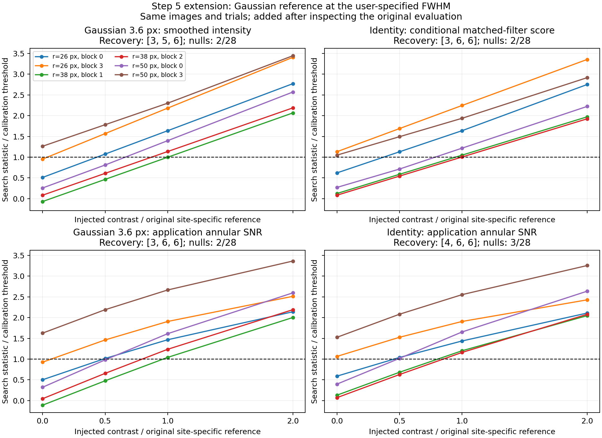

# Step 5 reference: Gaussian smoothing at FWHM 3.6 pixels

**The current experiment does not establish that the identity matched filter beats Gaussian smoothing.**
With the application's usual annular SNR normalization, `filter.lpfGaussFW=3.6` recovers the same number of
injections as the original identity statistic, with the same observed null-exceedance count.

This reference was requested after reviewing the [original evaluation](../p4-step5-evaluation-20260918/README.md).
The width is the user's fixed choice of one lambda/D, not a parameter selected from recovery results. These are
descriptive comparisons on the existing images, not a new blind experiment.

## Detection results

All rows use the original 28 eligible calibration searches, 28 eligible evaluation searches, and 18 full-image
positive injections. Each trial takes the maximum signed statistic over the same five native pixels. Each new
threshold is the maximum calibration score, following the original `ceil((n+1)*0.95)` rule, and is frozen before
processing positive images. Detection requires strict exceedance. The old four methods and thresholds are unchanged.

| Filter and detection statistic | 0.5× recovery | 1× recovery | 2× recovery | Evaluation null exceedances |
| --- | ---: | ---: | ---: | ---: |
| **Gaussian 3.6 px, application annular SNR** | **3/6** | **6/6** | **6/6** | **2/28** |
| Identity matched filter, original conditional score | 3/6 | 6/6 | 6/6 | 2/28 |
| Gaussian 3.6 px, smoothed intensity only | 3/6 | 5/6 | 6/6 | 2/28 |
| Identity matched filter, application annular SNR | 4/6 | 6/6 | 6/6 | 3/28 |
| Diagonal matched filter, original conditional score | 1/6 | 4/6 | 6/6 | 0/28 |
| Zero-mode PCA, original conditional score | 2/6 | 4/6 | 6/6 | 1/28 |
| Three-mode PCA, original conditional score | 2/6 | 5/6 | 6/6 | 1/28 |

Brightness multipliers retain the original **site-specific zero-mode PCA reference contrasts**. They are not
Gaussian SNRs or Gaussian threshold contrasts. Three levels reuse six sites in one correlated residual field.
All new references have finite support at every retained search pixel. Radius-20 trials remain excluded by the
original common-eligibility rule, even though the Gaussian filter itself does not need covariance training there.

The smoothing-only comparison gives identity one extra middle-brightness recovery. Conversely, putting both
filters through the application SNR path gives identity one extra faint recovery **and** one extra null exceedance.
Neither observation establishes a general matched-filter advantage. Equal observed null counts also do not imply
precisely known or equal underlying false-positive probabilities. In particular, the small calibration/evaluation
sets cannot settle fine differences in completeness.



Lines connect the measured brightnesses, with zero denoting the original baseline. The horizontal dashed line is
the method-specific frozen threshold. These curves compare threshold crossings, not the numerical units of the
different statistics. Some sites already exceed threshold before injection; they stay in the preassigned sample.

## What the references measure

**Gaussian smoothing only** calls the actual `hciAnalyze::filterCube()` implementation with high-pass FWHM zero and
low-pass FWHM 3.6, with no PSF response applied. The production kernel is 15×15 at this width; it renormalizes over
finite, in-bounds samples. Its smoothed intensity is the detection statistic. Its overall constant normalization
has no effect on threshold crossings, and no fitted noise scale is used. It is not a recovered contrast estimate.
The Gaussian calibration and evaluation input-footprint unions are disjoint, including the full 15×15 kernel and
five-pixel search. The Gaussian has a different footprint from the 11×11 processed-response template by design.

**Application Gaussian/SNR** uses the existing `hciAnalyze` executable with `filter.lpfGaussFW=3.6`, no PSF response,
and no high-pass filter. It subtracts the interpolated annular mean, divides by the interpolated annular standard
deviation, and applies the existing small-sample multiplier with `lambdaD=3.6`. The same calibration-null procedure
then sets its detection threshold; its SNR values are not assumed to be Gaussian significances.

**Application identity/SNR** supplies the original full response field to that same application, with Gaussian
filtering disabled, then uses the ordinary annular SNR output. The full field is needed to calculate annular
statistics; the original conditional experiment could use a sparse subset because its noise estimator reads the
unfiltered full image. Response values at trial locations are unchanged.

Both application-SNR controls mask the known planet with radius 7.3 and use the same 0–60-pixel annulus. They
retain the ordinary application's normalization behavior: **the calibration/evaluation neighborhoods are not
excluded from those annular statistics**, and injection images can change their own estimated mean/variance.
They therefore serve as practical pipeline references, not as the strictly held-out covariance estimator.
Gaussian and response filtering also have different full-field valid support for these annular statistics.
The smoothing-only reference makes this normalization distinction explicit.

## Implementation and verification

- Added [`hciGaussianReference.cpp`](../../../../benchmarks/hciGaussianReference.cpp), built with the optional CPU
  benchmarks. It exposes the existing production Gaussian filter and saves its output before SNR normalization;
  it does not change the filter, application defaults, or production APIs.
- Added [`run_p4_step5_gaussian.py`](../../scripts/run_p4_step5_gaussian.py), which freezes software and input
  fingerprints, processes the saved baseline and 18 positive images, and records commands, thresholds, and results.
- For **all 19 images**, applying the ordinary SNR path to the exported Gaussian image with smoothing disabled
  reproduces the direct `filter.lpfGaussFW=3.6` SNR map **bit for bit**.
- An independent FP64, mask-aware convolution agrees with every exported Gaussian image to a maximum error of
  **1.19e-6 of its peak absolute value**. The small difference reflects the production FP32 arithmetic.
- All original input and frozen software hashes remain unchanged. No full reduction was rerun.
- An independent audit recomputes all **168 new null searches and 54 new positive searches** from the saved FITS
  maps, reproduces the calibration thresholds, checks disjoint Gaussian calibration/evaluation footprints, and
  verifies that the helper refuses to overwrite an existing output. See [`verification.json`](verification.json).
- The helper builds, passes `clang-format`, and the Python runner passes syntax checking. All 15 directly called
  mxlib APIs have exact function records and 100% recorded executable-line coverage in the current LCOV report;
  [`mxlib_coverage.json`](mxlib_coverage.json) records that audit. No new ownership gap was found.

Artifacts: [`manifest.json`](manifest.json), [`thresholds.json`](thresholds.json), [`results.json`](results.json),
[`complete.json`](complete.json), and the figure above. Raw images, frozen software, commands, and logs are in
`working/roc/p4_noise_step5_gaussian_20260918/`.

To reproduce into new output/archive directories:

```sh
cmake -S . -B _build_fresh -DHCIREDUCE_BUILD_CPU_BENCHMARKS=ON
cmake --build _build_fresh --target hciGaussianReference -j2
MPLCONFIGDIR=/tmp/p4-step5-matplotlib python3 agents/plans/scripts/run_p4_step5_gaussian.py \
  --evaluation working/roc/p4_noise_step5_evaluation_20260918 \
  --helper _build_fresh/benchmarks/hciGaussianReference \
  --output /path/to/new/raw-directory --archive /path/to/new/report-directory
```

The Gaussian reference should remain in subsequent validation. Any claimed advantage from the response template
or covariance weighting needs a comparison against it at comparable false-positive rates, confirmed on fresh
held-out data after development choices are fixed.
