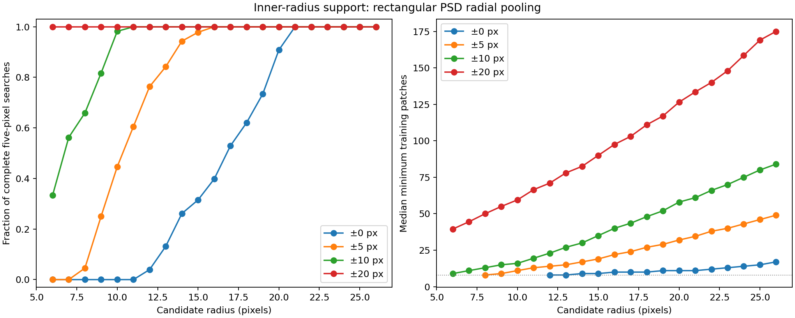

# Step 5: inner-radius rectangular-PSD coverage

## Question

The pooled rectangular PSD is now the method of interest. P4 is intended to be
useful at small angular separations, while the existing 90-injection study starts
at 26 pixels. This score-free audit asks whether extending the training-center
range beyond ±5 pixels makes the full five-pixel search trainable at smaller
radii. It measures geometry and PSD-fit validity; it does not measure recovery.

Use the saved full-study baseline, response templates, exact interpolation
stencils, minimum of eight accepted 11×11 patches, and the current sitewise
holdout: the known source, all 28 calibration search/kernel footprints, and the
candidate search/kernel footprint. Every candidate needs finite response and
science support at its center and four axial one-pixel search neighbors.

Compare rectangular PSD training-center half-widths 0, 5, 10, and 20 pixels,
using five-pixel radial steps and the fixed 0.3 flat-spectrum mixture. This is
the existing estimator; only the included center rings change. Nonpositive
center radii are skipped. Patch counts include overlapping angular and radial
samples and are not counts of independent observations.

## Coverage result



| Candidate radius | Candidate centers | Same radius | ±5 pixels | ±10 pixels | ±20 pixels |
| ---: | ---: | ---: | ---: | ---: | ---: |
| 6 | 36 | 0 | 0 | 12 | 36 |
| 8 | 44 | 0 | 2 | 29 | 44 |
| 10 | 56 | 0 | 25 | 55 | 56 |
| 12 | 76 | 3 | 58 | 76 | 76 |
| 14 | 88 | 23 | 83 | 88 | 88 |
| 16 | 108 | 43 | 108 | 108 | 108 |
| 20 | 120 | 109 | 120 | 120 | 120 |
| 24 | 160 | 160 | 160 | 160 | 160 |
| 26 | 156 | 156 | 156 | 156 | 156 |

Entries are complete five-pixel searches, not individual valid pixels. The full
6–26-pixel table and per-candidate support are in [coverage.json](coverage.json).

Extending the band clearly improves geometric coverage:

- ±20 pixels gives 100% coverage at every tested integer radius from 6 through
  26 pixels.
- ±10 pixels covers 12/36 candidates at radius 6, 29/44 at radius 8, 55/56 at
  radius 10, and every candidate from radius 11 outward.
- ±5 pixels covers only 2/44 candidates at radius 8, 25/56 at radius 10, and
  58/76 at radius 12. It first reaches complete coverage at radius 16.
- Same-radius training first reaches complete coverage at radius 21.

The median of the minimum five search-pixel sample counts at radius 8 is 13 for
±10 and 50 for ±20. At radius 12 it is 23 and 71. The much larger ±20 count may
improve estimation, but it also transfers covariance over a wider region; the
earlier outer-radius diagnostics found poorer split-weight stability as bands
widened. Coverage alone therefore does not select ±20.

## Frozen inner recovery grid

The audit selected six sites at each of radii **8, 12, 16, 20, and 24 pixels**.
Selection used geometry only: azimuths 45°–315° exclude the known-source sector,
both ±10 and ±20 searches must be complete, selected centers and previously
inspected centers must be at least four pixels apart, and a deterministic
maximin rule spreads the six sites. No baseline score, source measurement, or
recovery result entered selection.

All 30 selected center fits are valid for ±10 and ±20 rectangular PSD. Their
covariance condition numbers span 8.30–16.36 for ±10 and 7.44–14.77 for ±20.
The fixed 0.3 spectral floor makes positive definiteness unsurprising; these
checks also confirm finite real-data variance and the intended samples. The ±5
control has a complete search at 22/30 selected sites: none at radius 8, four of
six at radius 12, and all sites at radii 16–24. Invalid searches should remain
nondetections in a recovery study.

The natural next experiment is a frozen comparison of pooled rectangular PSD
at ±5, ±10, and ±20 on these 30 sites, with identity and Gaussian FWHM 3.6
references and a common production annular SNR. It should use the same three
brightness levels and freeze calibration thresholds before any positive-image
analysis. The inner thresholds need explicit validation because the existing
28 calibration sites lie at radii 26–50; output annular normalization does not
by itself prove threshold transfer to 8–24 pixels.

The subsequent full-study setup strengthens the planet exclusion and adds
radius 6. It therefore creates a new 36-site grid rather than executing this
earlier 30-site grid. See the
[inner recovery setup](../p4-step5-inner-recovery-setup-20260919/README.md)
for the final injection and calibration contract.

## Reproducibility

The maintained [audit script](../../scripts/audit_p4_step5_inner_rectangular.py)
records every candidate, five search-pixel count, selected site, center PSD fit,
input fingerprint, and selection rule. [Completion](complete.json) fingerprints
the JSON and plot. The result uses no new reduction and changes no production
C++ or mxlib-calling function.

Reproduce from the repository root into a new output directory:

```sh
OPENBLAS_NUM_THREADS=1 OMP_NUM_THREADS=1 MPLCONFIGDIR=/tmp/p4-step5-matplotlib \
  python3 agents/plans/scripts/audit_p4_step5_inner_rectangular.py \
  --study working/roc/p4_psd_full_20260918 --output /path/to/new/output
```
