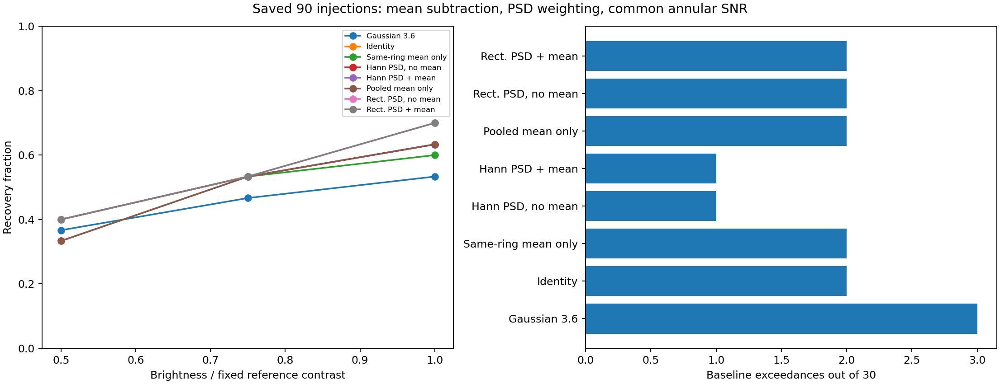

# Step 5: fitted mean, PSD weights, and common annular SNR

## Question and fixed comparison

This approved development comparison reuses the baseline and all 90 positive
injection reductions from [the full ROC study](../p4-step5-roc-full-20260918/README.md).
It separates the effects of subtracting a fitted background mean, weighting with
a PSD covariance, and changing the noise normalization. No new P4 reductions are
needed. The existing images have already been inspected; this is a controlled
comparison within the development sample.

The motivation includes the [known-planet measurement](../p4-step5-planet-20260919/README.md):
pooled isotropic filtering changes the matched-filter amplitude through its fitted
mean patch, while its scalar covariance cancels from the normalized weights. A
one-pixel shift of the planet peak is acceptable; aperture maxima and injection
recovery guide the comparison, with no method selection from one planet.

| Variant | Training support | Candidate mean subtraction | Covariance weights |
| --- | --- | --- | --- |
| Gaussian FWHM 3.6 | None | None | Gaussian kernel |
| Identity | None | None | Identity |
| Same-ring mean only | Same radius | Fitted mean patch | Identity |
| Hann PSD, no mean | Same radius | None | Hann PSD, mixing 0.1 |
| Hann PSD + mean | Same radius | Fitted mean patch | Hann PSD, mixing 0.1 |
| Pooled mean only | Offsets −5, 0, +5 pixels | Fitted mean patch | Identity |
| Rectangular PSD, no mean | Offsets −5, 0, +5 pixels | None | Rectangular PSD, mixing 0.3 |
| Rectangular PSD + mean | Offsets −5, 0, +5 pixels | Fitted mean patch | Rectangular PSD, mixing 0.3 |

For each PSD family, the same centered training patches estimate the covariance
in both mean settings. Only subtraction from the candidate changes:

\[
 w=\frac{C^{-1}t}{t^T C^{-1}t},\qquad
 \hat a_{\rm off}=w^T d,\qquad
 \hat a_{\rm on}=w^T(d-\mu).
\]

The corresponding mean-only control is
$\hat a_{\rm mean}=t^T(d-\mu)/(t^Tt)$, using exactly the same fitted mean and
training support as that PSD family. Consequently, within-family comparisons
isolate mean subtraction and PSD weighting. The two families also differ in
window, mixing, and radial support, so their difference does not isolate pooling.

## Calibration and normalization

All eight amplitude images receive the production `hciAnalyze` annular SNR:
one-pixel radial mean/sample-standard-deviation profiles, linear interpolation,
and the existing small-sample correction with lambda/D = 3.6. Search locations,
30 sites, three brightness levels, five native search pixels, 28 calibration
locations, response templates, and covariance masks match the parent study.
Every site/method threshold is the maximum of its 28 baseline calibration search
scores; all 240 thresholds are frozen before the positive phase. Exceedance is
strict. A search needs all five valid pixels, and an invalid search is a
nondetection.

The annular normalization also retains the parent injection study's mask:
known-source radius 7.3 plus the production half-pixel buffer, output radii 0–60.
Calibration and trial neighborhoods remain in these radial noise profiles.
Covariance training instead excludes the known source, all calibration kernel
footprints, the current trial's kernel footprint, and the candidate patch. These
different masks are inherited conventions. Thresholds transfer between baseline
and positives, but positive images estimate their own annular profiles as before.

To reduce work, each task computes **every pixel in the complete radial bins**
needed to interpolate at its searched pixels. Baseline tasks cover calibration
and trial searches; positive tasks cover their trial searches. Other pixels are
NaN in saved amplitude maps. The native CLI's display aperture is set to 60 only
to avoid an empty known-planet aperture in these sparse maps; that option does
not affect SNR map creation. The experiment's searches remain center plus the
four axial one-pixel neighbors. These settings differ from the separate planet
measurement's larger aperture and source mask.

## Execution and checks

Maintained driver: [compare_p4_step5_mean_snr.py](../../scripts/compare_p4_step5_mean_snr.py).
Run directory on ROC (`exao5`):
`working/roc/p4_mean_snr_step5_20260919`.
The isolated software directory uses 12 processes on separate physical CPUs,
with one numerical thread per process. Source images, response files, parent
measurements, native binary/dependencies, scripts, and protocol are fingerprinted.

[Setup checks](setup_checks.json), reproduced by [setup_check.py](setup_check.py),
passed before launch: 630 training matrices exactly equal the original extraction,
30 protected stamps leave training unchanged, 210 injected unit-response checks,
and 60 independent generic PSD solves. The driver additionally compares archived
candidate fits, reconstructs production annular SNR independently, and requires
all Gaussian/identity search decisions to reproduce the original study.

## Completed results

The full analysis completed on ROC in **72.8 seconds**, using the saved baseline
and all 90 positive images. Every primary search is valid. All 240 thresholds
were frozen before positive analysis, and all Gaussian/identity decisions match
the parent study.

| Method, all with annular SNR | 0.5× recovery /30 | 0.75× recovery /30 | 1× recovery /30 | Baseline exceedances /30 |
| --- | --- | --- | --- | --- |
| Gaussian FWHM 3.6 | 11 | 14 | 16 | 3 |
| Identity | 12 | 16 | 19 | 2 |
| Same-ring mean only | 10 | 16 | 18 | 2 |
| Hann PSD, no mean | 12 | 16 | 19 | 1 |
| Hann PSD + mean | 12 | 16 | 19 | 1 |
| Pooled mean only | 10 | 16 | 19 | 2 |
| Rectangular PSD, no mean | 12 | 16 | 21 | 2 |
| Rectangular PSD + mean | 12 | 16 | 21 | 2 |

Mean-on/off curves overlap exactly in this plot. Identity also shares Hann's
recovery counts, although one faint detection differs in each direction.

### What this isolates

**Mean subtraction flips no detection decisions**, including all 90 positives
and 30 nulls, within either PSD family. It does change the amplitude and SNR:
mean absolute positive-search SNR changes are 0.038 for Hann and 0.024 for
rectangular PSD (maxima 0.123 and 0.069). Thus the equality is in decisions at
these frozen thresholds, not in the filtered images. Mean-only identity does
not improve recovery over original identity in this sample.

**PSD weighting retains a modest advantage over its mean-only controls.** Hann
adds 2/0/1 recoveries across the three levels, and rectangular PSD adds 2/0/2;
neither loses a detection to its matching mean-only control. Relative to
original identity, both PSD families gain one and lose one faint detection;
rectangular PSD additionally gains two at 1×. The observed rectangular/identity
null counts are both 2/30, but this does not establish equal underlying
false-positive rates.

**The earlier Hann recovery advantage depends on score normalization.** Its
same mean-subtracted amplitude estimates produce different outcomes with the
original conditional score and the common annular SNR:

| Fixed PSD amplitude | Original conditional recovery, 0.5× / 0.75× / 1× | Common annular recovery | Conditional nulls /30 | Annular nulls /30 |
| --- | --- | --- | --- | --- |
| Hann + mean | 14 / 16 / 20 | 12 / 16 / 19 | 3 | 1 |
| Rectangular + mean | 13 / 16 / 21 | 12 / 16 / 21 | 6 | 2 |

Annular normalization trades some recovery for fewer observed null exceedances.
The original Hann advantage was therefore not solely an amplitude-weighting
effect. This comparison does not establish that either normalization is better
at a common false-positive rate. It also does not isolate radial pooling from
the other differences between the two PSD families.

### Raw photometry

These are signed center-amplitude errors relative to the injected contrast,
including residual background. They are separate from aperture-max detection
scores and are not baseline-subtracted paired increments. Gaussian amplitude
has a different normalization and is omitted from this contrast table.

| Matched filter | Median fractional error | Fractional RMS error |
| --- | --- | --- |
| Identity | +2.1% | 78.7% |
| Same-ring mean only | +5.2% | 78.6% |
| Hann PSD, no mean | +2.8% | 77.5% |
| Hann PSD + mean | +7.8% | 77.4% |
| Pooled mean only | +1.4% | 78.9% |
| Rectangular PSD, no mean | +4.9% | 78.0% |
| Rectangular PSD + mean | +5.3% | 78.1% |

Mean subtraction has little effect on pooled RMS error and does not consistently
improve raw photometry here. Per-level summaries and paired site decisions are
in [results.json](results.json); [derived comparisons](derived_comparisons.json)
include mean-toggle score differences, radius totals, and photometry.

## Completion verification and artifacts

The driver performed 565,896 valid PSD fits and 38,400 comparisons to archived
candidate-fit scalars; the largest absolute scalar difference is 2.66e-15.
Its independent annular oracle exactly reproduces all finite computed SNRs.
[Remote verification](remote_review.json) checks 1,593 distinct fingerprints and
all 120 task receipts. The run finished at 2026-09-19 16:10:36 UTC.

[Local reconstruction](review.json), reproduced by [review.py](review.py),
checks all 120 task products, 7,680 method/search combinations, 38,400 SNR pixels,
9,568 annular profile entries, 240 thresholds, 960 detection decisions, and
9,600 mean-toggle pixel identities. The searched SNRs are exactly equal to the
independent reconstruction. It also verifies all paired gain/loss lists and raw
photometry summaries. Local verification covers 1,564 distinct fingerprints;
the absent native binaries/libraries were checked on ROC and are explicitly
listed in the local receipt.

The tracked report preserves [protocol](protocol.json), [manifest](manifest.json),
[launch receipt](launch.json), [thresholds](thresholds.json),
[calibration completion](calibration_complete.json), results, plot, and checks.
All amplitude/SNR FITS cubes, per-task profiles, measurements, commands, and logs
are mirrored in the run directory on mx11 and ROC. The 24.2 MB
`completed-analysis.tar.gz` has a verified [archive fingerprint](archive.json).
NaNs outside the required annuli in those maps are intentional.

## Interpretation and follow-up

This test finds no detection benefit from candidate mean subtraction within the
fixed PSD methods. The evidence for covariance weighting over ordinary matched
filtering is smaller after applying common SNR: rectangular PSD retains two
extra bright recoveries, and Hann has the same recovery counts with one fewer
null exceedance. These small differences in one correlated, previously inspected
field do not set a production default.

The next useful validation is threshold transfer to independent noise support
or another field, retaining Gaussian and identity references and frozen PSD
settings. A larger held-out null sample would allow comparison at a common
empirical false-positive rate. The inner-radius support issue from the known
planet remains separate; no conclusion here extends below the 26-pixel injection
sample. No production C++ or mxlib-calling functions changed.
