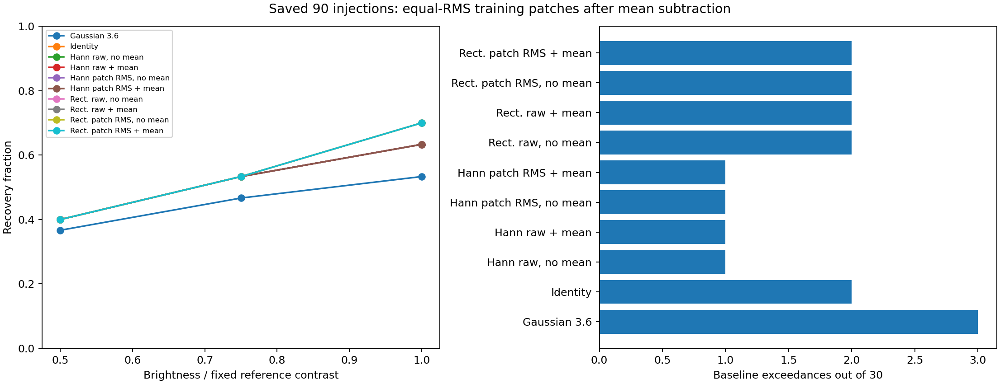

# Step 5: per-patch RMS normalization after mean subtraction

## Documentation audit and question

The user requested confirmation that recent work was documented, then a test of
per-patch normalization after mean subtraction. The full ROC study, known-planet
SNR comparison, and common-annular-SNR/mean comparison already had reports,
protocols, results, and verification receipts. Commit `5d70709` fills the remaining
gap by recording the [pooling and normalization-order discussion](../p4-step5-mean-snr-20260919/README.md#follow-up-discussion-what-is-pooled-and-when-normalization-happens)
in that report and the main plan. Recent report links were checked.

For this experiment, per-patch normalization means dividing each **training
residual patch by its own RMS after subtracting the raw ensemble mean patch**.
This differs from the earlier global radial scaling before patch extraction.
It also differs from removing a separate scalar spatial mean from each patch.
The order and scale below are fixed before measuring the new results.

## Fixed estimator

For N raw, aligned training patches x_j of p = 121 pixels, compute

\[
\mu=\frac1N\sum_j x_j,\qquad r_j=x_j-\mu,\qquad
s_j=\sqrt{\frac1p\sum_a r_{j,a}^2},\qquad z_j=\frac{r_j}{s_j}.
\]

Average the windowed, 21×21 zero-padded Fourier powers of z_j. Normalization is
performed before applying the rectangular or Hann window. No second ensemble
centering is performed: the mean of z_j need not be zero after unequal scaling.
No additional spatial scalar mean is removed. For a rectangular window, this
makes each residual patch's total contribution to the periodogram equal; the
Hann window subsequently changes power according to its spatial distribution.

Rescale the mean spectrum to the original raw mean pixel variance,

\[
\bar v=\frac{\sum_j\lVert r_j\rVert^2}{(N-1)p},\qquad
P_\beta=(1-\beta)P+\beta\bar v.
\]

Thus the experiment changes the relative contributions of training patches while
keeping the original physical variance scale, spectral mixture, padding, and
finite 121×121 lag-covariance construction. The raw ensemble mean mu remains the
candidate's fitted background in both raw and normalized fits. The numerical
zero guard invalidates a normalized fit if any RMS is nonfinite or at most
`16 * float64 epsilon * max(abs(raw training samples))`. No patch is discarded
and no mean is refitted to bypass this guard.

Candidate data d and response t retain their original units. The amplitude
weights are w = C^-1 t / (t^T C^-1 t). As in the preceding test, evaluate both
w^T d and w^T(d−mu), using identical weights within that mean toggle. Candidate
RMS is never estimated for training normalization. This preserves the unit
source response and avoids changing weights in response to candidate flux.
All amplitude maps receive the unchanged production annular SNR.

## Fixed comparison and execution

Ten variants: Gaussian FWHM 3.6, identity, and raw/per-patch-RMS PSD estimates for
each of the two existing families, each with candidate mean subtraction on/off.
The families remain same-ring Hann/mixing 0.1 and ±5-pixel rectangular/mixing 0.3.
All use the saved 30 sites and 90 positive images from the full ROC study. The
11×11 patches, five-pixel sampling/search geometry, response templates, training
exclusions, source mask, and annular normalization are unchanged. There are no
new P4 reductions and no changes to production code.

Baseline calibration uses the same 28 search locations per site. All 300
site/method maximum-calibration thresholds are frozen before positive analysis;
detection requires strict exceedance and all five valid search pixels. Source
and calibration footprints remain excluded from covariance training. Output
annular SNR retains the known-source exclusion only, including the historical
trial-neighborhood contribution to its noise profile. Sparse maps contain every
pixel in all radial bins needed for search interpolation, as in the prior run.
The production CLI display aperture of 60 does not change the five-pixel search.

The maintained [driver](../../scripts/compare_p4_step5_patch_rms.py) runs in the
isolated `working/roc/p4_patch_rms_step5_20260919` directory on ROC (`exao5`), with
12 physical-core workers and one numerical thread each. It reproduces the
entire saved raw-control amplitude/SNR maps and their summaries/decisions,
checks original candidate fits, and compares its SNR maps with an independent
annular oracle. Inputs, dependencies, source code, and protocol are fingerprinted.

## Setup verification

[setup_check.py](setup_check.py) compares the new covariance to explicit linear
pixel-lag sums without Fourier transforms, and uses generic matrix solves for
source amplitudes. It checks protected training support and injected unit
response at all 30 sites. Synthetic checks cover equal-RMS equivalence to the
raw estimator, invariance of normalized covariance shape to paired residual
amplitude changes, physical-unit scaling, the isotropic endpoint, and invalid
or numerically zero training residuals. The [receipt](setup_checks.json) records
counts, errors, and driver/source fingerprints.

## Results

The full comparison finished in **112.3 seconds** on ROC, at 2026-09-19 16:42:50
UTC. All searches were valid. Every individual positive and null detection is
unchanged by per-patch RMS normalization within its matching PSD family and
candidate-mean setting. Candidate mean subtraction itself also flips no decisions.

Each PSD row below applies to both candidate-mean settings; the ten individual
variants are preserved in [results.md](results.md) and [results.json](results.json).

| Method with common annular SNR | 0.5× recovery /30 | 0.75× recovery /30 | 1× recovery /30 | Null exceedances /30 |
| --- | --- | --- | --- | --- |
| Gaussian FWHM 3.6 | 11 | 14 | 16 | 3 |
| Identity | 12 | 16 | 19 | 2 |
| Same-ring Hann, raw patches | 12 | 16 | 19 | 1 |
| Same-ring Hann, post-mean patch RMS | 12 | 16 | 19 | 1 |
| Pooled rectangular, raw patches | 12 | 16 | 21 | 2 |
| Pooled rectangular, post-mean patch RMS | 12 | 16 | 21 | 2 |

The overlapping curves reflect identical recovery counts. Inspection of the
paired site lists confirms this is also equality of individual decisions within
each raw/normalized comparison, rather than offsetting gains and losses.

### Changes beneath the detection counts

The new estimator changes amplitudes and SNRs. With candidate mean subtraction,
mean absolute changes in positive-search SNR are **0.0234 for Hann** and **0.0170
for rectangular PSD**; maxima are 0.1166 and 0.0591. Without candidate mean
subtraction the corresponding means are 0.0237 and 0.0163. Each variant still
uses its own separately frozen calibration threshold.

The training patches did have unequal RMS: across positive search pixels, the
median ratio of largest to smallest training-patch RMS was 1.58 for same-ring
Hann and 1.77 for pooled rectangular, with maxima 1.87 and 2.27. Normalization
therefore changes their relative power contributions. These ratios describe
correlated, overlapping training sets and are not independent measurements.

Native-center photometry includes residual background, with signed fractional
error measured amplitude / injected contrast − 1. The figures below pool all 90
positives and do not use baseline-subtracted increments.

| PSD family / candidate mean subtraction | Median error, raw → patch RMS | Fractional RMS error, raw → patch RMS |
| --- | --- | --- |
| Same-ring Hann / off | +2.84% → +2.37% | 0.77499 → 0.77825 |
| Same-ring Hann / on | +7.84% → +7.10% | 0.77350 → 0.77704 |
| Pooled rectangular / off | +4.92% → +5.08% | 0.78000 → 0.77851 |
| Pooled rectangular / on | +5.26% → +5.11% | 0.78088 → 0.77980 |

The small RMS changes are mixed: slightly worse for Hann, slightly better for
rectangular. The experiment finds no detection improvement at these fixed
settings. It does not establish that the two procedures are generally equivalent.
All per-level statistics, paired decisions, radial totals, and score-change
summaries are archived in [derived comparisons](derived_comparisons.json).

## Completion verification and reproducibility

- Setup: 60 direct-lag covariance comparisons (maximum difference / variance
  4.42e-16), 60 generic solves, 90 protected training-matrix checks, 270 unit-source
  increments, and 16 synthetic identities. These checks passed before launch.
- Driver: 1,131,792 valid raw/normalized PSD fits, with 33,600 original candidate
  scalar checks differing by at most 2.66e-15. Its independent annular oracle
  reproduces all finite computed SNRs exactly.
- [Local reconstruction](review.json), reproduced by [review.py](review.py):
  9,600 searches, **48,000 SNR pixels exactly reproduced**, 11,960 profile entries,
  300 thresholds, 1,200 decisions, and 19,200 mean-toggle pixel identities.
  All 1,440 raw-control amplitude/SNR planes are **bitwise identical** to the
  earlier run, including NaN support. Direct lag sums and generic matrix solves
  additionally verify 240 normalized baseline/positive center fits; the largest
  amplitude difference is 7.05e-19.
- [Remote verification](remote_review.json): all 120 task receipts and 2,439
  distinct fingerprints pass. Calibration completion precedes every positive
  amplitude product. Local checks verify 2,410 distinct fingerprints; the
  remote-only native dependencies are explicitly listed in the local receipt.

The report tracks [protocol](protocol.json), [manifest](manifest.json),
[launch](launch.json), [calibration receipt](calibration_complete.json),
[thresholds](thresholds.json), [completion](complete.json), results, plot, and
verification. Every per-task amplitude/SNR FITS cube, radial profile, measurement,
command, and log is mirrored under the run directory on mx11 and ROC. The 31.3 MB
`completed-analysis.tar.gz` has a verified [fingerprint](archive.json). Sparse
map NaNs outside required radial bins are intentional. The comparison figure
was visually inspected. No production C++ or mxlib-calling function changed.

## Scope of the result

This test applies to normalization by each residual patch's own RMS after the
existing **ensemble mean-patch subtraction**, before the spectral window. It
keeps the candidate mean and overall covariance variance scale fixed. It does
not test subtraction of each patch's spatial scalar mean, nor application of
an external radial sigma profile after mean subtraction.

There is no evidence here for adding the RMS normalization to the existing
same-ring Hann or ±5-pixel rectangular method. Its effect with wider radial
pooling or at inner radii remains untested. Independent noise support and
threshold-transfer validation are still needed; these are the same inspected,
correlated images and no production default is selected.
