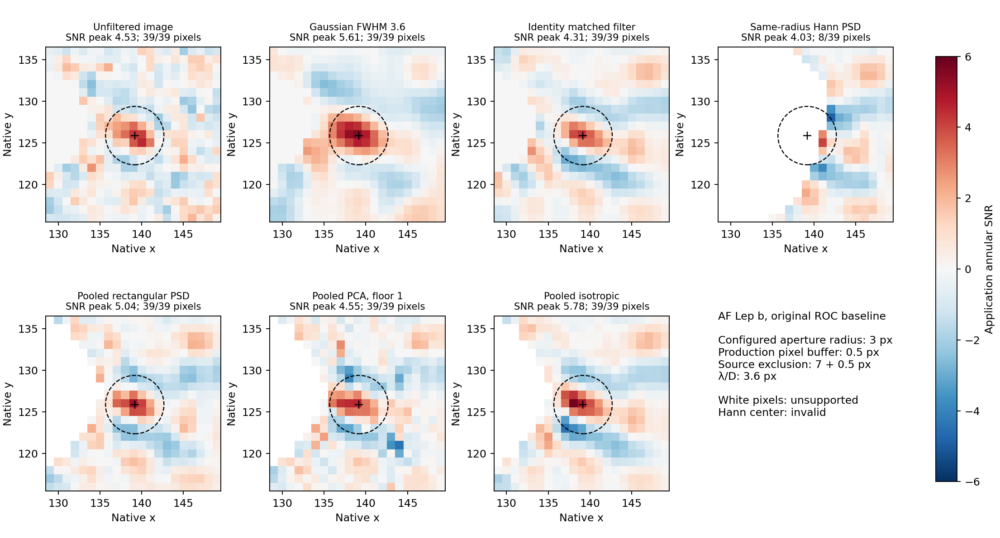

# Step 5: SNR of AF Lep b

**Using `working/analyze.conf`, Gaussian smoothing gives annular SNR 5.61 at the planet, versus 5.04 for
pooled rectangular PSD and 4.31 for identity matched filtering.** The fitted-mean isotropic method has the
highest aperture maximum, 5.78, one pixel left of the nearest planet pixel; its center value is 4.93.
Same-radius Hann cannot provide a valid center measurement with the fixed eight-patch minimum.

This uses the original, uninjected baseline from the [completed full ROC study](../p4-step5-roc-full-20260918/README.md).
No reduction, injection, filter-parameter tuning, or production-code change was needed.

## Common annular SNR

Every row uses production `hciAnalyze` to measure the **filtered amplitude image**, with the same configuration.
The center is the nearest native pixel `(139,126)`. The aperture maximum is the quantity printed by the CLI;
it is a peak search, not an aperture-summed flux. Coordinates below are zero-based `(x,y)`.

| Filter | SNR at center | Aperture maximum | Peak pixel | Valid aperture pixels |
| --- | --- | --- | --- | --- |
| Unfiltered image | 4.27 | 4.53 | (140,125) | 39/39 |
| Gaussian FWHM 3.6 | **5.61** | **5.61** | (139,126) | 39/39 |
| Identity matched filter | 4.31 | 4.31 | (139,126) | 39/39 |
| Same-radius Hann PSD, mixture 0.1 | **Invalid** | 4.03† | (141,125) | **8/39** |
| ±5-pixel rectangular PSD, mixture 0.3 | 5.04 | 5.04 | (139,126) | 39/39 |
| ±5-pixel PCA, three modes / floor 1 | 4.55 | 4.55 | (139,126) | 39/39 |
| ±5-pixel fitted-mean isotropic | 4.93 | **5.78** | (138,126) | 39/39 |

† Hann's 4.03 is only the maximum of its eight supported aperture pixels. Its center is unsupported and
31 aperture pixels are invalid, so this value is a partial-aperture diagnostic rather than a comparable
planet SNR. No missing pixels were filled with another filter or a relaxed covariance estimate.



The isotropic filter's larger peak occurs at a different native pixel. At the fixed center, Gaussian is strongest.
Isotropic weighting cancels out of the unit-response amplitude normalization; its difference from original
identity comes from subtracting the fitted training mean. Both then receive the same annular-SNR procedure.
The single known planet does not establish a completeness or false-positive advantage for either method.

The eight study statistics map to six distinct filtered images: `gaussian_raw` and `gaussian_snr` share the
Gaussian image, while `identity` and `identity_snr` share the identity amplitude image. Once a common
annular SNR is requested, each pair gives one row above. The unfiltered image is an additional reference.

## Configuration and masks

The supplied [configuration](analyze.conf) was copied without modification:

- `lambdaD=3.6` pixels;
- `planet.sep=11.782`, `planet.PA=262.051`, `planet.R=7`;
- `snr.minRad=6`, with maximum radius 60 resolved from the FITS header;
- `snr.apertureR=3`.

The configured planet coordinates map to `(139.1687927,125.8706512)`, approximately 0.21 pixel from the
nearest native center. Production `maskCircle` includes its default **0.5-pixel buffer**: the aperture selects
pixel centers within 3.5 pixels, giving 39 pixels, and annular noise estimation excludes centers within
7.5 pixels of the planet. These are the application's existing semantics; the configuration values stay 3 and 7.

Annular SNR subtracts a radial mean and divides by radial standard deviation, estimated from finite filtered
pixels outside the source exclusion. Means and sample standard deviations use one-pixel radial bins and
linear interpolation. The application then applies its existing circumference-based small-sample multiplier.
These SNR values are not independently calibrated Gaussian false-alarm significances.

The four covariance filters retain the full study's 11×11 untapered data/response stamps, five-pixel sampling
steps, eight-training-patch minimum, and fixed window/mixing/floor choices. Their training mask retains all
28 original calibration footprints and protects the **entire configured planet search footprint**: the union
of 15×15 Gaussian kernels centered on its 39 aperture pixels, plus the source circle. This extends the
earlier five-pixel-search holdout to the user's larger aperture. The annular-SNR estimator separately uses
the application's ordinary finite-pixel/source-circle mask, so calibration pixels may enter its radial profile.

At the planet center the accepted training counts are **1, 5, and 11** at radial offsets −5, 0, and +5 pixels.
Thus same-radius Hann has only **five patches**, below eight; pooling gives **17 patches**. Across the full
aperture, the pooled models have 9–29 patches and are valid everywhere. Hann's eight valid pixels have
8–9 patches. The preliminary seven-patch count used the old, smaller search footprint; the final five-patch
count protects the complete configured aperture. The minimum was not changed after inspecting scores.

## Conditional covariance scores are separate

The covariance-predicted center score is fitted amplitude divided by its conditional sigma. It differs from
the common annular SNR above, which estimates noise from the output amplitude map.

| Covariance method | Conditional center score | Annular center SNR |
| --- | --- | --- |
| Same-radius Hann PSD | Invalid | Invalid |
| ±5-pixel rectangular PSD | 6.40 | 5.04 |
| ±5-pixel PCA | 14.49 | 4.55 |
| ±5-pixel isotropic | 10.71 | 4.93 |

The large PCA/isotropic conditional scores do not imply stronger detections than Gaussian. Their local
covariance normalization is different and was not calibrated at this separation. Original identity's algebraic
`C=I` score is 3.74, but has no fitted physical noise scale and is not reported as an additional SNR method.

AF Lep b lies at 11.8 pixels, substantially inside the 26–50-pixel injection sample. This source inspection
therefore does not contradict the outer-site recovery comparison. No outer-site detection thresholds are
applied here, and no inner-radius completeness claim is made.

## Verification and artifacts

- Independent one-pixel annular means/stddevs, interpolation, source masking, and small-sample corrections
  reproduce all **242 valid aperture-pixel SNR values exactly** in the exported float maps.
- All seven CLI aperture maxima match direct reads from their FITS maps.
- Gaussian and identity maps passed through annular analysis reproduce the **direct production filtering
  paths bitwise** across their entire SNR maps.
- Generic dense covariance solves verify all **125 valid covariance fits** inside the aperture.
- The source frames/products, supplied configuration, analysis scripts, frozen executable and libraries
  retain their recorded hashes. The frozen local `hciAnalyze.cpp` matches current production source.
- The comparison figure was visually inspected; Python syntax and whitespace checks pass. No mxlib-calling
  function was edited, so no new mxlib coverage ownership follow-up is needed.

[`results.json`](results.json) retains every aperture pixel's amplitude, conditional sigma/score, training
support, native center, and peak. [`annular_profiles.json`](annular_profiles.json) preserves radial means,
standard deviations, and valid-pixel counts for every map. [`settings.json`](settings.json),
[`manifest.json`](manifest.json), [`complete.json`](complete.json), [`verification.json`](verification.json), and
[`training_exclusion.fits`](training_exclusion.fits) preserve geometry, provenance, and validation.

Full amplitude, conditional-score, sigma, sample-count, and SNR FITS maps, commands, and CLI logs are in:

```text
working/roc/p4_planet_step5_20260919
```

Reproduce from the repository root into a new directory with the maintained
[`measure_p4_step5_planet.py`](../../scripts/measure_p4_step5_planet.py):

```sh
OPENBLAS_NUM_THREADS=1 OMP_NUM_THREADS=2 MPLCONFIGDIR=/tmp/p4-step5-matplotlib \
  taskset -c 12,13 python3 agents/plans/scripts/measure_p4_step5_planet.py \
  --study working/roc/p4_psd_full_20260918 \
  --config working/analyze.conf \
  --output /path/to/new/planet-comparison
```
