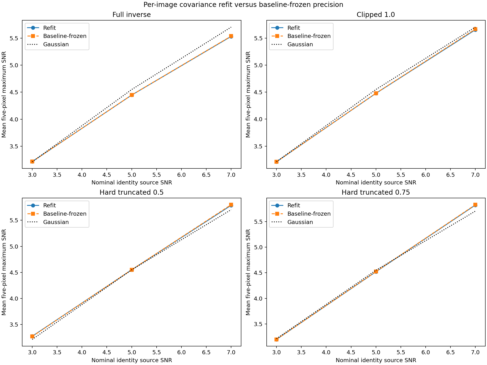

# Step 5: P4 precision-closure setup

## Questions fixed before the comparison

This closure study addresses three remaining questions from the completed
rectangular-PSD precision experiment:

1. Do the inner-radius gains persist when the covariance, fitted mean, and
   matched-filter weight are learned only from the uninjected baseline?
2. How sensitive are the maximum-null thresholds and recovery counts to the
   available common-support calibration locations?
3. What SNR do the selected policies measure for the known planet under
   `working/analyze.conf`?

The study reuses the completed 36 sites, 108 saved positive images, response
field, source masks, one-lambda/D trial exclusion, and production annular SNR.
It performs **no new P4 reduction**.

## Baseline-frozen covariance replay

Four raw rectangular ±20 PSD precision policies are fixed:

- the full inverse;
- eigenvalue clipping at 1.0 times the mean covariance variance;
- hard truncation below 0.5 times the mean covariance variance;
- hard truncation below 0.75 times the mean covariance variance as the
  aggressive diagnostic.

For each injection site and every candidate pixel needed by its five-pixel
search and annular normalization, the runner fits the PSD covariance and mean
once on the **uninjected baseline** using the same trial-specific training
exclusion as the completed comparison. It forms each unit-response weight
once, then applies that unchanged weight and baseline mean to the three saved
positive images at that site.

The paired control copies the completed maps that refit covariance separately
on each positive image. The frozen and refit members of each policy have
identical baseline maps by construction and therefore share the completed
maximum-null threshold. The runner independently recomputes every frozen
baseline amplitude and requires agreement with the completed parent map.

Identity with the 1.8-pixel response low pass and production Gaussian FWHM 3.6
remain copied references. They are not changed by covariance freezing.

This design isolates positive-image covariance adaptation. Any frozen-versus-
refit difference can come from changes in the covariance estimate or fitted
mean caused by the positive reduction. The injected source and P4 reduction
itself remain unchanged.

## Common-support threshold audit

For every nominal radius, all calibration trials inside the completed parent's
frozen radial band that are valid for all four precision policies form a paired
common-support set. Their expected counts are 20, 36, 24, 20, 20, and 20 at
radii 6, 8, 12, 16, 20, and 24 pixels.

The audit records each policy's median, upper-tail quantiles, second-largest
score, maximum, and gap between the two largest scores. It then makes 10,000
deterministic paired draws of 20 locations without replacement and reports the
resulting threshold, recovery-count, and held-out-null distributions for both
the refit and frozen positive maps. The random seed is `20260920`.

Only radii 8 and 12 have more than 20 common candidates, so only those radii
can vary under this fixed-band subset audit. Radius 6 and radii 16–24 explicitly
retain a single possible 20-location set. The audit diagnoses calibration-pool
sensitivity; it does not create independent null samples or justify a formal
false-alarm probability.

## Known-planet endpoint

The known planet is measured with the four precision policies, smoothed
identity, and Gaussian FWHM 3.6. The runner follows `working/analyze.conf`:

- lambda/D: 3.6 pixels;
- planet exclusion radius: 7 pixels plus the production half-pixel boundary;
- SNR minimum radius: 6 pixels;
- search aperture radius: 3 pixels;
- production annular mean subtraction and small-sample correction.

The precision maps cover every complete annulus required by all 39 native
pixels in the planet aperture. Covariance training excludes the known-source
circle and the 15-by-15 footprints of all aperture pixels. This is deliberately
conservative and matches the earlier planet diagnostic's treatment of source
contamination. The production `hciAnalyze` maps must agree with an independent
annular oracle.

Planet SNR is a descriptive endpoint only. It is not compared with the
injection thresholds and cannot select a method from one source.

## Validation completed before launch

The setup passed:

- local precision algebra and deterministic subset-sampling checks;
- Python compilation and strict-JSON summary generation;
- immutable preparation against the completed ROC parent, verifying 3,597
  frozen inputs;
- an end-to-end radius-6 site replay covering all three source levels;
- planet geometry with 604 fitted map pixels, 39/39 supported aperture pixels,
  and at least 55 covariance-training patches;
- an end-to-end planet `hciAnalyze` run and independent annular-oracle check.

## ROC commands

After pulling the setup commit, run the algebra check:

```sh
OPENBLAS_NUM_THREADS=1 OMP_NUM_THREADS=1 MKL_NUM_THREADS=1 \
  MPLCONFIGDIR=/tmp/p4-step5-matplotlib \
  /opt/conda/envs/xpy3_13/bin/python3 \
  agents/plans/scripts/run_p4_step5_precision_closure.py check
```

Prepare the immutable closure study:

```sh
OPENBLAS_NUM_THREADS=1 OMP_NUM_THREADS=1 MKL_NUM_THREADS=1 \
  MPLCONFIGDIR=/tmp/p4-step5-matplotlib \
  /opt/conda/envs/xpy3_13/bin/python3 \
  agents/plans/scripts/run_p4_step5_precision_closure.py prepare \
  --parent working/roc/p4_psd_precision_20260920 \
  --config working/analyze.conf \
  --root working/roc/p4_precision_closure_20260920 \
  --cpus 0 1 2 3 4 5 6 7 8 9 10 11
```

Launch the resumable replay:

```sh
tmux new-session -d -s p4-precision-closure \
  "cd /home/jrmales/Source/mxApps/hciReduce && \
   OPENBLAS_NUM_THREADS=1 OMP_NUM_THREADS=1 MKL_NUM_THREADS=1 \
   MPLCONFIGDIR=/tmp/p4-step5-matplotlib \
   /opt/conda/envs/xpy3_13/bin/python3 \
   agents/plans/scripts/run_p4_step5_precision_closure.py run \
   --root working/roc/p4_precision_closure_20260920 \
   > working/roc/p4_precision_closure_20260920/driver.log 2>&1"
```

Monitor it with:

```sh
cat working/roc/p4_precision_closure_20260920/state.json
tail -n 30 working/roc/p4_precision_closure_20260920/driver.log
```

The final ROC products include `results.json`, `results.md`, and
`comparison.png`, plus the planet amplitude/SNR maps and their
independent-oracle diagnostics.

## Completed ROC result (2026-09-20)

The run completed all 36 baseline-frozen sites and 108 positive analyses with
no new P4 reductions. All frozen inputs remained unchanged. Copied parent SNR
maps and the independent annular oracle agree exactly with their references;
the largest difference between a recomputed frozen-baseline amplitude and its
parent map is $4.64\times10^{-10}$.

### Covariance adaptation

The refit and baseline-frozen results are nearly identical:

| Precision policy | Refit recovery at SNR 3/5/7 | Frozen recovery at SNR 3/5/7 | Refit mean max SNR at 3/5/7 | Frozen mean max SNR at 3/5/7 | Nulls |
| --- | --- | --- | --- | --- | ---: |
| Full inverse | 19/33/34 | 19/33/34 | 3.216/4.447/5.532 | 3.216/4.448/5.537 | 0 |
| Clipped at 1.0 | 23/34/34 | 23/34/34 | 3.210/4.478/5.655 | 3.210/4.480/5.666 | 0 |
| Hard truncated at 0.5 | 21/33/34 | 21/33/34 | 3.273/4.549/5.788 | 3.269/4.551/5.800 | 0 |
| Hard truncated at 0.75 | 25/34/35 | 25/35/35 | 3.198/4.519/5.821 | 3.198/4.522/5.829 | 1 |

The largest absolute radius-and-level mean maximum-SNR change is 0.051. The
largest throughput change is 0.00194, or about 0.2 percent for a unit response.
No conservative-policy detection changes. The only changed decision is one
additional middle-level detection for the aggressive 0.75 truncation at
radius 8. The previously measured precision gains therefore do not come from
allowing the injected source to alter the covariance estimate or fitted mean.

The unchanged references recover 25/35/35 for identity with the 1.8-pixel
response low pass and 20/34/36 for Gaussian FWHM 3.6. Their held-out-null
counts are zero and one, respectively.

### Threshold sensitivity

The following entries are the 5th percentile / median / 95th percentile over
10,000 paired common-support draws. Detection counts are aggregated over all
36 sites. Only the radius-8 and radius-12 thresholds vary between draws.

| Policy and image fitting | SNR-3 detections | SNR-5 detections | SNR-7 detections | Held-out nulls |
| --- | --- | --- | --- | --- |
| Full, refit | 19/19/20 | 33/33/34 | 34/34/34 | 0/0/1 |
| Full, frozen | 18/18/20 | 33/33/34 | 34/34/34 | 0/0/1 |
| Clipped 1.0, refit | 23/23/23 | 34/34/34 | 34/34/34 | 0/0/1 |
| Clipped 1.0, frozen | 23/23/23 | 34/34/34 | 34/34/34 | 0/0/1 |
| Hard 0.5, refit | 21/21/22 | 33/33/34 | 34/34/34 | 0/0/1 |
| Hard 0.5, frozen | 21/21/22 | 33/33/34 | 34/34/34 | 0/0/1 |
| Hard 0.75, refit | 25/25/25 | 34/34/35 | 35/35/35 | 1/1/2 |
| Hard 0.75, frozen | 25/25/25 | 34/34/35 | 35/35/35 | 1/1/2 |

The aggregate recovery conclusion is fairly stable, particularly the clipped
policy's 23 faint detections. A zero held-out-null count is not stable at the
95th percentile for any conservative policy, however. The aggressive 0.75
truncation retains a median of one null and is not a conservative candidate.

Individual maximum-null thresholds remain noisy at radius 8. The table gives
the completed threshold followed by the resampled 5th percentile / median /
95th percentile:

| Radius | Policy | Completed threshold | Resampled threshold 5%/median/95% |
| ---: | --- | ---: | --- |
| 8 | Full | 3.215 | 2.812/3.344/3.344 |
| 8 | Clipped 1.0 | 2.811 | 2.523/2.970/2.970 |
| 8 | Hard 0.5 | 3.051 | 2.677/3.268/3.268 |
| 8 | Hard 0.75 | 2.178 | 2.050/2.227/2.227 |
| 12 | Full | 2.072 | 1.955/2.072/2.072 |
| 12 | Clipped 1.0 | 2.055 | 1.974/2.055/2.055 |
| 12 | Hard 0.5 | 2.157 | 2.015/2.157/2.157 |
| 12 | Hard 0.75 | 2.108 | 2.044/2.108/2.108 |

At radius 8, a 20-of-36 draw includes the single largest score often enough
that the median equals the full-pool maximum, while draws omitting several tail
values can be much lower. This confirms that a raw maximum from 20 correlated
locations is a material source of threshold uncertainty even when aggregate
recovery changes little.

### Known planet

All methods peak at native pixel $(139,126)$, the nearest pixel to the expected
planet position:

| Method | Aperture maximum SNR |
| --- | ---: |
| Full inverse | 4.3341 |
| Clipped at 1.0 | 4.2971 |
| Hard truncated at 0.5 | 4.2819 |
| Hard truncated at 0.75 | 4.2803 |
| Identity, response LPF 1.8 px | 4.4876 |
| Gaussian FWHM 3.6 | **5.6147** |

The real planet favors the Gaussian filter by 1.13 SNR over smoothed identity
and by 1.28--1.33 over the PSD precision methods. This one planet remains a
descriptive cross-check and does not override the multi-location injection
study.

The closure tests rule out positive-image covariance adaptation as the source
of the regularization result and quantify the remaining maximum-null
uncertainty. Clipping at the mean variance remains the most stable conservative
precision candidate by recovery count; half-mean truncation retains the best
mean injection SNR relative to Gaussian. Neither is selected for production
from this repeatedly inspected data set.


