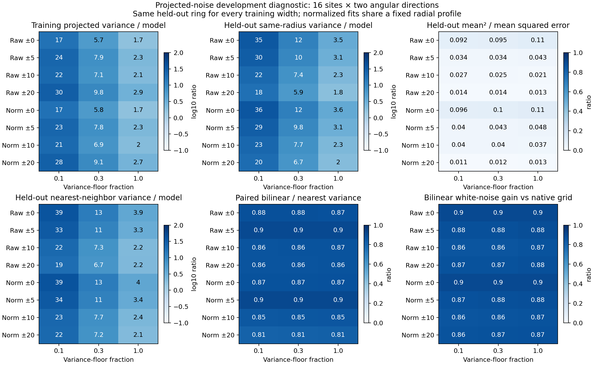

# Step 5 development: projected-noise diagnostic

**The three-mode model underestimates variance along the amplitude weights even on its own training patches.**
At floor 1.0, median training projection variance is 1.71–2.89 times the modeled variance across the eight sampling
policies; opposite-half, same-radius variance is 1.85–3.63 times the prediction. The mismatch is mainly in the
discarded eigenspace. Mean offsets and interpolation contribute, but do not account for most of these discrepancies.

This diagnostic uses one saved baseline image and the same 24 policies as the
[variance-floor comparison](../p4-step5-variance-floor-20260918/README.md). No positive images, reductions, new
detection thresholds, or ROC jobs were generated. These are development diagnostics, not an independent validation
or a newly calibrated uncertainty model.



## Fixed samples and projection

Use the previously established **16 common split sites**: all four angular blocks at nominal radii 46 and 50 in
both original calibration/evaluation groups. At each site, fit on patches entirely in one native y half-plane and
validate on the opposite half-plane, then swap directions. Reject any patch whose nonzero interpolation stencil
straddles the boundary. Train/validation native support is disjoint, including across different rings. The original
source/holdout exclusions, 11×11 patches, five-pixel radial/angular spacing, three-mode model, and floor grid remain.

The primary validation set is always the **same-radius opposite-half ring**, with at least eight patches, regardless
of training width. Each policy therefore has 32 directional fits on identical validation geometry. A secondary
validation uses its matching radial band; separate ring projections measure radial transfer. Wider bands have
uneven support after exclusions and image boundaries. Ring summaries require at least eight validation patches.

Normalized fits use the existing radial profile estimated outside all original source/holdout circles. The profile
is shared by both halves and held fixed throughout this diagnostic. The experiment tests mean/covariance fitting
conditional on that profile; it does not make profile estimation independent. Patches overlap within a half, nearby
sites reuse data, and disjoint halves can remain spatially correlated. The 32 directional fits are not 32 independent
trials. Results at radii 46–50 do not establish behavior at smaller separations.

In the selected raw or standardized coordinates, define the frozen amplitude weights and residual projections as

$$
g=\frac{C^{-1}t}{t^TC^{-1}t},\qquad
\sigma_\alpha^2=g^TCg,\qquad
z_j^{\rm proj}=\frac{g^T(x_j-\widehat\mu)}{\sigma_\alpha}.
$$

The template, weights, predicted sigma, and training mean remain fixed while evaluating held-out patches. Their
centered sample variance is the measured/model variance ratio. Separately record the mean, mean squared error
(MSE), and the fraction of MSE attributable to the squared mean. For `n` validation patches,
`MSE = (n−1)/n × sample variance + mean²`. Validation demeaning is saved only as a diagnostic; it is not a proposed
photometric or detection correction.

## Variance along the filter weights

Entries with three numbers follow floor order **0.1 / 0.3 / 1.0**. Every value is a median over the 32 directional
fits. Variance ratios of one would match the covariance prediction; these are variance ratios, not sigma ratios.

| Pixels / training half-width | Training variance / model | Held-out same-radius variance / model | Held-out squared-mean share of MSE, floor 1.0 |
| --- | --- | --- | ---: |
| Raw / 0 px | 17.18 / 5.72 / 1.71 | 34.59 / 11.53 / 3.46 | 10.7% |
| Raw / 5 px | 23.66 / 7.85 / 2.34 | 29.79 / 9.98 / 3.05 | 4.3% |
| Raw / 10 px | 21.62 / 7.14 / 2.11 | 21.95 / 7.37 / 2.26 | 2.1% |
| Raw / 20 px | 29.57 / 9.78 / 2.89 | 17.88 / 5.94 / 1.85 | 1.3% |
| Normalized / 0 px | 17.40 / 5.79 / 1.74 | 36.23 / 12.08 / 3.63 | 11.1% |
| Normalized / 5 px | 23.39 / 7.76 / 2.31 | 28.95 / 9.77 / 3.08 | 4.8% |
| Normalized / 10 px | 20.93 / 6.91 / 2.04 | 22.99 / 7.68 / 2.33 | 3.7% |
| Normalized / 20 px | 27.59 / 9.12 / 2.69 | 20.16 / 6.72 / 2.02 | 1.3% |

The training rows use the same data that fitted the covariance, so their mismatch cannot be explained solely by
transfer to another location. The covariance approximation itself does not preserve measured variance along these
weights. Transfer across angular halves matters too: same-radius policies have held-out medians roughly twice
their training medians. Pooling changes that relation and improves the median same-radius
held-out ratio here, without making it unity. These ratios alone do not establish better detection performance.

### Retained versus discarded directions

Project `g` onto the retained eigenvectors and their orthogonal complement. The retained empirical eigenvalues
are represented exactly; the complement is replaced by the isotropic floor. The empirical and modeled variance
partitions reconstruct the direct projected variances independently.

At floor 1.0, **98.01–99.66%** of empirical training variance along `g` is in the complement (range of policy medians).
The model also places 95.68–99.47% of its predicted variance there, but its complement variance is too small by
median factors **1.72–2.97**. Thus the mismatch is not primarily in the three explicitly retained modes. The
template has 68–90% of its squared norm in the complement, and inverse weighting further reduces contributions
from the retained high-variance directions.

This identifies a failure of the three-mode-plus-isotropic approximation in these data. It does not prove that
an unregularized full sample covariance will generalize: the samples are few, correlated, and often fewer than the
121 pixels. The complement also contains unmeasured sample-nullspace directions.

## Interpolation control

For each fixed fit, also project **nearest-neighbor samples at the exact same accepted coordinates** through the
same weights and mean. The nearest native pixel is one of the nonzero bilinear stencil inputs, so no extra masked
or training-half pixels enter validation. This removes averaging but preserves the rotated sampling grid.
Nearest-neighbor resampling can repeat pixels and has quantization/rotation effects; it is not an exact native,
unrotated candidate stamp or a recommended replacement sampler.

For an additional mechanical check, form the native sampling operator conceptually and calculate
`||A_samp^T g||² / ||g||²`. This is its projected variance gain relative to a native grid under unit independent
native-pixel noise in the chosen fitting coordinates. Shared native pixels between output samples are accounted
for. It is a white-noise control, not an assumption about the real residual covariance.

| Pixels / half-width | Paired bilinear / nearest projected variance, floor 1.0 | Bilinear white-noise gain vs native grid, floor 1.0 |
| --- | ---: | ---: |
| Raw / 0 px | 0.875 | 0.902 |
| Raw / 5 px | 0.899 | 0.883 |
| Raw / 10 px | 0.867 | 0.867 |
| Raw / 20 px | 0.865 | 0.877 |
| Normalized / 0 px | 0.872 | 0.902 |
| Normalized / 5 px | 0.904 | 0.881 |
| Normalized / 10 px | 0.855 | 0.867 |
| Normalized / 20 px | 0.814 | 0.874 |

The first column is the median paired ratio, not a ratio of separately computed medians. The second first takes
the median gain over each validation ring, then over directional fits. The measured interpolation effect is much
smaller than the covariance mismatch above. A universal interpolation correction is not inferred from these
controls, especially for spatially varying correlated residuals.

For context, the original **28 native evaluation-center scores**, using their original full-training fits rather
than these half-training fits, have centered sample variance 4.3–6.8 at floor 1.0. They are saved separately in
`summary.json`. This corroborates the earlier native uncertainty failure, but it is a different spatial sample
and fit; differences from the half-plane diagnostic cannot be attributed solely to interpolation.

## Radial transfer

Project each opposite-half ring through the same frozen weights. Compare its variance with the same-radius ring
for that exact fit. At floor 1.0 with ±20-pixel training:

| Validation-ring offset | Eligible directional fits | Median paired ring / same-radius variance, raw | Median paired ring / same-radius variance, normalized |
| --- | ---: | ---: | ---: |
| −10 px | 8 | 5.15 | 3.86 |
| −5 px | 24 | 2.20 | 1.87 |
| 0 px | 32 | 1.00 | 1.00 |
| +5 px | 16 | 1.22 | 1.52 |

Other offsets do not meet the eight-patch validation minimum. Each ratio is paired to the same-radius measurement
on its eligible subset; the number and composition of fits differ across offsets. Normalization reduces some
inward differences but does not make the projected covariance transferable across radius. Pooling many rings
therefore still requires validation of covariance shape, even after radial variance normalization.

## Next comparison

Test a **trace-preserving shrinkage covariance** that keeps all empirical modes:

$$
C_\gamma=(1-\gamma_{\rm shrink})\widehat C+
\gamma_{\rm shrink}\,\frac{\operatorname{tr}(\widehat C)}{p}I,
\qquad \gamma_{\rm shrink}\in\{0.1,0.3,1.0\}.
$$

Use the same sampling choices and fixed directional splits first, retaining the three-mode controls. The positive
isotropic component regularizes the sample nullspace; all empirical correlations are reduced continuously instead
of discarding every mode after the third. The endpoint 1.0 is an isotropic covariance with the same fitted mean,
which need not reproduce the original identity reference's background handling. Check held-out directional
variance and stability before interpreting injection recovery; retain identity/Gaussian detection references for
that subsequent comparison. No shrinkage result or production change is claimed here.

## Verification and artifacts

- [`summary.json`](summary.json): all 24 policy summaries, native-center context, and radial-transfer counts.
- [`projections.json`](projections.json): all 768 directional fits, standardized projected samples, variance budgets,
  interpolation gains, and ring-specific measurements.
- [`manifest.json`](manifest.json), [`verification.json`](verification.json),
  [`independent_checks.json`](independent_checks.json), [`complete.json`](complete.json): frozen design/provenance and checks.
- [`diagnose_p4_step5_projected_noise.py`](../../scripts/diagnose_p4_step5_projected_noise.py): maintained diagnostic.

Verification reproduces 5,828 archived control scalars, checks 144 ring geometries, and verifies all 768 unit-response,
predicted-variance, direct covariance-projection, and eigenspace-budget identities. Independent checks recompute
3,072 saved projection groups and all policy medians. Replacing the opposite half-plane with NaNs leaves 576
raw/normalized training-ring matrices unchanged, conditional on the fixed profile. Exact white-noise gains agree
with independently formed dense sampling covariances on 32 real stencils and a synthetic control. Input/script
fingerprints remain unchanged during the run. Python syntax and whitespace checks pass; the figure was visually
inspected. No production C++ function or mxlib call changed.

Reproduce from the repository root into a new directory:

```sh
OPENBLAS_NUM_THREADS=1 OMP_NUM_THREADS=2 MPLCONFIGDIR=/tmp/p4-step5-matplotlib \
  python3 agents/plans/scripts/diagnose_p4_step5_projected_noise.py \
  --floor-comparison agents/plans/results/p4-step5-variance-floor-20260918 \
  --radial-comparison agents/plans/results/p4-step5-radial-comparison-20260918 \
  --output /path/to/new/projected-noise-directory
```
