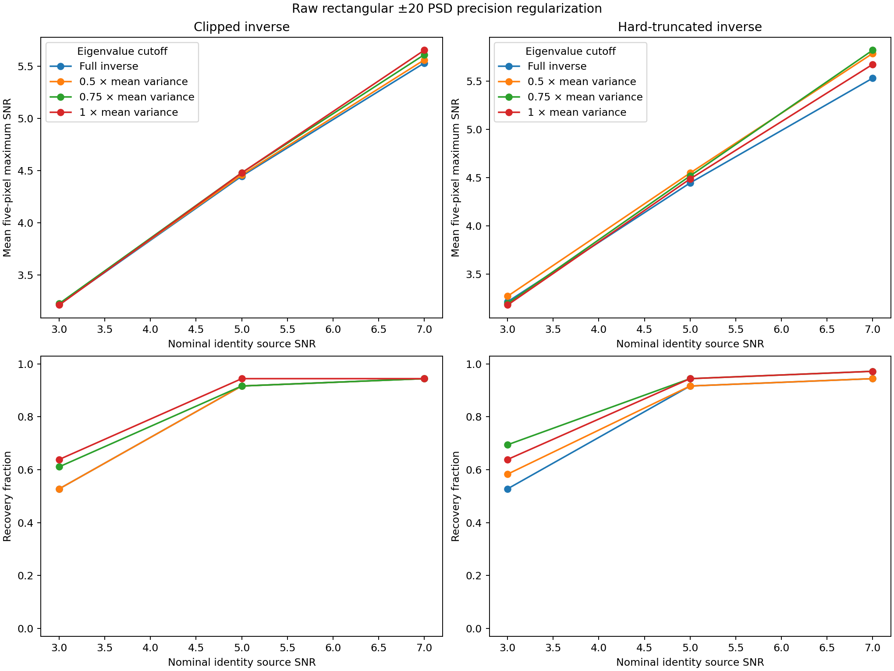

# Step 5: rectangular-PSD precision regularization setup

## Fixed question

Does suppressing the low-eigenvalue modes of the current rectangular-PSD
covariance improve small-separation injection recovery while the independently
measured response remains fixed?

The response-smoothing comparison found gains mainly at radii 6 and 8 pixels.
The measured positive-minus-baseline amplitude increments nevertheless followed
the response-overlap prediction within a few percent. This test therefore keeps
the unsmoothed measured response and changes only how the existing PSD
covariance is inverted.

## Fixed precision policies

At every candidate pixel, the unchanged raw rectangular model uses ±20-pixel
radial pooling, ensemble-mean subtraction, a rectangular 11-by-11 periodogram
on a 21-by-21 padded grid, and the existing 0.3 flat-spectrum mixture. Write its
finite 121-by-121 covariance as

\[
C = Q\,\operatorname{diag}(\nu_i)Q^T,
\qquad
\bar v = \frac{1}{121}\sum_i \nu_i.
\]

The fixed controls and candidates are:

- **full inverse:** \(\pi_i=1/\nu_i\);
- **clipped inverse:**
  \(\pi_i=1/\max(\nu_i,c\bar v)\);
- **hard-truncated inverse:** \(\pi_i=1/\nu_i\) when
  \(\nu_i\geq c\bar v\), and \(\pi_i=0\) otherwise.

The cutoff grid is fixed at **\(c=0.5,0.75,1.0\)**. Clipping retains all 121
modes but limits their maximum precision. Hard truncation removes modes below
the cutoff. The existing 0.3 spectral mixture remains part of \(C\); this test
does not replace or retune it.

For every policy, the amplitude weight is normalized to unit response to the
same unsmoothed measured template. The report records the number of modified or
retained modes and the expected SNR efficiency relative to the full inverse if
the fitted PSD covariance were exact. That efficiency cannot exceed one by the
matched-filter optimum, so any measured recovery gain indicates covariance
model error, calibration effects, or finite-sample behavior rather than an
improvement under an exact covariance.

## Fixed data and controls

The test reuses the completed 164 baseline and 108 positive response-smoothing
analyses and performs no new P4 reduction. It retains the same saved images,
known-planet and one-lambda/D trial exclusions, covariance samples, fitted
means, candidate pixels, five-pixel searches, and production `hciAnalyze`
annular SNR.

Every new precision policy uses the frozen raw rectangular ±20 calibration
pool and receives its own maximum-null threshold before positive measurements
are read. These parent results are copied as references and must reproduce
their amplitude maps, SNR maps, thresholds, and decisions:

- full rectangular ±20 inverse with the unsmoothed response;
- identity with the unsmoothed response;
- identity with the 1.8-pixel response low pass;
- rectangular ±20 with the 2.7-pixel response low pass;
- production Gaussian FWHM 3.6.

The runner also recomputes the full rectangular inverse from the eigensystem at
every fitted pixel and requires agreement with the copied Cholesky-solve parent
map. This checks that any candidate difference comes only from the declared
eigenvalue policy.

## Outputs and interpretation

The final report includes recovery and held-out null counts, mean five-pixel
maximum and fixed-center SNR, paired amplitude throughput, paired decision
changes from the full inverse, exact-PSD efficiency, and retained/modified mode
counts. Results at radii 6 and 8 are the main diagnostic, with radii 12–24 kept
as controls. The same correlated field and previously inspected injections
make this a development comparison; it cannot select a radius-dependent
production policy by itself.

## Validation and ROC commands

After pulling the setup, run the local algebra check:

```sh
OPENBLAS_NUM_THREADS=1 OMP_NUM_THREADS=1 MKL_NUM_THREADS=1 \
  MPLCONFIGDIR=/tmp/p4-step5-matplotlib \
  /opt/conda/envs/xpy3_13/bin/python3 \
  agents/plans/scripts/compare_p4_step5_psd_precision.py check
```

Prepare the immutable comparison:

```sh
OPENBLAS_NUM_THREADS=1 OMP_NUM_THREADS=1 MKL_NUM_THREADS=1 \
  MPLCONFIGDIR=/tmp/p4-step5-matplotlib \
  /opt/conda/envs/xpy3_13/bin/python3 \
  agents/plans/scripts/compare_p4_step5_psd_precision.py prepare \
  --comparison working/roc/p4_response_smoothing_20260920 \
  --root working/roc/p4_psd_precision_20260920 \
  --cpus 0 1 2 3 4 5 6 7 8 9 10 11
```

Launch the resumable analysis:

```sh
tmux new-session -d -s p4-psd-precision \
  "cd /home/jrmales/Source/mxApps/hciReduce && \
   OPENBLAS_NUM_THREADS=1 OMP_NUM_THREADS=1 MKL_NUM_THREADS=1 \
   MPLCONFIGDIR=/tmp/p4-step5-matplotlib \
   /opt/conda/envs/xpy3_13/bin/python3 \
   agents/plans/scripts/compare_p4_step5_psd_precision.py run \
   --root working/roc/p4_psd_precision_20260920 \
   > working/roc/p4_psd_precision_20260920/driver.log 2>&1"
```

Monitor it with:

```sh
cat working/roc/p4_psd_precision_20260920/state.json
tail -n 30 working/roc/p4_psd_precision_20260920/driver.log
```

The final products will be `results.json`, `results.md`, and `comparison.png`
under the new root.

## Completed result

The ROC comparison completed all **164 baseline and 108 positive analyses**
with no new P4 reduction. A separate completion audit verified all **3,154
frozen inputs** and all six result products. The copied full inverse, identity,
both response-smoothed references, and Gaussian amplitude and SNR maps reproduce
their parent maps exactly. The independent annular oracle also agrees exactly.
The eigensystem full inverse agrees with the copied parent Cholesky solve to a
maximum amplitude difference of `1.85e-9`. The completion receipt records
SHA-256 `dec977e65f54c7e80e716f85a7675774125dbc057ec7fcfeecb9a1a24babd918`
for `results.json`.

Aggregate results over all 36 sites are:

| Precision policy | SNR-3 recovery | SNR-5 recovery | SNR-7 recovery | Held-out nulls | Mean max SNR at 3 / 5 / 7 |
| --- | ---: | ---: | ---: | ---: | --- |
| Full inverse | 19 | 33 | 34 | 0 | 3.216 / 4.447 / 5.532 |
| Clipped, 0.5 mean variance | 19 | 33 | 34 | 0 | 3.220 / 4.458 / 5.562 |
| Clipped, 0.75 mean variance | 22 | 33 | 34 | 0 | 3.224 / 4.479 / 5.612 |
| Clipped, 1.0 mean variance | **23** | **34** | 34 | 0 | 3.210 / 4.478 / 5.655 |
| Hard truncated, 0.5 mean variance | 21 | 33 | 34 | 0 | **3.273 / 4.549 / 5.788** |
| Hard truncated, 0.75 mean variance | **25** | **34** | **35** | 1 | 3.198 / 4.519 / **5.821** |
| Hard truncated, 1.0 mean variance | 23 | 34 | 35 | 4 | 3.182 / 4.488 / 5.675 |
| Identity | 23 | 35 | 35 | 0 | 3.175 / 4.454 / 5.664 |
| Identity, response LPF 1.8 px | **25** | **35** | **35** | 0 | 3.156 / 4.461 / 5.763 |
| Rectangular ±20, response LPF 2.7 px | 22 | 34 | 35 | 0 | 3.197 / 4.497 / 5.704 |
| Production Gaussian | 20 | 34 | **36** | 1 | 3.212 / 4.549 / 5.704 |

No regularized method loses a positive decision that the full inverse made.
Clipping at the mean variance adds four SNR-3 and one SNR-5 recoveries with no
held-out null exceedance. Hard truncation at 0.5 adds two faint recoveries and
has the largest zero-null mean-SNR gains. The 0.75 hard cutoff adds six faint,
one middle, and one bright recovery, but it also produces one radius-6 held-out
null. The 1.0 hard cutoff produces four null exceedances, including two at
radius 12, and is too aggressive for promotion.

## Separation and eigenmode behavior

The useful changes are concentrated at the inner edge. At radius 6, the mean
maximum-SNR changes relative to the full inverse are:

| Policy | SNR 3 change | SNR 5 change | SNR 7 change |
| --- | ---: | ---: | ---: |
| Clipped, 1.0 mean variance | +0.040 | +0.205 | +0.751 |
| Hard truncated, 0.5 mean variance | **+0.323** | **+0.647** | +1.563 |
| Hard truncated, 0.75 mean variance | +0.074 | +0.469 | **+1.698** |

At radius 6, the 0.5 hard cutoff removes about 48 modes and retains 73; its
mean exact-PSD efficiency is 0.990. The 0.75 hard cutoff retains about 43 modes
with efficiency 0.977. Clipping at 1.0 modifies about 88 modes while retaining
all 121 and has efficiency 0.994. These small idealized losses alongside much
larger measured radius-6 gains show that low-eigenvalue modes have little
matched-signal value under the fitted model but receive enough inverse gain to
hurt the observed inner statistic.

At radius 8, aggressive truncation improves fixed-center SNR but does not
uniformly improve the five-pixel mean maximum. Its extra recoveries partly come
from lower frozen null thresholds: the radius-8 threshold falls from 3.215 for
the full inverse to 2.178 for the 0.75 hard cutoff. The associated held-out null
remains at radius 6. This emphasizes that the recovery gain combines filter
behavior with a noisy 20-sample maximum-null calibration, especially where the
annular support is sparse.

The 0.5 hard cutoff is nearly neutral at radii 12–24. Its mean maximum-SNR
changes are within 0.031 there, and it has no held-out null exceedance. The
stronger cutoffs also remain small at radii 16–24, while the 1.0 hard cutoff's
two radius-12 nulls show the cost of discarding roughly 87 modes at that
separation.

Paired amplitude throughput remains within about one percent of the full
inverse for every precision policy. Regularization therefore changes noise
weighting rather than recovered source amplitude. If the fitted PSD covariance
were exact, aggregate SNR efficiencies would be 0.9998–0.9969 for clipping and
0.9952, 0.9863, and 0.976 for the three hard cutoffs. The measured gains despite
those algebraic penalties are direct evidence of covariance mismatch or
finite-sample error in the low-eigenvalue precision modes.

This is encouraging evidence for precision regularization at small separation,
but it does not select a production filter. Clipping at 1.0 and hard truncation
at 0.5 are the two conservative zero-null candidates for a fresh validation;
the 0.75 hard cutoff is useful as an aggressive diagnostic. Identity with the
1.8-pixel response low pass still has the strongest zero-null aggregate recovery
at SNR 3 and 5. The repeatedly inspected sites and sparse inner annuli remain
the limiting evidence.


