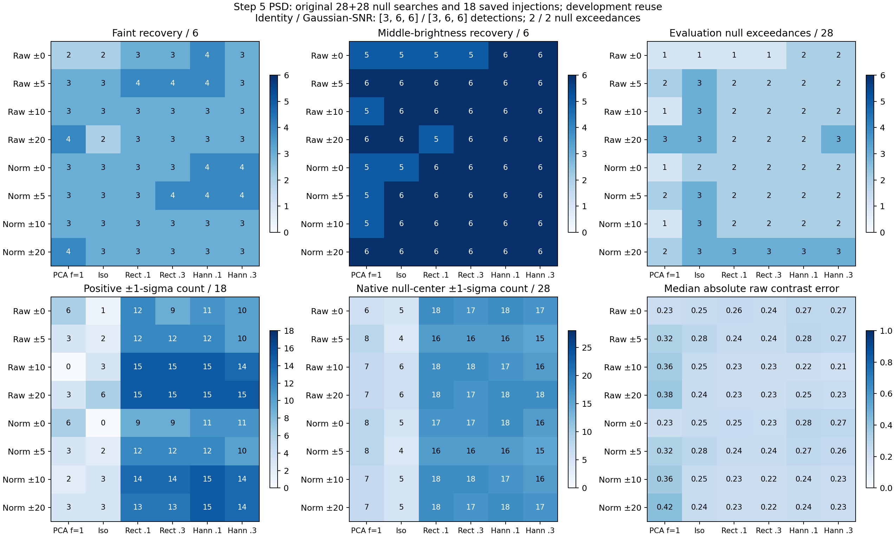

# Step 5: PSD recovery on saved full-image injections

**The PSD models improve conditional uncertainty estimates and give a modest recovery gain in some settings.**
Nine of the 32 fixed PSD settings recover **4/6, 6/6, 6/6** injections at the three brightnesses, with **2/28**
evaluation null exceedances. Gaussian 3.6-pixel smoothing with application SNR and the original identity score
both recover **3/6, 6/6, 6/6**, also with **2/28** null exceedances.

All nine settings gain the same faint source at radius 50, block 0, which is below threshold in the baseline.
Its positive-image score is only **1.7–8.9% above threshold**. These are 32 settings evaluated on six reused
injection sites in one correlated residual field, so the result does not establish a general advantage or a
preferred setting. Exact-center contrast errors remain comparable to identity; broader radial pooling is not
consistently better. The stronger improvement is the covariance model's conditional uncertainty prediction.



## Fixed experiment

Reuse the unchanged estimator from the [Welch-style PSD diagnostic](../p4-step5-welch-psd-20260918/README.md):
rectangular and separable symmetric Hann windows, each at spectral isotropic mixtures 0.1 and 0.3, crossed with
raw/normalized pixels and radial training half-widths 0, 5, 10, and 20 pixels. **All 32 PSD settings** are retained.
Eight matching three-mode/floor-1 and eight fitted-mean isotropic covariance controls bring the fitted grid to
48 settings. The grid and comparison rule were fixed before running the experiment.

Keep 11×11 response/noise stamps, five-pixel radial/angular center spacing, the eight-training-patch minimum,
and every original native-pixel source/held-out exclusion. The PSD's 21×21 padding, variance rescaling, positive
spectral mixture, finite lag covariance, and estimator-only window are unchanged. Data and templates remain
untapered. Raw fits use original pixels; normalized fits apply the native radial scale consistently to data and
template, before training-patch interpolation. Re-estimate the same radial profile and covariance on each image,
using the same exclusions.

This is the candidate-filtering test: **fit all accepted annular/band patches**, including patches straddling the
previous diagnostic's half-plane boundary, then evaluate the native candidate stamp. The preceding test instead
fitted one half-plane and projected the other. A candidate's full stamp and every declared source/held-out
neighborhood remain excluded from training. Frozen baseline filters are used only in the separate increment
diagnostic below; primary recovery uses each positive image's own fitted mean and covariance.

Use the original **28 calibration and 28 evaluation searches**, each the maximum signed score over the center
and its four axial one-pixel neighbors. Each setting's threshold is the maximum calibration score, following the
original `ceil((28+1)*0.95)` order-statistic rule. Detection requires **strict exceedance**. All 48 thresholds were
written and fingerprinted before any positive image was filtered. This rule targets the original per-search
operating point; the small correlated sample does not establish a precise underlying false-positive rate.

The primary positive sample is the same **18 saved full-image injections**: six sites at nominal radii 26, 38,
and 50, each at 0.5×, 1×, and 2× its original site-specific contrast scale. These multipliers are not PSD SNRs.
Three earlier development positives remain separate. No reduction, new injection, ROC job, or production change
is part of this checkpoint. The existing calibration/evaluation labels preserve the spatial split; all these
images have already influenced development choices.

## Detection results

Each entry is **detections at 0.5×, 1×, 2× (out of six each); null exceedances (out of 28)**.
Every setting uses its own calibration-only threshold. All retained primary searches are valid.

| Pixels / training half-width | PCA, floor 1 | Isotropic | Rect. 0.1 | Rect. 0.3 | Hann 0.1 | Hann 0.3 |
| --- | --- | --- | --- | --- | --- | --- |
| Raw / 0 px | 2,5,6; 1 | 2,5,6; 1 | 3,5,6; 1 | 3,5,6; 1 | 4,6,6; 2 | 3,6,6; 2 |
| Raw / 5 px | 3,6,6; 2 | 3,6,6; 3 | 4,6,6; 2 | 4,6,6; 2 | 4,6,6; 2 | 3,6,6; 2 |
| Raw / 10 px | 3,5,6; 1 | 3,6,6; 3 | 3,6,6; 2 | 3,6,6; 2 | 3,6,6; 2 | 3,6,6; 2 |
| Raw / 20 px | 4,6,6; 3 | 2,6,6; 3 | 3,5,6; 2 | 3,6,6; 2 | 3,6,6; 2 | 3,6,6; 3 |
| Normalized / 0 px | 3,5,6; 1 | 3,5,6; 2 | 3,6,6; 2 | 3,6,6; 2 | 4,6,6; 2 | 4,6,6; 2 |
| Normalized / 5 px | 3,5,6; 2 | 3,6,6; 3 | 3,6,6; 2 | 4,6,6; 2 | 4,6,6; 2 | 4,6,6; 2 |
| Normalized / 10 px | 3,5,6; 1 | 3,6,6; 3 | 3,6,6; 2 | 3,6,6; 2 | 3,6,6; 2 | 3,6,6; 2 |
| Normalized / 20 px | 4,6,6; 2 | 3,6,6; 3 | 3,6,6; 3 | 3,6,6; 3 | 3,6,6; 3 | 3,6,6; 3 |

The unchanged practical references are:

| Reference and statistic | 0.5× recovery | 1× recovery | 2× recovery | Null exceedances |
| --- | --- | --- | --- | --- |
| Gaussian 3.6 px + application SNR | 3/6 | 6/6 | 6/6 | 2/28 |
| Identity matched filter, original conditional score | 3/6 | 6/6 | 6/6 | 2/28 |
| Gaussian 3.6 px, smoothed intensity | 3/6 | 5/6 | 6/6 | 2/28 |
| Identity matched filter + application SNR | 4/6 | 6/6 | 6/6 | 3/28 |

The Gaussian and identity application-SNR references retain ordinary annular mean/variance estimation, which
includes trial neighborhoods. Gaussian's 15×15 kernel also differs from the 11×11 response stamp. These are
practical pipeline references with the same trial/threshold procedure, not identical noise estimators; see the
[Gaussian reference report](../p4-step5-gaussian-20260918/README.md).

### What changes at individual sites

All nine four-faint-recovery PSD settings detect `evaluation_r50_b0_l0` in addition to the same three sources
recovered by Gaussian/SNR and original identity. This site's baseline score is only **0.40–0.48 times threshold**
for these PSD settings. The new crossing therefore is not a baseline exceedance counted as an injected recovery.
It is nevertheless a small margin: the injected score is **1.017–1.089 times threshold**.

These settings have the **same two evaluation null exceedances as Gaussian/SNR**: `evaluation_r34_b2` and
`evaluation_r50_b3`. Original identity's two are `evaluation_r26_b3` and `evaluation_r50_b3`. Baseline-exceeding
sites remain in the preassigned injection sample for every method. In particular, radius 50, block 3 already
exceeds baseline threshold and is not evidence for a new detection enabled by injection.

The nine settings all use same-radius or ±5-pixel training. ±10 and ±20-pixel PSD settings recover only three
faint sources. The normalized ±20-pixel settings have three null exceedances, versus two for the references.
Thus the available extra patches do not establish a recovery benefit from wide pooling. Normalization and
window choice have mixed effects; this test does not select a production setting.

## Native-center uncertainty and photometry

Photometry uses the **exact native center**, independently of the five-pixel maximum used for detection. Raw
fractional contrast error is `measured amplitude / injected contrast − 1`, on the positive image itself. These
are positive injections with known contrasts, not differences from a negative-injection fit.

Four-number entries follow **rectangular 0.1 / rectangular 0.3 / Hann 0.1 / Hann 0.3**.

| Pixels / half-width | Positive estimates within ±1 conditional sigma / 18 | Native null centers within ±1 conditional sigma / 28 | Median absolute raw fractional contrast error |
| --- | --- | --- | --- |
| Raw / 0 px | 12 / 9 / 11 / 10 | 18 / 17 / 18 / 17 | 0.255 / 0.244 / 0.274 / 0.269 |
| Raw / 5 px | 12 / 12 / 12 / 10 | 16 / 16 / 16 / 15 | 0.242 / 0.240 / 0.280 / 0.268 |
| Raw / 10 px | 15 / 15 / 15 / 14 | 18 / 18 / 17 / 16 | 0.229 / 0.225 / 0.222 / 0.214 |
| Raw / 20 px | 15 / 15 / 15 / 15 | 18 / 17 / 18 / 18 | 0.228 / 0.226 / 0.245 / 0.233 |
| Normalized / 0 px | 9 / 9 / 11 / 11 | 17 / 17 / 18 / 16 | 0.246 / 0.233 / 0.279 / 0.274 |
| Normalized / 5 px | 12 / 12 / 12 / 10 | 16 / 16 / 16 / 15 | 0.244 / 0.241 / 0.268 / 0.260 |
| Normalized / 10 px | 14 / 14 / 15 / 14 | 18 / 18 / 17 / 16 | 0.227 / 0.224 / 0.237 / 0.229 |
| Normalized / 20 px | 13 / 13 / 15 / 14 | 18 / 17 / 18 / 17 | 0.226 / 0.224 / 0.236 / 0.228 |

PSD includes **9–15/18 positive estimates** and **15–18/28 native null centers** within one conditional sigma,
versus **0–6/18** and **6–8/28** for the three-mode/floor-1 controls. Median positive sigma is **1.31–1.89 times**
the corresponding PCA sigma across policies. The improved coverage therefore includes a larger, more realistic
reported uncertainty and does not by itself establish reduced photometric error.

Pooling the 28 standardized native null-center scores gives sample variance **1.42–1.86**, mean **0.26–0.35**,
and mean square **1.45–1.88** across PSD settings. PCA's corresponding variances are **4.30–6.82**. These are
heterogeneous, spatially correlated sites with separately fitted weights and sigmas; the pooled variance is a
descriptive calibration check, not one repeated fixed-filter variance ratio. It still indicates imperfect noise
prediction. The earlier near-unity medians were for rotated held-out patches at 16 outer sites, with different
training support. Their difference from this result does not isolate interpolation as the cause.

Across the 18 positives, PSD median absolute fractional contrast error is **0.214–0.280**, versus **0.231** for
original identity and **0.226–0.425** across PCA controls. PSD RMS fractional error is **0.580–0.630**, versus
**0.583** for identity. This sample therefore shows broadly comparable photometry to identity, despite better
covariance uncertainty estimates than PCA. Some PSD settings improve broad-pooling PCA photometry, but the
small recovery gain should not be described as a general photometric gain.

For context, the signed median errors by injected brightness are:

| Brightness multiplier | PSD: range of policy median raw fractional errors | Original identity median raw fractional error |
| --- | --- | --- |
| 0.5× | +0.221 to +0.407 | +0.336 |
| 1× | +0.123 to +0.219 | +0.185 |
| 2× | +0.074 to +0.124 | +0.108 |

Ranges above span policy medians, not positional scatter or confidence intervals. Individual errors, per-level
ranges, RMS errors, and signed scores are in the saved records. Gaussian's exported smoothed intensity is not a
contrast estimate, so no Gaussian photometric error is fabricated. Original identity uses `C=I` with no fitted
physical noise scale; its nominal one-sigma inclusion of all 18 positives and all 28 null centers does not
establish calibrated uncertainty.

### Response increments and source effects on training

Two diagnostics remove the baseline realization without replacing raw photometry:

- **Adaptive paired increment error:** `(positive amplitude − baseline amplitude) / injected contrast − 1`,
  refitting mean/profile/covariance on each image. PSD policy medians span **+1.26% to +1.88%**.
- **Frozen-weight increment error:** apply the baseline physical-unit, unit-response weights to the native
  positive-minus-baseline pixel stamp, divide by injected contrast, and subtract one. No positive-image mean,
  profile, or covariance is fitted in this diagnostic. Its policy medians span **+1.26% to +1.73%**.

The close increments support the response approximation on these images. They do not remove background error
from real single-image measurements. Median changes in training matrices are **0.87–1.30%** of the centered
baseline training norm; physical covariance changes are **0.12–0.52%** of baseline covariance norm across PSD
policies. The known source footprints are excluded, but the adaptive full reduction can still affect pixels
elsewhere. Changes in the re-estimated radial profile are included for normalized policies.

## Separate inner-support diagnostics

Radial pooling makes all eight previously excluded radius-20 null searches valid; same-radius training still
makes none valid. They remain outside threshold setting and the primary 28+28 comparison.

The three older development images also remain separate:

| Development radius | PSD settings with all five search pixels valid / 32 | Raw fractional error range among those valid settings |
| --- | --- | --- |
| 12 px | 16/32 | +0.536 to +0.987 |
| 24 px | 24/32 | −0.373 to −0.303 |
| 42 px | 32/32 | +0.080 to +0.103 |

These are ranges over settings at a single injected site each. The radius-12 errors and incomplete support
preclude extrapolating the outer-site result inward. A valid center is distinct from a valid five-pixel search;
the records preserve both. The original thresholds are not validated at that innermost site.

## Next step

**Update:** the [full ROC study is now specified and prepared](../p4-step5-roc-full-20260918/README.md).
The user waived the separate small ROC pilot. That report records the fixed eight-method comparison,
30 new sites, three transition brightnesses, and the necessary per-site holdout/recalibration change.
The proposal below describes the recommendation at this recovery checkpoint.

The structured PSD family warrants a **fresh ROC study** after freezing a small comparison set and checking
numerical consistency and throughput on ROC. Same-radius and ±5-pixel training, rectangular/Hann estimation,
and the Gaussian/identity references are the useful choices to retain in that specification. Fix exact settings,
source masks, trial support, and calibration rules before new data are inspected; the full 32-setting development
sweep is not a frozen winner. The existing plan proposes 30 fresh sites at three brightness levels, with reductions
shared by every filter. No ROC job or production-policy change is made here.

Further validation must cover native-pixel uncertainty and smaller radii, and distinguish background offsets from
conditional covariance error. A fresh sample is more informative now than selecting more settings on the same six
injection sites. Equal observed null counts in this small field do not establish equal underlying false-positive
rates or statistically secure completeness differences.

## Verification and artifacts

- [`summary.json`](summary.json): all 48 fitted settings, Gaussian/identity references, coverage, and error summaries.
- [`nulls.json`](nulls.json), [`thresholds.json`](thresholds.json), [`injections.json`](injections.json): individual
  trials, frozen thresholds, exact-center results, source increments, and every positive search pixel.
- [`baseline_pixels.json`](baseline_pixels.json), [`variance_profiles.json`](variance_profiles.json): all 335 baseline
  candidate pixels and the baseline/21 positive-image radial profiles.
- [`manifest.json`](manifest.json), [`verification.json`](verification.json),
  [`independent_checks.json`](independent_checks.json), [`complete.json`](complete.json): design, provenance, completion,
  and independent checks.
- [`compare_p4_step5_psd_recovery.py`](../../scripts/compare_p4_step5_psd_recovery.py): maintained experiment driver.

The run reproduces **8,036 archived PCA/profile scalars**, including all control decisions and primary summary
counts. All **20,424 valid candidate fits** satisfy unit response, conditional variance, and equivalent physical-unit
solves. Native source and candidate exclusions are verified. The input, PSD-estimator, and threshold hashes remain
unchanged. The candidate-only synthetic integration check leaves all 48 training covariances unchanged and
recovers the exact imposed template amplitude increment.

Independent checks reconstruct **4,080 searches**, **1,008 positive photometry records**, all **48 thresholds**,
and their summary counts. Direct linear-lag sums and generic physical-unit solves reproduce **2,720 PSD fits**
at all valid baseline null/development centers and positive centers, with maximum absolute amplitude difference
**1.74e-18** and relative sigma difference **6.67e-16**. Frozen increments and source-effect diagnostics agree.
All **296** Gaussian/identity reference searches are remeasured from the saved FITS maps or identity equations.
Python syntax and whitespace checks pass, and the figure was visually inspected. No production C++ or mxlib-calling
function changed.

Reproduce from the repository root into a new output directory:

```sh
OPENBLAS_NUM_THREADS=1 OMP_NUM_THREADS=2 MPLCONFIGDIR=/tmp/p4-step5-matplotlib \
  taskset -c 12,13 python3 agents/plans/scripts/compare_p4_step5_psd_recovery.py \
  --psd-comparison agents/plans/results/p4-step5-welch-psd-20260918 \
  --floor-comparison agents/plans/results/p4-step5-variance-floor-20260918 \
  --radial-comparison agents/plans/results/p4-step5-radial-comparison-20260918 \
  --evaluation working/roc/p4_noise_step5_evaluation_20260918 \
  --gaussian working/roc/p4_noise_step5_gaussian_20260918 \
  --development working/roc/p4_noise_step5_development_20260918 \
  --output /path/to/new/psd-recovery-directory
```

The affinity mask is the one used for this run; choose available cores on another machine.
