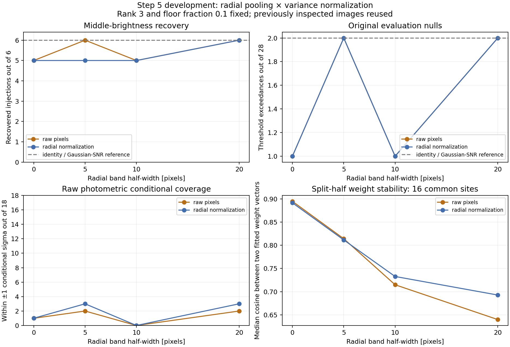

# Step 5 development: radial pooling and variance normalization

**Pooling makes more searches trainable, but has not fixed conditional uncertainty or established a detection
advantage.** Both ±20-pixel variants recover one more faint injection than the identity and Gaussian/SNR references
at the same observed null-exceedance count. Radial normalization gives no consistent improvement. The reported
one-sigma intervals still contain only 0–3 of the 18 injected contrasts.

This comparison reuses the saved baseline, 18 evaluation positives, and three original development positives.
The original calibration/evaluation names identify their spatial split; all these previously inspected data now
serve development. Eight policies were inspected on only six evaluation injection sites. This is not fresh
confirmation, and no new P4 reductions or ROC jobs were launched.



## Fixed experiment

Compare same-radius training and radial bands of ±5, ±10, and ±20 pixels, each with raw pixels or native radial
variance normalization. Keep the 11×11 response footprint, five-pixel radial/angular sampling, eight-patch minimum,
at most three PCA modes, and variance-floor fraction 0.1 fixed. The floor is 0.1 times the median centered sample
pixel variance; retained eigenvalues above it keep their empirical values. All patches have equal weight and
retain candidate orientation, without radial magnification. Overlapping patch counts are not independent samples.

Every policy uses the original union of known-source and development/calibration/evaluation exclusions, applied
to the exact nonzero native interpolation stencils. Normalization uses the previously specified variance profile:
3.6-pixel bins over 0–60 pixels, at least 20 unmasked pixels per bin, sample-mean subtraction and an `n−1`
denominator, log-variance interpolation, and constant endpoint half-bins. The profile is re-estimated for every
image. Divide native image pixels by radial standard deviation before extracting training patches. Apply the
same scale to candidate data and response, and fit the background mean and covariance in those coordinates.
Independent solves using the equivalent covariance in original units verify that contrast and sigma are preserved.

Thresholds use the same original 28 calibration searches and their maximum five-pixel score, with strict
exceedance. This is the original empirical rule targeting a 5% per-search false-positive rate; it does not imply
that the true rate is known precisely. Thresholds were written and fingerprinted before filtering positive images.
All primary comparisons retain the original 28 evaluation searches. The eight newly trainable radius-20 searches
are counted separately rather than changing the comparison sample.

## Recovery and conditional uncertainty

Each brightness column contains six positive-source trials. Detection uses the maximum over the fixed five-pixel
search. Conditional coverage uses the exact-center contrast estimate on the raw positive image: whether the
known injected contrast lies within its reported ±1 sigma. No baseline subtraction enters either measurement.

| Training pixels / radial half-width | Detections at 0.5× / 1× / 2× | Null exceedances | Positive ±1-sigma coverage | Null-center ±1-sigma coverage |
| --- | --- | ---: | ---: | ---: |
| Raw / 0 px | 2/6, 5/6, 6/6 | 1/28 | 1/18 | 1/28 |
| Raw / 5 px | 3/6, 6/6, 6/6 | 2/28 | 2/18 | 2/28 |
| Raw / 10 px | 3/6, 5/6, 6/6 | 1/28 | 0/18 | 4/28 |
| Raw / 20 px | 4/6, 6/6, 6/6 | 2/28 | 2/18 | 0/28 |
| Normalized / 0 px | 3/6, 5/6, 6/6 | 1/28 | 1/18 | 2/28 |
| Normalized / 5 px | 3/6, 5/6, 6/6 | 2/28 | 3/18 | 2/28 |
| Normalized / 10 px | 2/6, 5/6, 6/6 | 1/28 | 0/18 | 4/28 |
| Normalized / 20 px | 4/6, 6/6, 6/6 | 2/28 | 3/18 | 2/28 |
| Identity matched-filter reference | 3/6, 6/6, 6/6 | 2/28 | — | — |
| Gaussian 3.6 px + application SNR reference | 3/6, 6/6, 6/6 | 2/28 | — | — |

Both ±20-pixel variants add the same faint recovery at radius 38, angular block 2, relative to those references.
Six sites and eight inspected policies cannot establish a general gain; the null searches also share spatial
structure. The Gaussian reference retains the application's ordinary annular normalization, including trial
neighborhoods, as documented in the [Gaussian comparison](../p4-step5-gaussian-20260918/README.md). Identity's unit
covariance is not a calibrated uncertainty model, and Gaussian intensity is not a contrast estimate; their
conditional-coverage entries are therefore omitted here.

All pooled policies make the eight original radius-20 null searches valid. At the original inner development
position near radius 12, ±5 pixels supplies eight patches at the center but only seven at one search neighbor:
the complete five-pixel search still fails. ±10 and ±20 make that full search trainable. These three development
positives are retained as photometry/source-leakage diagnostics, outside the 18-trial recovery table; thresholds
from the original comparison region are not validated at the innermost position.

Raw median contrast errors remain positive and include preexisting background offsets. Individual errors and
separate paired baseline-increment diagnostics are saved in `injections.json`; neither is a negative-injection
fit. The poor null-center coverage shows that the conditional-uncertainty failure is not solely finite-source
nonlinearity.

## Stability and variance represented by the model

Split training into the two native image y half-planes and reject every patch whose nonzero stencil straddles
their boundary. The two sets read disjoint native pixels and each must supply at least eight patches. Compare
physical-unit amplitude weights and regularized covariances fitted separately to those sets. For a fair width
comparison, use the **same 16 eligible centers** for all eight policies: all four angular blocks at radii 46 and
50 in both original spatial splits. Wider bands allow more split diagnostics elsewhere, recorded separately.

| Pixels / half-width | Median weight cosine, common 16 | Median relative covariance difference, common 16 | Median modeled / sample covariance trace, 28 evaluation centers |
| --- | ---: | ---: | ---: |
| Raw / 0 px | 0.895 | 1.388 | 0.453 |
| Raw / 5 px | 0.814 | 1.355 | 0.327 |
| Raw / 10 px | 0.715 | 1.277 | 0.301 |
| Raw / 20 px | 0.640 | 1.299 | 0.299 |
| Normalized / 0 px | 0.892 | 1.387 | 0.449 |
| Normalized / 5 px | 0.812 | 1.341 | 0.323 |
| Normalized / 10 px | 0.733 | 1.263 | 0.292 |
| Normalized / 20 px | 0.693 | 1.281 | 0.282 |

Weight cosine is one for identical directions; covariance difference is
`2 ||C_a − C_b||_F / (||C_a||_F + ||C_b||_F)`. The wider bands have not made the inferred weights more consistent
between these halves. Finite-sample mode estimation and spatial changes in covariance are both possible causes.
The halves can remain spatially correlated; normalized halves also share the variance profile estimated from
all allowed pixels. This is a descriptive stability check, not independent cross-validation.

The final column compares the trace of the regularized covariance with the centered empirical covariance in the
same fitting coordinates. The fixed rank-three, floor-0.1 model represents about 45% of sample variance at one
radius and 28–30% with ±20-pixel pooling. This motivates testing how the discarded-mode variance is modeled.
It is not a measurement of true noise covariance or a factor by which amplitude sigmas can simply be rescaled:
variance along the particular template direction matters.

Pooling also changes sensitivity to injected sources outside their excluded footprints. For the radius-42
development positive, the relative change in physical, **regularized** covariance falls from 32.7% to 9.1%
between raw widths 0 and 20, and from 24.0% to 7.7% for normalized pixels. Other sites do not improve monotonically.
These values concern the fitted model, unlike the earlier empirical sample-covariance audit. Pooling can dilute
source effects without making the training field source-free.

## Follow-on test

The [variance-floor comparison](../p4-step5-variance-floor-20260918/README.md) is now complete. It compares fractions
**0.1, 0.3, and 1.0** on these same saved development images, holding rank three and the sampling/normalization
grid fixed. It examines null and positive conditional coverage, split-weight stability, and recovery with the
same calibration rule and identity/Gaussian controls. A floor based on mean discarded-mode
variance is a possible separate control; it has not been tested. Avoid selecting solely by these six sites'
recovery count. The radial profile's outer-edge rise and covariance transfer across radii remain open questions.

Freeze a revised policy before fresh confirmation. The tentative 30-new-site × three-brightness study remains
intended for ROC after a numerical-consistency and throughput check; this experiment does not launch it.

## Artifacts, verification, and reproduction

- [`summary.json`](summary.json), [`nulls.json`](nulls.json), and [`injections.json`](injections.json): summary and
  individual measurements, including sample counts, conditional errors, source effects, and split diagnostics.
- [`manifest.json`](manifest.json), [`thresholds.json`](thresholds.json), and
  [`variance_profiles.json`](variance_profiles.json): fixed choices, input fingerprints, thresholds, and every profile.
- [`verification.json`](verification.json), [`independent_checks.json`](independent_checks.json), and
  [`complete.json`](complete.json): numerical controls, independent checks, and completion record.
- [`compare_p4_step5_radial_pooling.py`](../../scripts/compare_p4_step5_radial_pooling.py): independent NumPy/SciPy
  development implementation. Production C++ options and defaults are unchanged.

The raw same-radius control reproduces production counts/status at 320 baseline search pixels and amplitudes,
sigmas, and scores with maximum relative difference 5.62e-8. It reproduces all 18 original positive measurements
and detection/coverage decisions. Cached interpolation agrees with the prior independent sampler on 25 rings.
Replacing every forbidden baseline pixel by NaN leaves the variance profile and raw/normalized training matrices
unchanged on 34 checked rings. All normalized fits pass the original-unit solve check. All eight threshold and
summary counts were independently recomputed; source/script/threshold fingerprints remain unchanged. Python
syntax checking and `git diff --check` pass, and the figure was visually inspected. No mxlib-calling function changed.

Reproduce from the repository root into a **new** output directory:

```sh
OPENBLAS_NUM_THREADS=1 OMP_NUM_THREADS=2 MPLCONFIGDIR=/tmp/p4-step5-matplotlib \
  python3 agents/plans/scripts/compare_p4_step5_radial_pooling.py \
  --evaluation working/roc/p4_noise_step5_evaluation_20260918 \
  --gaussian working/roc/p4_noise_step5_gaussian_20260918 \
  --development working/roc/p4_noise_step5_development_20260918 \
  --output /path/to/new/comparison-directory
```
