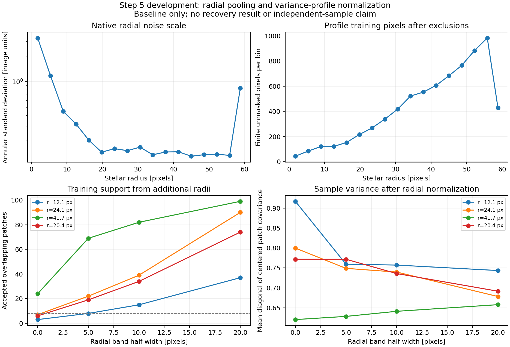

# Step 5 development: radial pooling feasibility

**Adding nearby radii materially increases the available training patches.** The saved baseline also has a strong
radial variance gradient near the star, making radial normalization a useful separate experiment. This checkpoint
measures geometry and noise scale; it does not yet evaluate new matched filters or demonstrate a detection gain.

The subsequent [saved-image filtering comparison](../p4-step5-radial-comparison-20260918/README.md) is now complete.
It records recovery, conditional uncertainty, common-site split stability, and the next variance-floor test.

The user proposed pooling across radii because the P4 optimization/predictor region (OR) is wider than the search
region (SR), and reducing the OR worsens the reduction. That motivates testing broader residual structure.
Whether the final-image covariance shape transfers across those radii remains to be measured.



## Geometry

Use the existing 11×11 patches and five-pixel angular arc spacing. Center rings have five-pixel radial spacing,
with half-widths 0, 5, 10, and 20 pixels about the candidate's stellar radius. Rotation retains the original
candidate orientation; there is no radial magnification. Nonpositive ring radii are skipped. The same exact native
interpolation-stencil exclusions and complete finite-support requirement apply on every ring. All known-source,
development, calibration, and evaluation circles from the original protocol remain excluded.

| Candidate position (row, column) | Radius (pixels) | Same radius | ±5 pixels | ±10 pixels | ±20 pixels |
| --- | ---: | ---: | ---: | ---: | ---: |
| (120, 137), development | 12.1 | 3 | 8 | 15 | 37 |
| (109, 143), development | 24.1 | 7 | 22 | 39 | 90 |
| (98, 98), development | 41.7 | 24 | 69 | 82 | 99 |
| (145, 138), inner null site | 20.4 | 6 | 19 | 34 | 74 |

The ±5-pixel band reaches the existing eight-patch minimum at all four inspected positions. These numbers include
overlap both radially and azimuthally, so they do not count independent samples. Every accepted patch has equal
weight in this initial audit; more distant rings offer more angular centers. Missing support can make a band
asymmetric. [`audit.json`](audit.json) retains counts for every ring, including excluded and incomplete patches.

## Variance-profile diagnostic

Estimate the native residual variance in 3.6-pixel radial bins over 0–60 pixels, after excluding the full union of
source and held-out circles. Each variance subtracts that bin's sample mean and uses the `n−1` denominator; the
bin mean is not separately subtracted from the image in this audit. All 17 bins exceed the fixed minimum of 20
training pixels, with actual counts from 44 to 983. These pixel counts also do not imply independence.

The standard deviation falls from 3.28 in the central bin to 0.32 at radii 10.8–14.4 and approximately 0.13–0.17
over 18–57.6 pixels. It rises to 0.84 in the final 57.6–60 bin. The outer rise warrants a separate investigation
of support and processing boundaries before selecting a pooling range; this audit does not establish its cause.

For the normalized comparison, interpolate **log variance** between bin centers and divide each native pixel by
the resulting standard deviation before extracting/interpolating patches. Values are held constant inside the
endpoint half-bins and are undefined outside 0–60 pixels. Raw and normalized sampling have identical accepted
centers and exclusion/incomplete counts at every inspected ring.

Mean pixel variance of the normalized, centered training patches spans roughly 0.62–0.92 across these cases.
There is no requirement that it equal one: interpolation changes the statistics, local angular structure may
differ from the radial average, and the patches are correlated. Normalization does not by itself establish a
correct covariance or calibrated conditional uncertainty. Sample covariance spectra, including the fraction in
the leading three modes, are retained in the JSON as diagnostics, not as optimization criteria.

## Follow-on comparison

The [follow-on comparison](../p4-step5-radial-comparison-20260918/README.md) evaluates the four combinations of
**same-radius versus radial-band sampling**, and **raw versus radial-normalized pixels**, on the saved development
data. It keeps rank, floor, response footprint, and exclusions fixed to
separate their effects. For an actual filter, apply the same native scale map to the candidate data **and response
template**, and estimate the mean/covariance in that standardized space. The plan's Section 6 gives the equivalent
covariance in original image units, preserving the contrast parameter.

Check covariance shape across radii, stability across withheld angular blocks, conditional-error coverage, and
source leakage before choosing a band or profile estimator. More samples alone are not the success criterion.
Retain Gaussian and identity references for recovery comparisons. These inspected data are development data;
fresh validation follows after the policy is frozen.

The eventual tentative 90-injection validation study is intended for ROC. The user expects a 3–4× speedup over
the measured local runtime, suggesting approximately 2.5–3.3 hours of reductions, subject to a throughput and
numerical-consistency check. This audit used only the saved baseline and launched no new reductions.

## Artifacts and verification

- [`audit.json`](audit.json): exact variance profile, ring counts, sample covariance summaries, and provenance.
- [`verification.json`](verification.json): the unchanged default sampler matches saved production counts at
  16 calibration/evaluation centers across all eight original radii.
- [`diagnostics.png`](diagnostics.png): figure above, visually inspected.
- [`audit_p4_step5_radial_pooling.py`](../../scripts/audit_p4_step5_radial_pooling.py): maintained diagnostic.
- [`analyze_p4_step5_development.py`](../../scripts/analyze_p4_step5_development.py): independent stencil sampler,
  extended with an optional training-center radius while retaining its previous default.

The scripts pass Python syntax checking. No production C++ functions or mxlib calls changed. Reproduce into a new
directory from the repository root:

```sh
OPENBLAS_NUM_THREADS=1 OMP_NUM_THREADS=2 MPLCONFIGDIR=/tmp/p4-step5-matplotlib \
  python3 agents/plans/scripts/audit_p4_step5_radial_pooling.py \
  --holdout working/roc/p4_noise_step5_holdout_20260918 --output /path/to/new/audit-directory
```
