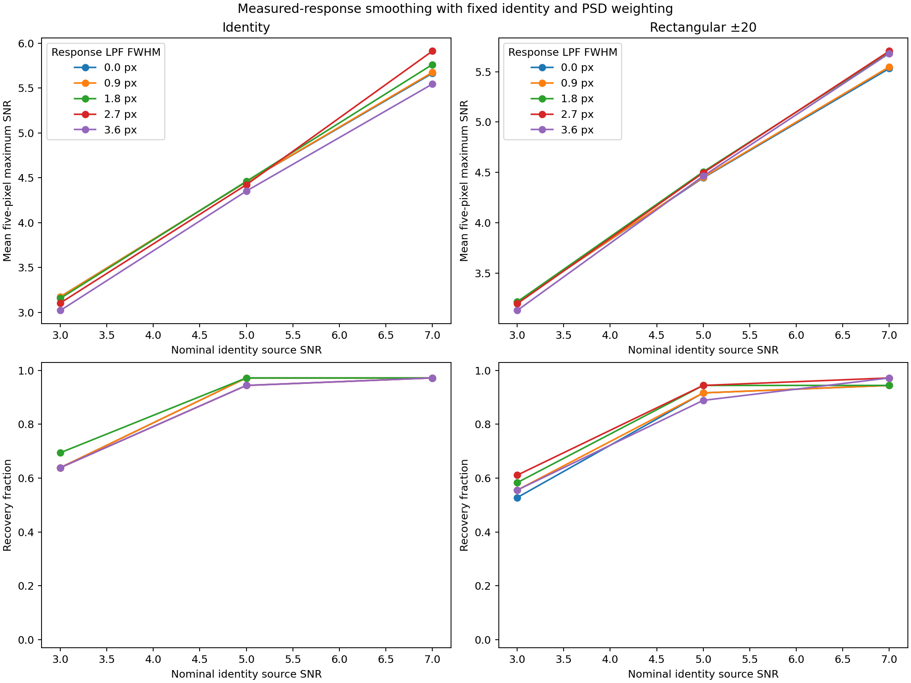

# Step 5: measured-response smoothing setup

## Fixed question

Does removing fine spatial structure from the independently measured P4
response improve injection SNR under either identity weighting or the current
small-separation rectangular-PSD weighting?

This test follows the observation that production Gaussian FWHM-3.6 smoothing
has slightly higher mean injection SNR than the identity matched filter. If the
stored measured response were exact and the image noise were white, smoothing
that response could only reduce expected matched-filter SNR. An observed gain
would therefore show that the removed structure is not useful in these
injections. It could arise from response-estimation error, response variation,
or interaction with non-white residual noise.

## Fixed comparison

The response-template Gaussian low-pass FWHM grid is **0, 0.9, 1.8, 2.7, and
3.6 pixels**, or 0, 0.25, 0.5, 0.75, and 1.0 lambda/D. Every width is applied
to both:

- identity weights, using the smoothed response divided by its squared norm;
- raw rectangular PSD weights with ±20-pixel training-center pooling and the
  existing 0.3 flat-spectrum mixture.

The ±20 branch is used because it has complete support at all 36 inner sites.
The production Gaussian FWHM-3.6 image remains a reference. Its width describes
direct image smoothing; it is distinct from convolving an already processed
response with a 3.6-pixel kernel.

Only each native 11-by-11 response template changes. The implementation uses a
constant-zero exterior, a four-sigma Gaussian kernel cutoff, and no template
renormalization. The matched-filter amplitude normalization makes the detection
statistic invariant to a scalar rescaling of a template. The report separately
records paired amplitude throughput.

The completed SNR-3/5/7 reductions and the completed one-lambda/D-masked
analysis are immutable inputs. The test retains the same injections, known
planet and current-trial exclusions, candidate pixels, covariance samples,
fitted PSD mean, five-pixel search, and production `hciAnalyze` annular SNR.
It performs no new P4 reduction.

Within each weighting family, all smoothing widths reuse the same 20 frozen
calibration locations selected by the completed masked comparison. Each method
gets its own maximum-null threshold, frozen before positive images are read.
The zero-width identity, zero-width rectangular ±20, and production Gaussian
maps, SNRs, thresholds, and decisions must reproduce the completed parent.

## Interpretation diagnostics

For every smoothed matched filter, the output includes:

- mean five-pixel maximum and fixed-center production SNR;
- recovery and held-out null counts;
- positive-minus-baseline amplitude throughput divided by injected contrast;
- the predicted matched-SNR efficiency if the unsmoothed measured response
  were the exact source template.

For identity weighting, the last quantity is the cosine between the original
and smoothed templates. For PSD weighting it is the corresponding covariance
inner-product cosine. A measured SNR improvement despite a predicted
exact-template loss is the key signature that the removed response structure
does not reproduce as useful signal.

This first comparison does not truncate or otherwise change the PSD inverse.
That remains a separate follow-up after the template-only result.

## Validation and ROC commands

Run the local algebra checks after pulling the setup:

```sh
OPENBLAS_NUM_THREADS=1 OMP_NUM_THREADS=1 MPLCONFIGDIR=/tmp/p4-step5-matplotlib \
  /opt/conda/envs/xpy3_13/bin/python3 \
  agents/plans/scripts/compare_p4_step5_response_smoothing.py check
```

Prepare the immutable saved-image comparison on ROC:

```sh
OPENBLAS_NUM_THREADS=1 OMP_NUM_THREADS=1 MPLCONFIGDIR=/tmp/p4-step5-matplotlib \
  /opt/conda/envs/xpy3_13/bin/python3 \
  agents/plans/scripts/compare_p4_step5_response_smoothing.py prepare \
  --comparison working/roc/p4_inner_snr357_patch_rms_lambdad_20260919 \
  --root working/roc/p4_response_smoothing_20260920 \
  --cpus 0 1 2 3 4 5 6 7 8 9 10 11
```

Launch the resumable analysis:

```sh
tmux new-session -d -s p4-response-smoothing \
  "cd /home/jrmales/Source/mxApps/hciReduce && \
   OPENBLAS_NUM_THREADS=1 OMP_NUM_THREADS=1 MPLCONFIGDIR=/tmp/p4-step5-matplotlib \
   /opt/conda/envs/xpy3_13/bin/python3 \
   agents/plans/scripts/compare_p4_step5_response_smoothing.py run \
   --root working/roc/p4_response_smoothing_20260920 \
   > working/roc/p4_response_smoothing_20260920/driver.log 2>&1"
```

Monitor it with:

```sh
cat working/roc/p4_response_smoothing_20260920/state.json
tail -n 30 working/roc/p4_response_smoothing_20260920/driver.log
```

The final products are `results.json`, `results.md`, and `comparison.png` under
the new root. This is a paired development reuse of one correlated field, not
an independent validation set.

## Completed result

The comparison completed all **164 baseline and 108 positive analyses**, ran no
new P4 reduction, and verified every frozen input. The zero-width identity,
zero-width rectangular ±20, and production Gaussian controls reproduce their
parent amplitude and SNR maps exactly. The production SNR maps agree exactly
with the independent annular oracle. The completion receipt records SHA-256
`8156684647318c6724e96ef9266968b5137383a95d3f8061a22f2275d40f687e`
for the full `results.json`.

Aggregate results over all 36 sites are:

| Weighting | Response LPF FWHM | SNR-3 recovery | SNR-5 recovery | SNR-7 recovery | Held-out nulls | Mean max SNR at 3 / 5 / 7 |
| --- | ---: | ---: | ---: | ---: | ---: | --- |
| Identity | 0.0 px | 23 | 35 | 35 | 0 | 3.175 / 4.454 / 5.664 |
| Identity | 0.9 px | 23 | 35 | 35 | 0 | 3.174 / 4.455 / 5.675 |
| Identity | 1.8 px | **25** | 35 | 35 | 0 | 3.156 / 4.461 / 5.763 |
| Identity | 2.7 px | 23 | 34 | 35 | 0 | 3.104 / 4.423 / 5.912 |
| Identity | 3.6 px | 23 | 34 | 35 | 0 | 3.021 / 4.352 / 5.545 |
| Rectangular ±20 | 0.0 px | 19 | 33 | 34 | 0 | 3.216 / 4.447 / 5.532 |
| Rectangular ±20 | 0.9 px | 20 | 33 | 34 | 0 | 3.216 / 4.452 / 5.548 |
| Rectangular ±20 | 1.8 px | 21 | 34 | 34 | 0 | 3.216 / 4.507 / 5.691 |
| Rectangular ±20 | 2.7 px | **22** | **34** | **35** | 0 | 3.197 / 4.497 / 5.704 |
| Rectangular ±20 | 3.6 px | 20 | 32 | 35 | 1 | 3.130 / 4.464 / 5.681 |
| Production Gaussian | — | 20 | 34 | **36** | 1 | 3.212 / 4.549 / 5.704 |

Moderate smoothing improves recovery without adding an observed null exceedance:
identity at 1.8 pixels gains two SNR-3 detections with no losses, while
rectangular ±20 at 2.7 pixels changes 19/33/34 to 22/34/35. A 3.6-pixel
response blur is too broad: it loses an SNR-5 detection under identity and has
one null exceedance plus lower SNR-5 recovery under rectangular weighting.
Identity with a 1.8-pixel response blur remains stronger in aggregate than the
best smoothed rectangular arm at SNR 3 and 5.

## Separation dependence

The aggregate gain is concentrated at the two innermost radii. The entries
below are the changes in mean maximum SNR caused by a 1.8-pixel response blur,
shown at nominal SNR 3 / 5 / 7:

| Radius | Identity change | Rectangular ±20 change |
| ---: | --- | --- |
| 6 px | −0.135 / +0.015 / **+0.616** | **+0.123 / +0.378 / +1.040** |
| 8 px | **+0.229 / +0.277 / +0.296** | **+0.088 / +0.279 / +0.361** |
| 12 px | +0.015 / +0.021 / +0.018 | −0.018 / −0.026 / −0.025 |
| 16 px | −0.061 / −0.087 / −0.094 | −0.045 / −0.085 / −0.121 |
| 20 px | −0.074 / −0.081 / −0.122 | −0.019 / −0.041 / −0.138 |
| 24 px | −0.087 / −0.105 / −0.124 | −0.127 / −0.145 / −0.159 |

At radius 8, identity recovery changes from 4/6 to 6/6 at nominal SNR 3.
Rectangular 2.7-pixel smoothing changes radius-8 recovery from 3/4/5 to
5/5/6. At radii 16–24, smoothing generally lowers mean SNR. A single global
smoothing width is therefore not supported as a production rule.

## What this says about the measured response

The paired amplitude increments closely follow the overlap predicted from the
original measured response:

| Method | Measured paired throughput at SNR 3 / 5 / 7 | Predicted amplitude response | Exact-template SNR efficiency |
| --- | --- | ---: | ---: |
| Identity, 0.0 px | 1.017 / 1.007 / 0.993 | 1.000 | 1.000 |
| Identity, 1.8 px | 1.377 / 1.361 / 1.340 | 1.347 | 0.987 |
| Rectangular ±20, 0.0 px | 1.004 / 0.994 / 0.982 | 1.000 | 1.000 |
| Rectangular ±20, 1.8 px | 1.424 / 1.408 / 1.387 | 1.404 | 0.979 |
| Rectangular ±20, 2.7 px | 1.979 / 1.954 / 1.920 | 1.938 | 0.929 |

Throughput above one is the expected consequence of normalizing the broadened
template by its own smaller matched-filter energy; it is not additional P4
source throughput. More significantly, the observed increments track that
prediction within a few percent. This argues against the simple hypothesis
that the measured response's fine structure is globally spurious. The result
is more consistent with fine response modes carrying disproportionate image
noise, or with the PSD covariance failing to downweight those modes at small
separations. The scalar overlap test cannot exclude smaller response errors.

The response smoothing still helps where annular support is weakest, so some
of the radius-6 and radius-8 improvement may be specific to their sparse noise
normalization. These six correlated sites per radius have also been inspected
repeatedly. Treat the result as a diagnostic for the next covariance test, not
as a selected radius-dependent filter.



## Next test

Test regularization of the PSD precision itself while keeping the response
fixed. The radius dependence suggests emphasizing radii 6 and 8 while retaining
12–24 as controls. A hard or tapered spatial-frequency cutoff should be compared
with a clipped inverse-PSD gain; the existing 0.3 flat-spectrum mixture remains
the zero-truncation reference. This will distinguish suppression of poorly
modeled noise frequencies from direct smoothing of the source template.
