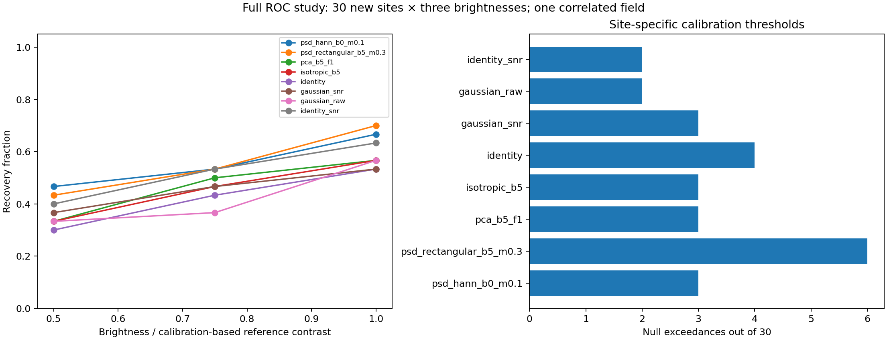

# Step 5: full PSD injection study on ROC

**All 90 injections and the automatic analysis completed. Same-radius Hann PSD improves recovery over
Gaussian/SNR in this sample, with the same observed baseline exceedance count.** The advantage over identity
matched filtering with application SNR is smaller, and raw photometric errors remain broadly comparable to
identity. The pooled rectangular PSD candidate has more baseline exceedances.

The full study took **78.4 minutes**, from 2026-09-19 03:45:56 to 05:04:19 UTC (September 18, 21:45:56 to
23:04:19 MDT). Median full-image reduction time was **51.26 seconds** across the baseline and 90 positives;
the range was 51.13–52.02 seconds. Setup and launch were committed as `35cfee7` and `9f59d34`. The user
waived a separate small ROC pilot; all thresholds, source contrasts, and filter settings were frozen before
new-site measurements. The completed products and independent review are archived here.

## Recovery results

Each recovery entry is **detections out of 30** at the stated brightness. The last column is baseline
exceedances at the 30 new sites, measured before injection. All searches are valid; no sites were dropped.

| Method | 0.5× | 0.75× | 1× | Baseline exceedances |
| --- | --- | --- | --- | --- |
| Same-radius Hann PSD, mixture 0.1 | **14/30** | **16/30** | **20/30** | **3/30** |
| ±5-pixel rectangular PSD, mixture 0.3 | 13/30 | 16/30 | 21/30 | 6/30 |
| ±5-pixel PCA, three modes / floor 1 | 10/30 | 15/30 | 17/30 | 3/30 |
| ±5-pixel fitted-mean isotropic | 10/30 | 14/30 | 17/30 | 3/30 |
| Original identity matched-filter score | 9/30 | 13/30 | 16/30 | 4/30 |
| Gaussian FWHM 3.6 + application SNR | 11/30 | 14/30 | 16/30 | 3/30 |
| Gaussian FWHM 3.6, smoothed intensity | 10/30 | 11/30 | 17/30 | 2/30 |
| Identity matched filter + application SNR | 12/30 | 16/30 | 19/30 | 2/30 |



Hann PSD recovers **every Gaussian/SNR detection**, plus 3, 2, and 4 sources at the three brightnesses.
It also recovers every original-identity detection, plus 5, 3, and 4. Against identity with application SNR,
the additions are only **2, 0, and 1**, with no lost detections. All these additional Hann detections were
below its threshold in the baseline. Thus the additions are actual injection-induced crossings, although
the overall counts also retain preassigned sites that already exceeded baseline threshold.

Hann and Gaussian/SNR each have three baseline exceedances, at different locations: Hann at
`fresh_r32_b1`, `fresh_r32_b2`, and `fresh_r38_b4`; Gaussian/SNR at `fresh_r26_b3`, `fresh_r26_b5`, and
`fresh_r38_b4`. Equal counts do not establish equal underlying false-positive rates. Identity/SNR has two
baseline exceedances, so this sample does not establish that Hann improves on that reference at a matched
false-positive rate.

The ±5-pixel rectangular PSD's six baseline exceedances make its 21/30 highest-level recovery insufficient
to prefer it over Hann. Both candidates differ in window, spectral mixture, and training width; this comparison
does not isolate the effect of pooling. The new baseline-to-positive crossings for Hann are **11, 13, 17 among
its 27 baseline-below-threshold sites**, versus **7, 10, 15 among the rectangular candidate's 24**. These
method-dependent subsets are descriptive diagnostics; the primary denominator remains the preassigned 30.

At 1×, Hann's four additional Gaussian/SNR recoveries lie at radii 26 and 44 (two each). The three-level
per-radius counts and individual paired decisions are preserved in [`review.json`](review.json). Sites on
each ring can overlap, so multiple additional detections can share the same local noise structure.

## Raw photometry and uncertainty

The following values summarize all **90 exact-center positive measurements**. Raw fractional contrast error
is `positive amplitude / injected contrast − 1`; it retains the background realization. Entries are errors
relative to the injected contrast, not errors relative to a negative-injection fit or uncertainty on a median.

| Method | Median signed error | Median absolute error | RMS error | Within ±1 conditional sigma |
| --- | --- | --- | --- | --- |
| Same-radius Hann PSD | +7.8% | 59.2% | 77.4% | 45/90 |
| ±5-pixel rectangular PSD | +5.3% | 56.7% | 78.1% | 37/90 |
| ±5-pixel PCA | +23.5% | 65.3% | 85.0% | 6/90 |
| ±5-pixel isotropic | +1.4% | 61.1% | 78.9% | 15/90 |
| Original identity | +2.1% | 57.3% | 78.7% | 90/90† |

† Identity's `C=I` sigma is an algebraic quantity without an estimated physical noise scale; its apparent
coverage is not evidence of calibrated uncertainty. Gaussian smoothed intensity is not a contrast estimator.

Hann's per-brightness median absolute errors are **80.5%, 53.4%, and 39.8%**, versus identity's
**90.7%, 59.9%, and 44.6%**. RMS errors are only modestly lower: **103.3%, 68.4%, 51.0%** versus
**105.2%, 69.6%, 51.8%**. Pooling brightness levels changes the ordering of the median absolute errors,
as the table shows; the overall evidence supports comparable photometry, with a modest improvement in
some summaries.

Conditional uncertainty is more realistic than PCA's but remains imperfect. Hann includes **15/30 native
baseline centers** within one conditional sigma, rectangular PSD 12/30, PCA 2/30, and isotropic 5/30.
The pooled baseline-center score variance is **1.95 for Hann**, 2.44 for rectangular PSD, 6.01 for PCA,
and 8.14 for isotropic. Hann's pooled mean is 0.137. These heterogeneous, correlated sites do not form
independent repeated draws of a single fixed filter; the statistics are descriptive calibration checks.

The diagnostic paired increment `(positive amplitude − baseline amplitude) / injected contrast − 1`
has median **−0.55% for Hann**, −0.67% for rectangular PSD, −0.72% for PCA, −0.69% for isotropic, and
−0.73% for identity. This supports the analytic response approximation on these injections. It does not
remove background errors from actual single-image photometry; the primary recovery and error tables use
the unpaired positive measurements.

## What this establishes

The frozen comparison supports **same-radius Hann PSD as the leading PSD candidate here** and confirms
a recovery gain over Gaussian smoothing with application SNR in this sample. Ordinary annular SNR
normalization also improves identity recovery substantially, leaving a much smaller gap to Hann.

This remains one reused residual field, with overlapping sites and shared training/calibration pixels.
The next validation should address threshold transfer and conditional uncertainty using more independent
noise support or another field, retaining identity/SNR as a close reference. The present counts do not
justify a production default or independent-trial confidence intervals. Radii below 26 pixels remain untested
by this full study. No additional reductions or production-policy changes were made during this review.

## Fixed comparison

The [preceding PSD recovery experiment](../p4-step5-psd-recovery-20260918/README.md) motivates two fixed PSD
candidates and six controls. Every method shares the same reductions, sites, and calibration rule.

| Method key | Fixed estimator / statistic |
| --- | --- |
| `psd_hann_b0_m0.1` | Same-radius raw patches; Hann PSD window; 0.1 isotropic spectral mixture |
| `psd_rectangular_b5_m0.3` | Raw patches pooled over ±5 pixels; rectangular PSD window; 0.3 spectral mixture |
| `pca_b5_f1` | Raw ±5-pixel patches; three covariance modes; variance floor fraction 1 |
| `isotropic_b5` | Raw ±5-pixel patches; fitted mean and mean sample pixel variance |
| `identity` | Original response matched filter with `C=I`, without fitted mean or physical noise scale |
| `gaussian_snr` | Production `filter.lpfGaussFW=3.6`, followed by ordinary application annular SNR |
| `gaussian_raw` | The same production Gaussian-smoothed intensity |
| `identity_snr` | Response matched filter with `C=I`, followed by ordinary application annular SNR |

The PSD estimator is unchanged: 11×11 stamps, 21×21 FFT padding, finite lag covariance, positive spectral
mixture, and variance rescaling. Windows affect covariance estimation only; candidate pixels and templates
remain untapered. Radial/angular patch-center spacing is five pixels, with at least eight training patches.
No radial normalization or additional parameter sweep is included.

## Sites, source amplitudes, and holdouts

There are **30 new sites**, six at each of five nominal radii, with **0.5×, 0.75×, and 1×** brightnesses.
The levels concentrate on the transition between the earlier 0.5× and 1× measurements. The former 2× level,
which was already fully recovered, is omitted. These multipliers are not PSD SNRs.

| Radius (pixels) | New native centers `(x, y)` | Minimum same-radius patches across candidate searches |
| --- | --- | --- |
| 26 | (102, 128), (102, 124), (103, 119), (105, 114), (115, 104), (121, 102) | 15 |
| 32 | (121, 159), (96, 129), (96, 124), (97, 117), (115, 98), (121, 96) | 21 |
| 38 | (125, 166), (110, 161), (91, 140), (90, 127), (92, 114), (125, 89) | 28 |
| 44 | (127, 172), (108, 167), (92, 154), (84, 136), (85, 118), (127, 83) | 36 |
| 50 | (127, 178), (103, 171), (84, 153), (78, 128), (83, 105), (127, 77) | 25 |

Coordinates are zero-based native FITS-array pixels: `row` in the existing analysis records means `x`, and
`column` means `y`; the NumPy access is `[y, x]`. The field center is `(127.5, 127.5)`. Sites are selected from
integer centers within 0.65 pixel of each radius and azimuth 90–270 degrees, using geometry and finite support
only. Six evenly spaced angular ranks are chosen from the viable pool, with at least four pixels between
centers on a ring. The `b` suffix identifies angular rank, not an independent angular block.

Each new site's complete 15×15 Gaussian-kernel/five-pixel-search footprint is disjoint from the earlier
calibration/evaluation Gaussian measurement footprints, the three development measurement footprints, and
the known source circle. New sites can overlap one another. This reuses the same residual field, including
pixels that could previously have supplied training noise; it is not a blind new-field validation.

**Training and calibration use a separate holdout for each new site.** Masking all 30 new sites simultaneously
left only 0–2 same-radius patches in the initial geometry check. Keeping the former global historical holdout
also prevented adequate new inner-site sampling. The fixed replacement excludes:

- the known source circle;
- all 28 original eligible calibration searches, each with its complete Gaussian/search footprint;
- the current new site's complete Gaussian/search footprint.

Other new sites and historical non-calibration development/evaluation regions may supply training pixels.
The current target is excluded from every covariance fit used to calibrate or measure that target. All 28
calibration searches remain valid for every site. Means and covariances are fitted again on each positive
image with these same masks. Nonlocal changes caused by the full reduction can still alter training noise.

For each site and each method, the threshold is the `ceil((28+1)*0.95)` order statistic: the maximum of the
28 baseline calibration search scores. Searches maximize the signed statistic over the native center and
four axial one-pixel neighbors; detection requires strict exceedance. These are site-specific recalibrations,
not reused thresholds from the earlier global-mask experiment.

The site's reference contrast is its `isotropic_b5` calibration threshold times its baseline candidate
conditional sigma. This uses training covariance and the response template; target-stamp pixel values are
not used to set source brightness. **All 30 sets of thresholds and all 90 injection contrasts are written and
fingerprinted before any new-site baseline score or positive image is measured.** Baseline-exceeding sites
remain in the positive sample. Invalid searches count as nondetections; missing structural support aborts
visibly rather than silently changing the preassigned sample.

## ROC execution

The isolated run directory on `roc` (hostname `exao5`) is:

```text
/home/jrmales/Source/mxApps/hciReduce/working/roc/p4_psd_full_20260918
```

ROC's existing checkout is left intact. Native executables were built from archived C++ source commit
`882cb15`, with Release configuration, CPU benchmarks, and experimental P4 precision enabled. The frozen
executables are `p4ReductionPrecisionBenchmark`, `hciAnalyze`, and `hciGaussianReference`; their shared
libraries are copied into the isolated software directory and fingerprinted. No production C++ changed.

All **621 original input-frame hashes match on ROC**. The run preserves P4-M32D64, mode fraction 0.15,
256×256 full images, mean combination, the original reduction configuration and analytic response field,
and the cropped 12×12 injection PSF without renormalization. The baseline belongs to this full study; no
separate numerical-consistency or timing pilot is inserted.

Reductions use ROC's 24 physical cores (CPU IDs 0–23), OpenMP 24, and single-threaded BLAS. Analysis uses
CPU IDs 12–13, OpenMP 2, and single-threaded BLAS. Python is the existing `xpy3_13` environment:
NumPy 2.4.3, SciPy 1.16.3, Astropy 7.2.0, and Matplotlib 3.10.8. Native dependency, build, and Python
provenance is recorded in `manifest.json`; there were 740 GB available before launch.

The driver ran in detached tmux session `p4-psd-full-20260918` (supervisor PID 1530357). It completed the baseline,
calibration, 30 new-site baseline measurements, all 90 positive reductions and reference/filter analyses,
then wrote `results.json`, `results.md`, `comparison.png`, and `complete.json`. Atomic `state.json`,
`driver.log`, per-trial completion records, commands, FITS products, and resource logs preserve progress.
The run required no open connection or further input. Its final state is `complete`.

Completed reductions and reference maps can be reused after hash verification. Partial output directories
are deliberately not overwritten: preserve/quarantine a failed trial directory before restarting. A failure
sets `state.json` to `failed` and stops; completion sets it to `complete`. A second invocation after completion
verifies the summary products and returns.

Read the retained final status:

```sh
ssh roc 'cat /home/jrmales/Source/mxApps/hciReduce/working/roc/p4_psd_full_20260918/state.json'
```

## Interpretation and verification

Recovery and baseline exceedances use the same fixed threshold procedure for all methods. Report raw
exact-center photometry separately: `positive amplitude / injected contrast − 1`, conditional-sigma coverage,
and the diagnostic paired increment relative to the baseline. Gaussian intensity is not a contrast estimate;
identity's `C=I` sigma is not a fitted physical uncertainty. Application-SNR references retain their ordinary
whole-annulus normalization, including trial neighborhoods.

The 30 positions share a residual field, calibration measurements, training pixels, and sometimes overlapping
measurement footprints. Counts are descriptive; they do not support independent-trial confidence intervals
or demonstrate equal underlying false-positive rates. Inner radii below 26 pixels remain a follow-up.

Local setup checks passed:

- independently reconstructed all 30 native masks;
- audited 150 candidate search stencils and 4,200 calibration search stencils;
- replacing target pixels with NaNs leaves 360 candidate/calibration covariance fits exactly unchanged;
- at a previously evaluated site, all four covariance filters and identity recover an exact template-only
  amplitude increment, without inspecting outcomes at the new sites;
- selected coordinates match a separate geometry prototype; original PSF and staged source hashes match.

The native build, library loading/help checks, and all input hashes pass on ROC. No mxlib-calling function
was edited, so this checkpoint adds no mxlib ownership follow-up.

Completion verification on ROC checked **1,322 distinct file fingerprints**, including all 621 source frames,
frozen software, build/source provenance, 91 completed reductions, 91 reference-map sets, and all measurements.
Every recorded measurement matches the final summary. All 91 Gaussian CLI replays are bitwise equal;
the maximum independent Gaussian error relative to image peak is 1.05e-6.

The local review independently reconstructed all 30 holdout masks and audited **960 searches**: 840
site-specific calibration searches, 30 new-site null searches, and 90 positive searches. Generic dense
covariance solves reproduce **19,200 candidate-pixel fits**, with maximum absolute amplitude difference
6.25e-18, relative sigma difference 6.33e-15, and absolute score difference 1.15e-13. The review reuses the
already-tested covariance estimators and interpolation geometry; it independently checks masks, solves,
native reference pixels, thresholds, decisions, and summaries.

All **4,800 identity pixels**, **2,880 Gaussian/application-SNR reference searches**, **240 thresholds**, and
**450 raw photometry/increment records** agree. The local review also verifies 644 distinct transferred
product fingerprints. The comparison figure was visually inspected. Python syntax and whitespace checks
pass; no production C++ changed.

### Artifacts

- [`protocol.json`](protocol.json): fixed methods, sites, amplitudes rule, exclusions, and compute settings.
- [`geometry.json`](geometry.json): every site's candidate and calibration training-count audit.
- [`native_manifest.json`](native_manifest.json): ROC-native executables, dependencies, source archive,
  build cache, Python environment, and all 621 source-frame fingerprints.
- [`launch.json`](launch.json): launch time, detached session, command, setup commit, and manifest/protocol hashes.
- [`startup_status.json`](startup_status.json): active supervisor, successful baseline, resource usage, and
  production Gaussian replay/independent-reference checks.
- [`thresholds.json`](thresholds.json), [`jobs.json`](jobs.json), and
  [`calibration_complete.json`](calibration_complete.json): all site/model thresholds and 90 exact source contrasts,
  frozen before new-site measurements; [`calibration.json`](calibration.json) preserves the full calibration measurements.
- [`setup_checks.json`](setup_checks.json), [`setup_check.py`](setup_check.py), and
  [`independent_geometry.json`](independent_geometry.json): local verification and separate selection audit.
- [`run_p4_step5_roc_full.py`](../../scripts/run_p4_step5_roc_full.py): maintained design/prepare/run driver.
- [`results.json`](results.json), [`results.md`](results.md), [`baseline_nulls.json`](baseline_nulls.json), and
  [`comparison.png`](comparison.png): unchanged full-study measurements, summary, and plot.
- [`complete.json`](complete.json), [`state.json`](state.json), and
  [`completion_verification.json`](completion_verification.json): completion, timing, and ROC provenance checks.
- [`review.json`](review.json) and [`review_p4_step5_roc_full.py`](../../scripts/review_p4_step5_roc_full.py):
  generic-solve/native-pixel verification, descriptive photometry, per-radius recovery, and paired decisions.

The ignored local run directory now also contains the transferred FITS products and per-trial logs. The tracked
report preserves the frozen design, calibration, completed scientific measurements, and verification evidence.

Reproduce the local review from the repository root, writing into a new output directory:

```sh
OPENBLAS_NUM_THREADS=1 OMP_NUM_THREADS=2 MPLCONFIGDIR=/tmp/p4-step5-matplotlib \
  taskset -c 12,13 python3 agents/plans/scripts/review_p4_step5_roc_full.py \
  --root working/roc/p4_psd_full_20260918 --output /path/to/new/review-directory
```
