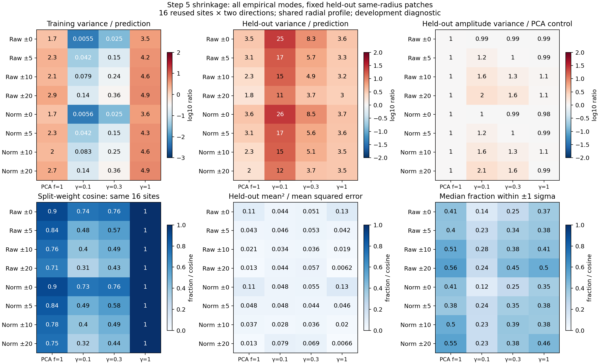

# Step 5 development: covariance shrinkage

**The tested shrinkage settings do not improve the fixed held-out projection diagnostic.** Strengths 0.1 and 0.3
have much smaller training variance than predicted but substantially larger held-out variance. With broad radial
pooling, they also increase actual held-out amplitude variance and reduce weight agreement between angular halves.
The fully isotropic endpoint is stable by construction and still underestimates held-out variance.

This uses the saved baseline, the same 16 common outer sites, and the same sampling/normalization choices as the
[projected-noise diagnostic](../p4-step5-projected-noise-20260918/README.md). It is a development comparison of noise
projections. Source recovery and Gaussian/identity detection comparisons remain in the earlier reports. No new
reductions, positive images, thresholds, production changes, or ROC jobs were introduced.



## Fixed experiment

For centered sample covariance $\widehat C$, test the previously specified strengths:

$$
C_\gamma=(1-\gamma_{\rm shrink})\widehat C+
\gamma_{\rm shrink}\frac{\operatorname{tr}(\widehat C)}{p}I,
\qquad \gamma_{\rm shrink}\in\{0.1,0.3,1.0\},\quad p=121.
$$

This preserves total sample variance and gives every direction at least
$\gamma_{\rm shrink}\operatorname{tr}(\widehat C)/p$ variance. Strengths below one retain all empirical modes,
including weaker modes discarded by the three-mode model. Strength one is isotropic. Every fit retains its training
mean; the isotropic endpoint therefore has different background handling from the original identity reference.

Cross the strengths with radial half-widths 0, 5, 10, and 20 pixels, each raw or radial-normalized. Retain 11×11
patches, five-pixel radial/angular spacing, the eight-patch minimum, exact native source/holdout exclusions, and
the existing radial variance profile. Fit on one native y half-plane, validate on the opposite half, and swap
directions. Straddling stencils are excluded, and cross-ring train/validation native support is disjoint.

Primary validation always uses the same-radius ring, independent of training width. Each policy has **32
directional fits at the same 16 sites**, nominal radii 46 and 50. The comparison control is the previously tested
three-mode model at floor fraction 1.0, refitted on exactly the same samples. Its archived projections and
split-weight diagnostics are reproduced before assessing shrinkage.

Normalized fits condition on the shared, fixed radial profile. Overlapping patches and nearby sites reuse pixels,
and disjoint halves can still be spatially correlated. The 32 fits are not independent trials, and these outer
sites do not establish performance at smaller separations. All medians below are across these fixed directional
fits, except split-weight cosines, which use the 16 paired sites.

## Conditional variance prediction

The entries are **centered held-out projection variance divided by the model's predicted amplitude variance**.
One would indicate agreement; these are variance ratios, not ratios of standard deviations.

| Pixels / training half-width | Three modes, floor 1.0 | Shrinkage 0.1 | Shrinkage 0.3 | Shrinkage 1.0 |
| --- | ---: | ---: | ---: | ---: |
| Raw / 0 px | 3.46 | 25.22 | 8.32 | 3.62 |
| Raw / 5 px | 3.05 | 16.74 | 5.66 | 3.30 |
| Raw / 10 px | 2.26 | 14.90 | 4.90 | 3.21 |
| Raw / 20 px | 1.85 | 10.51 | 3.72 | 2.98 |
| Normalized / 0 px | 3.63 | 25.64 | 8.47 | 3.72 |
| Normalized / 5 px | 3.08 | 16.81 | 5.63 | 3.63 |
| Normalized / 10 px | 2.33 | 15.49 | 5.10 | 3.52 |
| Normalized / 20 px | 2.02 | 11.59 | 3.70 | 3.46 |

In contrast, **training** variance/prediction medians span only 0.0055–0.142 for shrinkage 0.1 and 0.025–0.363
for shrinkage 0.3. The corresponding held-out ranges are 10.51–25.64 and 3.70–8.47. This large training/validation
gap is consistent with fitting poorly supported covariance directions, not successful noise suppression.
Shrinkage 1.0 gives training medians 3.48–4.92 and held-out medians 2.98–3.72; an isotropic variance at the mean
pixel variance does not describe the noise along these templates either.

## Actual amplitude variance and stability

A calibration ratio can improve simply by inflating the reported uncertainty. To separate that from suppressing
noise, compare **actual held-out amplitude variance in contrast units**, paired by site and training direction:
`sample_variance(projected scores) × conditional_sigma²`. The template has unit amplitude response in every fit.

Three-number entries follow shrinkage order **0.1 / 0.3 / 1.0**. The amplitude-variance column is the median of
paired ratios to the three-mode, floor-1 control, rather than a ratio of separately summarized variances.

| Pixels / half-width | Held-out amplitude variance / three-mode control | Three-mode split-weight cosine | Shrinkage split-weight cosine |
| --- | --- | ---: | --- |
| Raw / 0 px | 0.985 / 0.987 / 0.994 | 0.904 | 0.736 / 0.759 / 1.000 |
| Raw / 5 px | 1.216 / 1.025 / 0.986 | 0.843 | 0.485 / 0.568 / 1.000 |
| Raw / 10 px | 1.611 / 1.262 / 1.085 | 0.765 | 0.399 / 0.486 / 1.000 |
| Raw / 20 px | 2.017 / 1.614 / 1.061 | 0.708 | 0.310 / 0.429 / 1.000 |
| Normalized / 0 px | 0.998 / 0.992 / 0.985 | 0.901 | 0.734 / 0.756 / 1.000 |
| Normalized / 5 px | 1.206 / 1.001 / 0.994 | 0.842 | 0.493 / 0.577 / 1.000 |
| Normalized / 10 px | 1.580 / 1.257 / 1.072 | 0.778 | 0.401 / 0.490 / 1.000 |
| Normalized / 20 px | 2.070 / 1.648 / 0.985 | 0.751 | 0.318 / 0.438 / 1.000 |

At ±20 pixels, strength 0.1 roughly doubles actual projected variance relative to the three-mode control;
strength 0.3 increases it by roughly 61–65%. The nearly unchanged same-radius variances do not establish a gain.
Paired mean-squared-error comparisons, which retain mean offsets, give the same unfavorable broad-pooling result:
at ±20 pixels, ratios are 2.08/2.22 for raw/normalized strength 0.1 and 1.61/1.60 for strength 0.3.

Cosine compares the physical-unit amplitude weights learned from the two halves. One indicates identical
directions. Strengths 0.1 and 0.3 substantially reduce that agreement. At strength 1.0, weights agree exactly
because covariance is isotropic, conditional on the shared profile. For a fixed site, direction, and normalization,
actual centered validation variance is also independent of training width at this endpoint; the scalar predicted
sigma and fitted mean can still change. This endpoint is a verified control, not evidence that uncertainty is calibrated.

## Why the sample-nullspace matters

There are 121 patch pixels but only the following training counts per half:

| Training half-width | Patches per half | Empirical covariance rank |
| --- | --- | --- |
| 0 px | 8–18 | 7–17 |
| 5 px | 20–45 | 19–44 |
| 10 px | 26–52 | 25–51 |
| 20 px | 37–56 | 36–55 |

Ranks use the SVD cutoff `max(n,p) × machine_epsilon × largest_singular_value`; the measured rank is `n−1`
throughout this sample. Thus 66–114 directions have no measured sample variance. Shrinkage gives these directions
a positive floor, but inversion still favors them when that floor is low.

At strength 0.1, the median **squared weight norm** in the empirical sample nullspace is **98.45–99.99%** across
policies; at strength 0.3 it is **90.52–99.90%**. These are weight-norm fractions in the fitting coordinates,
not fractions of true noise variance. The inverse filter can achieve tiny training projections by concentrating
there, while real noise in held-out patches still occupies those directions. Positive definiteness and preservation
of total trace therefore do not ensure predictive calibration.

The three-mode model and full-mode shrinkage expose different weaknesses: the former replaces too much measured
directional variance with a white floor, while the latter learns a large poorly supported subspace in this sample.
Neither result establishes that covariance weighting cannot help. The experiment only tests the stated strengths,
geometry, and reused outer sites; intermediate strengths and other covariance structures are untested.

## Follow-up

Keep these shrinkage variants as development controls. A useful next comparison is a **structured covariance in a
fixed spatial-frequency basis**, closer to the user's Welch/PSD proposal. Average patch power with explicit
window/edge treatment and a positive regularization floor, instead of learning the covariance eigenvectors from
these few stamps. Test its unit response, interpolation/normalization consistency, and held-out projected variance
on the same splits first. Spatial stationarity and radial transfer would be assumptions to test, not established
properties of this image. Gaussian and identity remain the detection references when recovery comparisons resume.

No shrinkage policy is promoted to production or selected for the fresh ROC injection study at this checkpoint.

## Verification and artifacts

- [`summary.json`](summary.json): all 24 policies, eight three-mode controls, sample support, scatter, and radial transfer.
- [`projections.json`](projections.json), [`stability.json`](stability.json): all 768 shrinkage directional fits and
  384 paired-site stability comparisons, with projected samples and paired physical variance/MSE ratios.
- [`manifest.json`](manifest.json), [`verification.json`](verification.json),
  [`independent_checks.json`](independent_checks.json), [`complete.json`](complete.json): design, provenance, and checks.
- [`compare_p4_step5_shrinkage.py`](../../scripts/compare_p4_step5_shrinkage.py): maintained experiment driver.

The driver reproduces 51,136 archived control scalars across 256 three-mode fits and their split comparisons.
All shrinkage fits preserve trace and the positive variance bound; unit response, conditional variance, the
projected shrinkage identity, and original-unit versus standardized solves agree. Isotropic weights and
band-independent actual validation variance are verified explicitly. Independent checks recompute 2,304 projection
groups and the paired variance/MSE summaries. Independent SVD inversions agree on all 768 real fits, with maximum
relative precision-vector difference 8.78e-15; sample ranks and nullspace fractions agree too. Synthetic checks
cover deficient rank, the isotropic endpoint, invalid strengths, and insufficient/degenerate samples. Input/script
fingerprints, Python syntax, and whitespace checks pass; the figure was visually inspected. No mxlib-calling
function or production C++ code changed.

Reproduce from the repository root into a new directory:

```sh
OPENBLAS_NUM_THREADS=1 OMP_NUM_THREADS=2 MPLCONFIGDIR=/tmp/p4-step5-matplotlib \
  python3 agents/plans/scripts/compare_p4_step5_shrinkage.py \
  --projected-noise agents/plans/results/p4-step5-projected-noise-20260918 \
  --floor-comparison agents/plans/results/p4-step5-variance-floor-20260918 \
  --radial-comparison agents/plans/results/p4-step5-radial-comparison-20260918 \
  --output /path/to/new/shrinkage-directory
```
