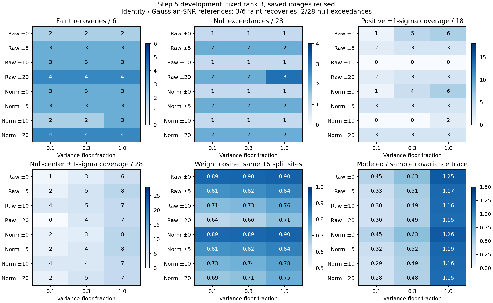

# Step 5 development: variance-floor comparison

**Increasing the floor improves conditional uncertainty and weight stability modestly, but does not solve the
uncertainty mismatch.** At floor fraction 1.0, only 0–6 of 18 injected contrasts and 6–8 of 28 null-center estimates
fall within their reported one-sigma intervals, depending on the sampling policy. Recovery is almost unchanged.
No floor or sampling policy is selected for production from these results.

This test reuses the same baseline, 18 positive images at six evaluation sites and three brightnesses, and three
original development positives as the [radial-pooling comparison](../p4-step5-radial-comparison-20260918/README.md).
The original calibration/evaluation names retain the spatial split; these inspected images are development data.
There are 24 fixed policies and no fresh injections, reductions, or ROC jobs.



## Fixed experiment

Cross floor fractions **0.1, 0.3, and 1.0** with the original eight sampling policies: radial half-widths 0, 5, 10,
and 20 pixels, each with raw or radial-normalized native pixels. Keep at most three PCA modes, 11×11 patches,
five-pixel radial/angular spacing, eight-patch minimum, and every native-stencil source/holdout exclusion fixed.
The same radial variance profile is applied consistently to data and response; its estimator and interpolation
are unchanged and it is re-estimated on each image.

For centered empirical covariance $\widehat C$ and its leading three eigenpairs $(\nu_i,u_i)$, use

$$
\tau_f^2=f_{\rm floor}\,\operatorname{median}_j(\widehat C_{jj}),\qquad
C_f=\tau_f^2I+\sum_{i=1}^{3}\max(\nu_i-\tau_f^2,0)u_iu_i^T.
$$

The fitted training mean is unchanged with floor. Increasing the floor assigns more variance to directions
outside the three modes and can cap a retained mode's excess variance at zero. All valid saved candidate-center
fits in this experiment retain three modes at every tested floor. Floor 1.0 is not identity filtering: the leading
covariance modes remain, and radial normalization also changes the floor in physical image units.

Every threshold is the maximum score among the **same 28 original calibration five-pixel searches**, with strict
exceedance, following the original empirical rule targeting 5% per-search false positives. All 24 thresholds were
written and fingerprinted before processing positive images. The primary null comparison retains the original
28 evaluation searches. The eight radius-20 searches enabled by pooling remain separate. Inner development
positives remain outside the 18-trial recovery table, since those thresholds are not validated at the innermost site.

## Detection results

Each detection triplet lists recovered sources out of six at **0.5×, 1×, and 2× brightness**. The last column lists
evaluation null exceedances out of 28 at floors **0.1, 0.3, and 1.0**, respectively. Each search uses its own policy's
calibration threshold; conditional scores are not interpreted as Gaussian significance.

| Pixels / radial half-width | Detections, floor 0.1 | Detections, floor 0.3 | Detections, floor 1.0 | Null exceedances: 0.1 / 0.3 / 1.0 |
| --- | --- | --- | --- | --- |
| Raw / 0 px | 2, 5, 6 | 2, 5, 6 | 2, 5, 6 | 1 / 1 / 1 |
| Raw / 5 px | 3, 6, 6 | 3, 6, 6 | 3, 6, 6 | 2 / 2 / 2 |
| Raw / 10 px | 3, 5, 6 | 3, 5, 6 | 3, 5, 6 | 1 / 1 / 1 |
| Raw / 20 px | 4, 6, 6 | 4, 6, 6 | 4, 6, 6 | 2 / 2 / 3 |
| Normalized / 0 px | 3, 5, 6 | 3, 5, 6 | 3, 5, 6 | 1 / 1 / 1 |
| Normalized / 5 px | 3, 5, 6 | 3, 5, 6 | 3, 5, 6 | 2 / 2 / 2 |
| Normalized / 10 px | 2, 5, 6 | 2, 5, 6 | 3, 5, 6 | 1 / 1 / 1 |
| Normalized / 20 px | 4, 6, 6 | 4, 6, 6 | 4, 6, 6 | 2 / 2 / 2 |

The unchanged **identity matched-filter and Gaussian 3.6 px + application SNR references each recover 3, 6, 6**
with **2/28 null exceedances**. As before, the Gaussian/SNR reference uses ordinary application annular normalization,
which includes trial neighborhoods; see the [reference report](../p4-step5-gaussian-20260918/README.md).

Only two individual decisions change from floor 0.1. Normalized ±10 at floor 1.0 recovers the faint source at
radius 26, block 3; raw ±20 at floor 1.0 adds a null exceedance at radius 34, block 2. Floor 0.3 changes no decisions.
The normalized ±20 policy retains its one extra faint recovery relative to the references at all three floors,
with the same observed null count. Six reused sites and 24 inspected policies do not establish a general gain or
a preferred floor. The spatially related null searches likewise do not give a precise false-positive rate.

## Conditional uncertainty and stability

Every three-value entry below follows floor order **0.1 / 0.3 / 1.0**. Positive coverage means the exact-center
estimate on the raw positive image lies within one reported sigma of the known injected contrast. Null coverage
means the unmodified exact-center estimate lies within one sigma of zero. Neither uses baseline subtraction or
a negative-injection fit. Paired baseline increments remain separate diagnostics in `injections.json`.

| Pixels / half-width | Positive coverage / 18 | Null-center coverage / 28 | Median split-weight cosine | Median modeled / sample covariance trace |
| --- | --- | --- | --- | --- |
| Raw / 0 px | 1 / 5 / 6 | 1 / 3 / 6 | 0.895 / 0.897 / 0.904 | 0.453 / 0.630 / 1.251 |
| Raw / 5 px | 2 / 3 / 3 | 2 / 5 / 8 | 0.814 / 0.821 / 0.843 | 0.327 / 0.514 / 1.171 |
| Raw / 10 px | 0 / 0 / 0 | 4 / 5 / 7 | 0.715 / 0.726 / 0.765 | 0.301 / 0.490 / 1.163 |
| Raw / 20 px | 2 / 3 / 3 | 0 / 4 / 7 | 0.640 / 0.655 / 0.708 | 0.299 / 0.491 / 1.153 |
| Normalized / 0 px | 1 / 4 / 6 | 2 / 3 / 8 | 0.892 / 0.894 / 0.901 | 0.449 / 0.629 / 1.259 |
| Normalized / 5 px | 3 / 3 / 3 | 2 / 4 / 8 | 0.812 / 0.819 / 0.842 | 0.323 / 0.517 / 1.185 |
| Normalized / 10 px | 0 / 0 / 2 | 4 / 4 / 7 | 0.733 / 0.743 / 0.778 | 0.292 / 0.485 / 1.163 |
| Normalized / 20 px | 3 / 3 / 3 | 2 / 5 / 7 | 0.693 / 0.706 / 0.751 | 0.282 / 0.476 / 1.153 |

Conditional sigma increases at every valid fit as required by covariance ordering. The median positive sigma
ratio between floors 1.0 and 0.1 is 2.99–3.14 across policies. Calibration scores and thresholds also change, so
larger sigmas alone need not change detection decisions. Coverage remains far below the roughly 68% associated
with a correctly centered Gaussian one-sigma model, including on null centers; these correlated trials are not
an independent binomial sample for assigning significance to that discrepancy.

The split-weight comparison uses the **same 16 eligible centers** as before, at radii 46 and 50. Training stencils
lie entirely in either native y half-plane; straddling patches are discarded. Each half has at least eight patches.
Cosine one means identical physical-unit amplitude-weight directions. Increasing the floor modestly improves
all eight median cosines, but wider pooling still has worse agreement between halves. The halves remain spatially
related, and normalized fits share the radial profile; this is a descriptive diagnostic rather than independent
cross-validation. Individual regularized covariance differences are also archived.

At floor 1.0, the modeled covariance trace is now **1.15–1.26 times** the empirical sample trace (medians over the
28 evaluation centers, in each model's fitting coordinates), yet conditional coverage remains poor. This does
not show that the true covariance is overestimated: the training sample can be unrepresentative, and total trace
does not determine variance along the filter's weight direction. Background-mean error, omitted directional
correlations, spatial transfer, and interpolation remain possible contributors. This experiment does not isolate
one cause. A trace-matching correction or arbitrary global sigma multiplier is not justified by these measurements.

## Follow-up

The [projected-noise diagnostic](../p4-step5-projected-noise-20260918/README.md) is now complete. Its specification
was **projected noise calibration with frozen filter weights**: fit on one angular
training subset, project disjoint held-out noise stamps through those weights, and compare their mean and variance
with zero and the model's predicted amplitude variance. Separate mean offsets from covariance mismatch and audit
how interpolation changes training-stamp statistics relative to native candidate stamps. Keep the native exclusions
and evaluate radial transfer explicitly. This should help decide whether to change the covariance representation,
sampling, or uncertainty model before another rank/floor search. The report identifies underestimated variance
in the discarded eigenspace and specifies a covariance-shrinkage comparison next.

The current test leaves production defaults unchanged. The previously discussed fresh ROC injection study still
requires a frozen policy and a numerical/throughput check; it has not launched.

## Verification and artifacts

- [`summary.json`](summary.json), [`nulls.json`](nulls.json), [`injections.json`](injections.json): all 24 policies,
  individual trials, uncertainty/source-effect diagnostics, and common-support stability results.
- [`manifest.json`](manifest.json), [`thresholds.json`](thresholds.json), [`variance_profiles.json`](variance_profiles.json):
  fixed choices, source/script fingerprints, frozen calibration thresholds, and unchanged variance profiles.
- [`verification.json`](verification.json), [`independent_checks.json`](independent_checks.json),
  [`complete.json`](complete.json): controls, independently recomputed counts, and completion record.
- [`compare_p4_step5_variance_floor.py`](../../scripts/compare_p4_step5_variance_floor.py): experiment driver.
  [`compare_p4_step5_radial_pooling.py`](../../scripts/compare_p4_step5_radial_pooling.py) now accepts an optional
  floor fraction in its fitting helpers while retaining the original default of 0.1.

The floor-0.1 control reproduces **14,265 archived scalar values**, including every previous null/positive
measurement, decision, profile, and summary value. Direct production checks cover 320 baseline search pixels with
maximum relative numerical difference 5.62e-8. Every normalized fit agrees with the equivalent physical-unit solve;
eligibility and the common 16-site stability set are unchanged with floor. All 24 thresholds and recovery/coverage
counts were independently recomputed. Numerical checks verify positive-semidefinite covariance increments,
nondecreasing sigma, the large-floor isotropic limit, and invalid-floor rejection. Original input, script, and
threshold fingerprints remain unchanged during the run. Python syntax and whitespace checks pass, and the figure
was visually inspected. No production C++ function or mxlib call changed.

The earlier radial report's script fingerprint identifies its original committed version. This run records the
extended helper's new fingerprint and verifies numerical reproduction of the earlier results; historical records
are preserved.

Reproduce from the repository root into a **new** output directory:

```sh
OPENBLAS_NUM_THREADS=1 OMP_NUM_THREADS=2 MPLCONFIGDIR=/tmp/p4-step5-matplotlib \
  python3 agents/plans/scripts/compare_p4_step5_variance_floor.py \
  --radial-comparison agents/plans/results/p4-step5-radial-comparison-20260918 \
  --evaluation working/roc/p4_noise_step5_evaluation_20260918 \
  --gaussian working/roc/p4_noise_step5_gaussian_20260918 \
  --development working/roc/p4_noise_step5_development_20260918 \
  --output /path/to/new/floor-comparison-directory
```
