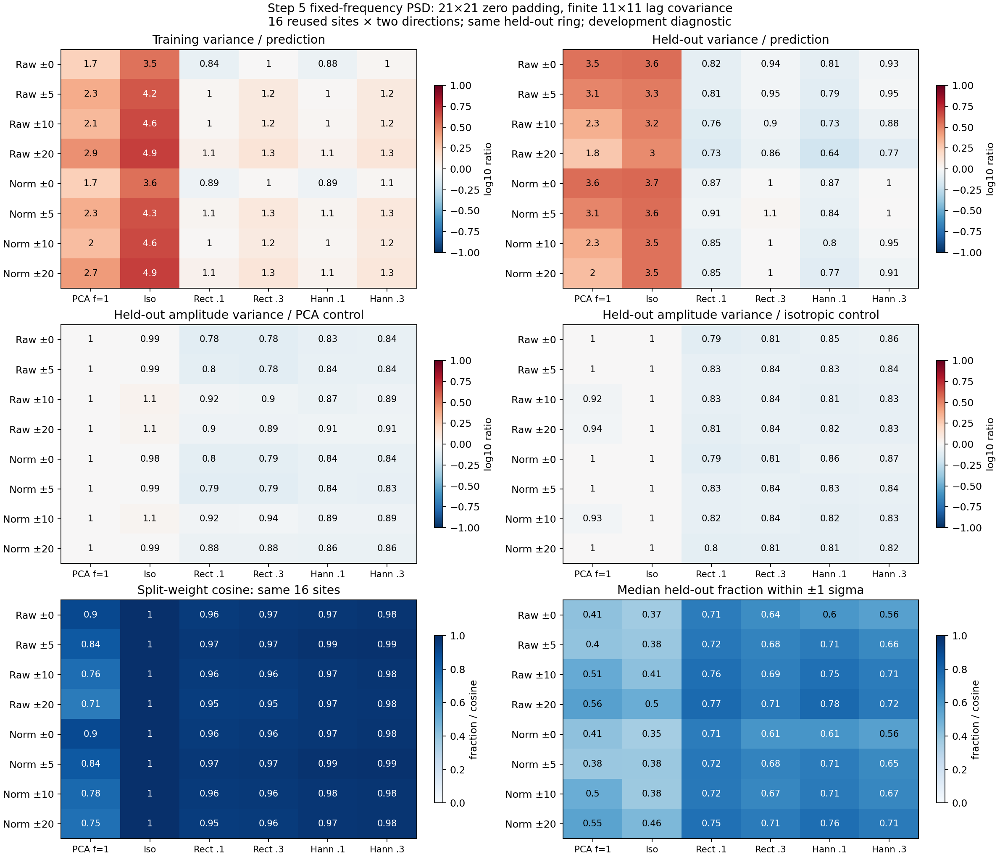

# Step 5: fixed-frequency Welch-style covariance

**The spectral model improves this development diagnostic.** Across the 32 tested policies, median paired
held-out amplitude variance is **6–22% lower than the three-mode, floor-1 control** and **13–21% lower than the
isotropic control**. Median measured/predicted variance is 0.64–1.05, versus 1.85–3.63 for the three-mode control;
weight directions also agree more closely between training halves. These are ranges of policy medians, not
confidence intervals. They do not establish improved source recovery or a production choice.

The isotropic control retains the fitted background mean and the selected radial normalization. It is not the
original identity detection reference. Gaussian smoothing (`filter.lpfGaussFW=3.6`) and identity remain necessary
references for the next recovery comparison.



## Fixed design and comparison support

Use the same saved baseline and splits as the [shrinkage diagnostic](../p4-step5-shrinkage-20260918/README.md).
Cross rectangular and symmetric separable Hann estimation windows with isotropic spectral mixtures 0.1 and 0.3.
Cross those four variants with training radial half-widths 0, 5, 10, and 20 pixels, raw or radial-normalized:
**32 PSD policies**, plus eight three-mode/floor-1 and eight isotropic control policies. This grid was fixed before
running the spectral comparison. No new reduction or positive-source image was generated or analyzed.

Keep 11×11 patches, five-pixel radial/angular center spacing, the eight-training-patch minimum, exact native
interpolation support, and the existing source/held-out exclusions. Fit on one native y half-plane, freeze the
mean and amplitude weights, project the opposite half, and swap. Native train/validation support is disjoint
across all rings; stencils that straddle the split are removed. Training halves have 8–56 patches for 121 pixels.

Every primary comparison uses the **same opposite-half, same-radius ring**, regardless of training width.
There are 32 directional fits per policy at the same 16 sites, nominal radii 46 and 50, spanning the original
calibration and evaluation groups. Split-weight comparisons use the 16 pairs. Matching-band and individual-ring
projections are secondary diagnostics; changing their support cannot change the primary comparison.

All sites have already been used for development. Overlapping patches and nearby sites share pixels, and
spatial correlations can persist across disjoint halves. Normalized policies also condition on the same shared
baseline radial profile. The 32 fits are not independent trials or fresh validation. This sample does not
establish performance at smaller separations.

## Spectral estimator and finite covariance

Let $x_j$ be a vectorized training patch, $\bar x$ its unwindowed across-patch mean, and $r_j=x_j-\bar x$ reshaped
to 11×11. Let $W$ be either ones or the outer product of `np.hanning(11)` with itself, and $U_W=\sum_a W_a^2$.
Use an unnormalized forward FFT on a **21×21 zero-padded grid**, with the inverse divided by $21^2$:

$$
\widehat P_{\rm raw}(k)=
\frac{\sum_{j=1}^{n}|\operatorname{FFT}_{21}[W r_j](k)|^2}{(n-1)U_W},
\qquad
\bar v=\frac{\sum_j\lVert r_j\rVert^2}{(n-1)p},\quad p=121.
$$

Rescale the spectral mean to the unwindowed mean pixel variance, then mix toward a flat spectrum:

$$
\widehat P(k)=\widehat P_{\rm raw}(k)
\frac{\bar v}{\operatorname{mean}_k\widehat P_{\rm raw}(k)},
\qquad
\widehat P_{\beta}(k)=(1-\beta_{\rm PSD})\widehat P(k)+\beta_{\rm PSD}\bar v,
\quad \beta_{\rm PSD}\in\{0.1,0.3\}.
$$

The rescaling is unity for the rectangular window to numerical precision. For Hann it ranges from 0.87 to 1.23
across individual fits. It preserves the same total covariance variance used by the isotropic control, so the
comparison does not silently substitute the taper-weighted pixel variance for the original variance.

Take $\widehat c=\operatorname{IFFT}_{21}(\widehat P_\beta)$ and construct the finite 121×121 matrix using each
pair's actual pixel separation:

$$
(C_{\rm PSD})_{ab}=\widehat c(u_a-u_b),
\qquad
(C_{\rm PSD})_{aa}=\bar v,\quad
\lambda_{\min}(C_{\rm PSD})\ge\beta_{\rm PSD}\bar v.
$$

Here $u_a$ is the two-dimensional coordinate of stamp pixel $a$. Negative lags index the padded inverse FFT
modulo 21. Padding to $2\times11-1$ keeps all linear lags −10 through +10 distinct: opposite edges of the 11×11
stamp do not become neighbors. The matrix is a finite stationary lag covariance (block Toeplitz), a principal
submatrix of the positive 21×21 periodic embedding. Its eigenvectors need not be the 11×11 Fourier modes;
we perform a dense finite-stamp solve rather than divide an 11×11 transform by the spectrum. The **spectrum's
representation is fixed**, avoiding a fit of arbitrary empirical covariance eigenvectors from these few patches.

The window acts **only inside the covariance estimator**. The reconstructed matrix models untapered stamps.
Candidate data, training-mean subtraction, held-out projections, and the response template stay untapered, with
the existing consistent native radial normalization where requested. This is distinct from multiplying the
measurement by a taper, which would require transforming its template and covariance too.

We do **not** divide out the window autocorrelation or the finite-patch lag-overlap factor. Even the rectangular
window therefore attenuates long lags; Hann attenuates them more strongly. This supplies deliberate structural
regularization, but the estimate is not an unbiased reconstruction of the underlying stationary covariance.
The $n-1$ normalization likewise does not correct correlations between overlapping patches. Local stationarity,
radial transfer, and prediction on native candidate pixels still require empirical checks.

All variants retain the same unwindowed mean and use unit-response amplitude weights
$g=C^{-1}t/(t^TC^{-1}t)$. The predicted variance is $\sigma_\alpha^2=g^TCg$. At mixture one, either window reduces
to exactly $\bar v I$; this endpoint was checked on every training set but is the isotropic control, not another
PSD policy. Insufficient samples, zero total variance, or zero windowed variance invalidate the fit; no such
failure occurred on the common real-data support.

## Held-out variance prediction

Entries are medians of **centered held-out amplitude variance / predicted amplitude variance**. One indicates
agreement. These are variance ratios, not ratios of standard deviations. PSD columns show the separate fixed
window/mixing variants.

| Pixels / training half-width | PCA, floor 1 | Isotropic | Rect. 0.1 | Rect. 0.3 | Hann 0.1 | Hann 0.3 |
| --- | ---: | ---: | ---: | ---: | ---: | ---: |
| Raw / 0 px | 3.46 | 3.62 | 0.82 | 0.94 | 0.81 | 0.93 |
| Raw / 5 px | 3.05 | 3.30 | 0.81 | 0.95 | 0.79 | 0.95 |
| Raw / 10 px | 2.26 | 3.21 | 0.76 | 0.90 | 0.73 | 0.88 |
| Raw / 20 px | 1.85 | 2.98 | 0.73 | 0.86 | 0.64 | 0.77 |
| Normalized / 0 px | 3.63 | 3.72 | 0.87 | 1.00 | 0.87 | 1.00 |
| Normalized / 5 px | 3.08 | 3.63 | 0.91 | 1.05 | 0.84 | 1.01 |
| Normalized / 10 px | 2.33 | 3.52 | 0.85 | 1.01 | 0.80 | 0.95 |
| Normalized / 20 px | 2.02 | 3.46 | 0.85 | 1.00 | 0.77 | 0.91 |

PSD training variance/prediction medians span 0.84–1.35. The very small training variance and much larger
held-out variance seen with full empirical shrinkage are absent here. Mixture 0.3 generally brings same-radius
median variance closer to one than mixture 0.1. That does not make conditional errors universally calibrated:
individual directional fits still scatter substantially, and the fitted mean contributes a separate error.

For example, normalized ±20 pixels with rectangular mixture 0.3 has median variance/prediction **1.00**, but
its 10th–90th percentile range is **0.38–1.19**. The normalized same-radius Hann/0.3 case has median **1.00** and
range **0.35–1.98**. These are descriptive percentiles over correlated fits. Median per-fit fractions inside
±1 sigma span **0.56–0.78** across all PSD policies; they are not independent binomial coverage measurements.

## Actual projected noise and stability

To distinguish noise reduction from a changed reported sigma, compute actual amplitude variance in contrast
units from each saved projected sample, and divide by the matching control variance at that same site and
direction. The entries below are medians of those **paired** ratios, not ratios of medians.

Four-number entries follow **rectangular 0.1 / rectangular 0.3 / Hann 0.1 / Hann 0.3**.

| Pixels / half-width | Actual variance / PCA control | Actual variance / isotropic control | PSD split-weight cosine |
| --- | --- | --- | --- |
| Raw / 0 px | 0.782 / 0.781 / 0.835 / 0.839 | 0.787 / 0.806 / 0.848 / 0.864 | 0.957 / 0.967 / 0.971 / 0.978 |
| Raw / 5 px | 0.798 / 0.783 / 0.844 / 0.840 | 0.835 / 0.838 / 0.827 / 0.840 | 0.966 / 0.973 / 0.987 / 0.989 |
| Raw / 10 px | 0.924 / 0.904 / 0.865 / 0.886 | 0.826 / 0.836 / 0.813 / 0.832 | 0.955 / 0.960 / 0.972 / 0.977 |
| Raw / 20 px | 0.896 / 0.887 / 0.909 / 0.913 | 0.810 / 0.842 / 0.822 / 0.827 | 0.946 / 0.953 / 0.970 / 0.975 |
| Normalized / 0 px | 0.796 / 0.792 / 0.842 / 0.836 | 0.791 / 0.810 / 0.858 / 0.873 | 0.955 / 0.964 / 0.971 / 0.978 |
| Normalized / 5 px | 0.790 / 0.789 / 0.837 / 0.834 | 0.834 / 0.844 / 0.831 / 0.837 | 0.965 / 0.972 / 0.987 / 0.989 |
| Normalized / 10 px | 0.925 / 0.942 / 0.892 / 0.892 | 0.822 / 0.839 / 0.820 / 0.835 | 0.957 / 0.963 / 0.976 / 0.980 |
| Normalized / 20 px | 0.880 / 0.881 / 0.861 / 0.856 | 0.795 / 0.813 / 0.809 / 0.822 | 0.951 / 0.957 / 0.975 / 0.979 |

The variance ratios span **0.781–0.942 versus PCA** and **0.787–0.873 versus isotropic**. Physical-unit
split-weight cosine spans **0.946–0.989**, compared with **0.708–0.904** for PCA. Isotropic weights have cosine
one by construction, conditional on the radial profile. No window/mixing/width choice is uniformly best.

Including mean offsets, the median paired **mean squared error / PCA control** spans **0.769–0.997**. For
normalized ±20-pixel Hann policies the ratios are 0.997 and 0.995: their centered-variance improvement brings
almost no MSE improvement. A claim about photometric error needs both the variance and bias information.
All individual score arrays, MSE comparisons, and mean-offset diagnostics are retained in the JSON artifacts.

## Radial transfer remains unresolved

Prediction is less consistent when the same weights are applied across other radii. At ±20-pixel training
width, matching-band variance/prediction medians are **1.22–1.50**, versus **0.64–1.00** on the fixed same-radius
ring. Those validation sets differ, so their aggregate medians alone are not a paired transfer test.

The following explicitly pairs each ring's centered projected variance with the same-radius variance from the
same fit. It shows the rectangular, mixture-0.3, ±20-pixel training policies as a representative comparison:

| Validation radial offset | Eligible directional fits (at least 8 patches) | Raw ring / same-radius variance | Normalized ring / same-radius variance |
| --- | ---: | ---: | ---: |
| -10 px | 8 | 5.17 | 4.24 |
| -5 px | 24 | 1.97 | 1.97 |
| +0 px | 32 | 1.00 | 1.00 |
| +5 px | 16 | 2.57 | 2.43 |

Other offsets have no eligible directional fits under this minimum. Each row uses its own eligible subset,
so a ratio above one at +5 pixels is compatible with that ring's aggregate variance/prediction median being
near one. The radial normalization reduces the −10-pixel mismatch somewhat but does not remove the transfer
problem. Broader pooling is consequently not validated as a universal improvement.

## Next comparison

Carry this structured covariance family into the **existing saved null and positive-injection images**, keeping
the original common-site support and the Gaussian/identity references. Fix the PSD candidate grid and threshold
rule before inspecting recovery, and set thresholds only with the designated calibration nulls. Check actual
contrast error, false positives, recovery, and prediction on native candidate stamps; rotated bilinear training
patches do not automatically have the same noise law. This can reuse the images without running P4 again.

Keep the experiment labeled development because these images have already influenced model choices. Freeze
any eventual policy before the fresh ROC injection study. No production configuration or ROC policy is selected
at this checkpoint, and no new detection/recovery result is claimed.

## Verification and artifacts

- [`summary.json`](summary.json): 32 PSD policies, 16 controls, dispersion, radial-transfer counts, and paired comparisons.
- [`projections.json`](projections.json), [`stability.json`](stability.json): 1,024 PSD directional fits, individual
  scores, and 512 paired-site stability comparisons. Reproduced controls remain in the preceding experiment archives.
- [`manifest.json`](manifest.json), [`verification.json`](verification.json),
  [`independent_checks.json`](independent_checks.json), [`complete.json`](complete.json): fixed design, input/script
  fingerprints, run completion, and verification outcomes.
- [`compare_p4_step5_welch_psd.py`](../../scripts/compare_p4_step5_welch_psd.py): experiment driver and PSD estimator.

The driver reproduces 101,692 archived control scalars across 512 control fits, verifies disjoint native support,
and checks 512 windowed isotropic endpoints. All PSD fits preserve the covariance trace and positive spectral
floor. Unit-response, conditional-variance, and physical-unit versus standardized-solve identities pass.

Independent checks recompute **8,448 projection groups**, **6,144 paired variance/MSE/sigma ratios**, and
**1,216 summary scalars**. Direct `scipy.signal.correlate2d` linear-lag sums, without an FFT, reproduce all
**1,024 real covariances** to maximum relative error **7.97e-16**. Separate `numpy.linalg.solve` inversions agree
in weight direction to **2.53e-15** relative error and reproduce all held-out same-radius scores and **512**
stability pairs. Exact white-noise ensembles verify both windows' normalization, while constant patches check
neighbor versus opposite-corner lags. Invalid mixtures, fewer than eight samples, zero covariance, and zero
Hann-windowed variance are checked. Python syntax, fingerprints, and whitespace checks pass; the figure was
visually inspected. No production C++ or mxlib-calling function changed.

Reproduce from the repository root into a new directory:

```sh
OPENBLAS_NUM_THREADS=1 OMP_NUM_THREADS=2 MPLCONFIGDIR=/tmp/p4-step5-matplotlib \
  taskset -c 12,13 python3 agents/plans/scripts/compare_p4_step5_welch_psd.py \
  --shrinkage agents/plans/results/p4-step5-shrinkage-20260918 \
  --projected-noise agents/plans/results/p4-step5-projected-noise-20260918 \
  --floor-comparison agents/plans/results/p4-step5-variance-floor-20260918 \
  --radial-comparison agents/plans/results/p4-step5-radial-comparison-20260918 \
  --output /path/to/new/welch-psd-directory
```

The affinity mask above is the one used for this run; choose available cores on another machine.
